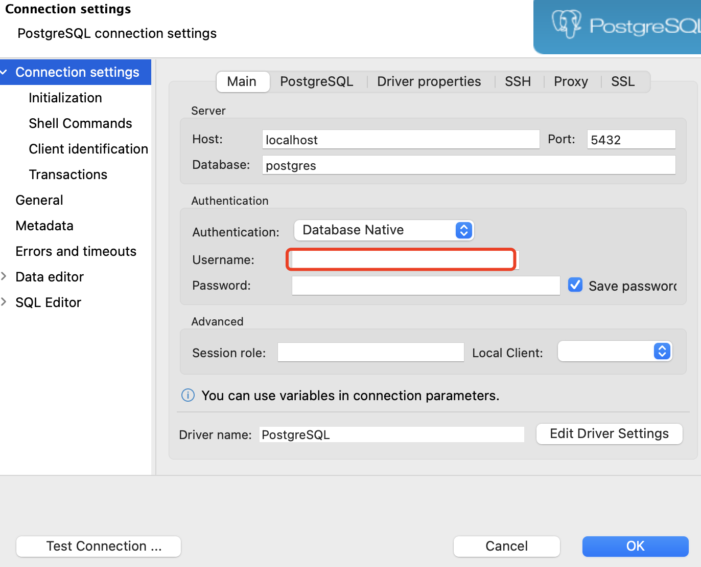
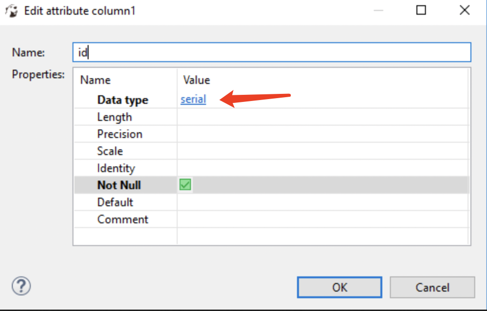

# PostgreSQL学习

## 基本操作

### 1 mac系统brew安装

* 安装
  
  ```shell
  brew install postgresql
  ```

* 查看安装版本

  ```shell
  psql --version
  ```

* 进入命令行
  
  ```shell
  psql
  ```

  * 命令 \l 查看有哪些数据库
  * 命令 \c 选择哪个数据库
  * 命令 \d 查看数据库中的表

### 2 dbeaver创建连接

* 用户名设置为空，不然会报错: role 'postgres' does not exist
  
* 创建表，怎么设置自增
  * 将id的类型设为serial
  
