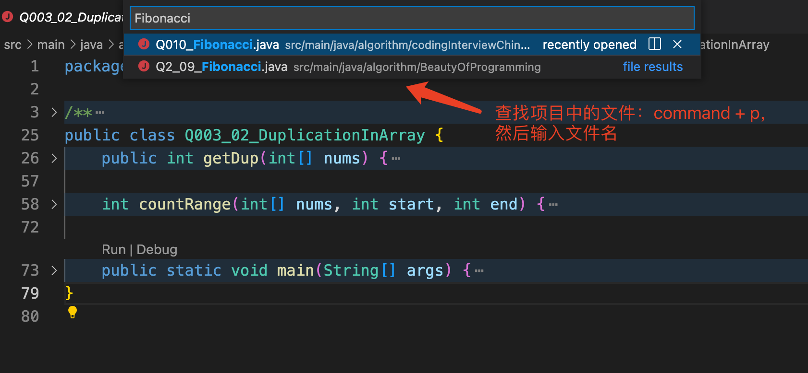
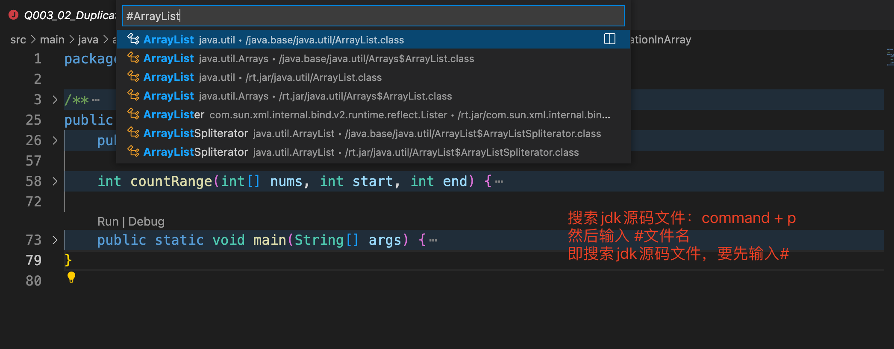

# 常用操作

## 1，安装oh-my-zsh

```shell
sh -c "$(curl -fsSL https://gitee.com/mirrors/oh-my-zsh/raw/master/tools/install.sh)"
```

## 2，编译spring源码（注意，gradlew后面的空格不能少）

```shell
./gradlew :spring-oxm:compileTestJava
```

## 3，github代码下载

```shell
git clone git@github.com:mingle08/algorithm.git
git clone git@github.com:mingle08/jdk8SourceNote.git
git clone git@github.com:mingle08/mybatis-3-study.git
```

## 4，gitee代码下载

```shell
git clone git@gitee.com:mingle08/java-note.git
```

## 5，快捷键

* idea
  |MAC|名称|WINDOWS|
  |:-|:-:|:-|
  |⌘N|自动生成get/set方法|Alt + Enter|
  |⌃⌥O|优化import|Ctrl + Alt + O|
  |⌃H|查看继承关系|Ctrl + H|
  |⌥⌘L|格式化代码|Ctrl + Alt +L|
  |⌘O|查找类文件|Ctrl + N|
  |⌘L|跳转到行号|Ctrl + G|
  |⌥space| 查看光标处的方法、类的定义|/|
  |⌘⇧F|全局查找|Ctrl + Shift + F|
  |⌥⇧↓ / ⌥⇧↑|移动当前行向下/向上|Ctrl + Shift + ↓ / ↑|

* visual studio code
  |MAC|名称|WINDOWS|
  |:-|:-:|:-|
  |⌃ + 反引号|调出终端/隐藏终端|Ctrl + 反引号|
  |⌥⇧F|格式化代码||
  |⌥←|移动到单词的最前面||
  |⌥→|移动到单词最末尾||
  |⌥↑|将当前行代码移动到上一行||
  |⌥↓|将当前行代码移动到下一行||
  |⌘←|移动到当前行最前面||
  |⌘→|移动到当前行最末尾||
  |⌘↑|移动到文档第一行||
  |⌘↓|移动到文档最后一行||
  |⌥⇧↓ / ⌥⇧↑|快速复制一行||
  |⌥↓ / ⌥↑|移动当前行向下/向上||
  |⌥⇧A|切换块注释||
  |⌘P|查找项目文件|ctrl + P|
  |⌘P #|查找jdk源码文件|ctrl + P #|
  
  原文链接：<https://blog.csdn.net/m0_64346035/article/details/124192655>




* 浏览器
  光标定位在地址栏    ⌘L

* 微信截图
  ⌃⌘A
