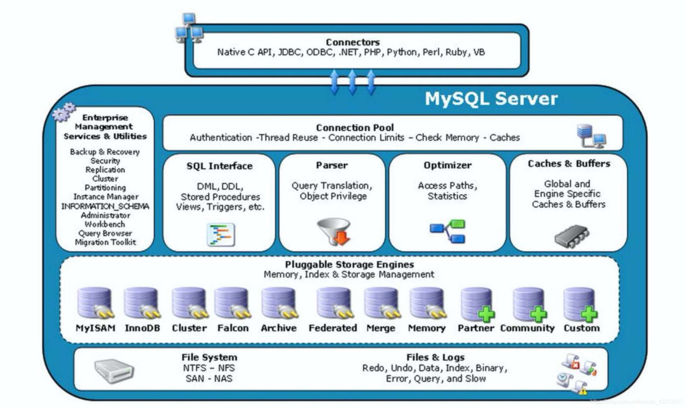
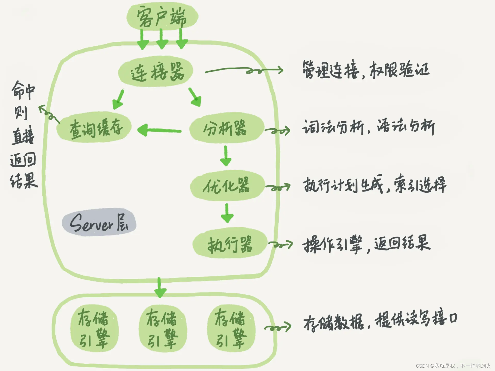
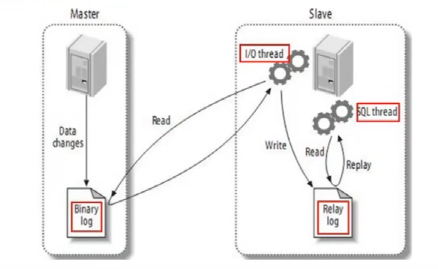
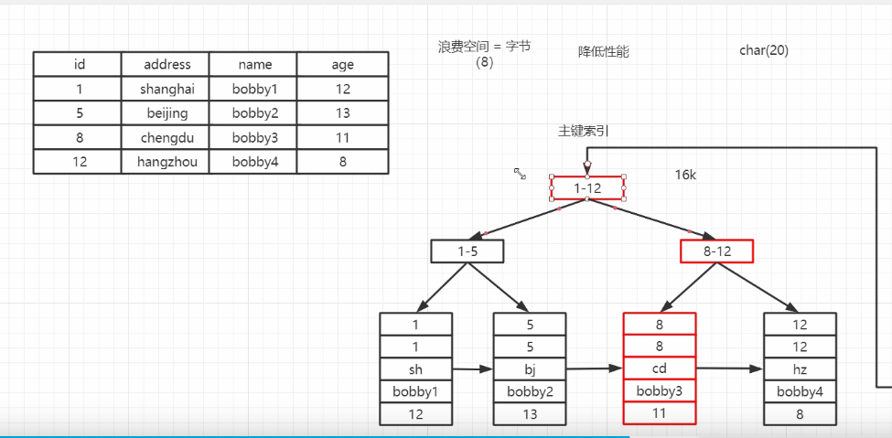
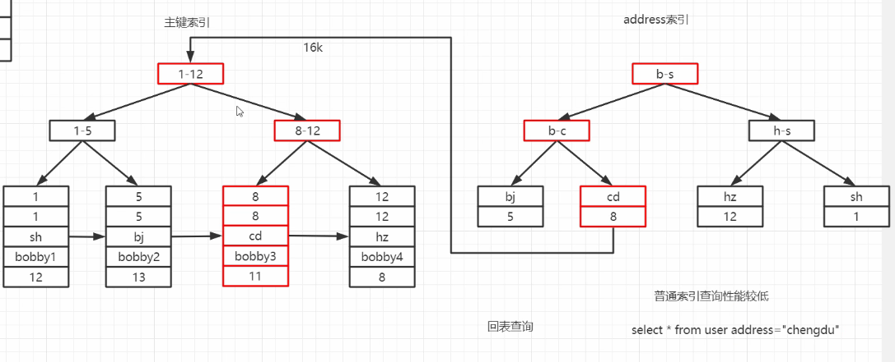
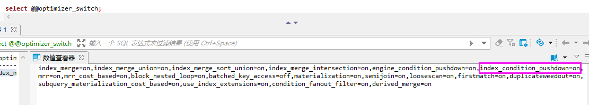
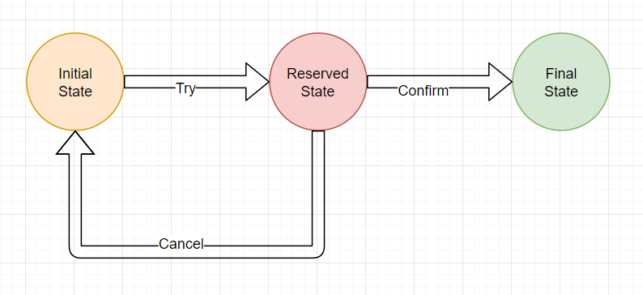
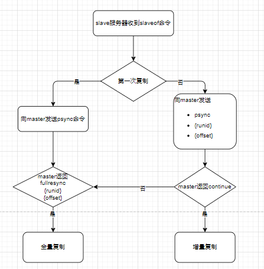

# 数据库笔记之一

## 序号（0~30）

### 1，如何保证Redis与mysql缓存一致性

* 延迟双删：先删除redis缓存，再更新mysql，然后删除redis缓存
* 先更新mysql，再删除缓存，如果删除失败，发到mq，消费mq消息删除缓存
* 使用canal，伪装成mysql的一台从机，将redis删除的消息发送到mq

### 2，mysql体系结构



（1）Server层

* 连接池组件
* 管理服务和工具组件
* SQL接口组件
* 查询分析器组件
* 优化器组件
* 缓存组件
  
（2）存储引擎层

* 插件式存储引擎：基于表，而不是数据库

（3）物理文件

另一张图

参考：<https://blog.csdn.net/qq_42239520/article/details/122145983>

### 3，数据库范式

（1）三范式（Normal Form）
1NF:字段不可分;
2NF:有主键，非主键字段依赖主键;
3NF:非主键字段不能相互依赖;

解释:
1NF:原子性 字段不可再分,否则就不是关系数据库;
2NF:唯一性 一个表只说明一个事物;
3NF:每列都与主键有直接关系，不存在传递依赖;

（2）数据库还有第四、每五范式
BCNF : Boyce-Codd Normal Form可以看作更好的3NF。在满足第二第三范式的情况下，决定项内部也不能部分或传递依赖。
4NF：没有多值依赖

（3）数据库设计涉及的名词
关系：一个关系对应通常所说的一张表
元组：表中的一行即为一个元组
属性：表中的一列即为一个属性；每一个属性都有一个名称，称为属性名
候选码：表中的某个属性组，它可以唯一确定一个元组
主码：一个关系有多个候选码，选定其中一个为主码
域：属性的取值范围
分量：元组中的一个属性值

### 4，什么是MVCC

* 概念：
  MVCC是Muiti-Version Concurrency Control的简写，即多版本并发控制：读取数据时通过一种类似快照的方式将数据保存下来，这样读锁和写锁就不冲突了，不同的事务session会看到自己特定版本的数据，版本链
  MVCC只有在READ COMMITTED和REPEATABLE READ两个隔离级别下工作。其他两个隔离级别和MVCC不兼容，因为READ UNCOMMITTED总是读取最新的数据行，而不是符合当前事务版本的数据行。而SERIALIZABLE则会对所有读取的行都加锁。
  * 快照读  select 语句
  * 当前读  
        select ... lock in share mode
        select ... for update
        insert/update/delete
* 聚簇索引记录中有两个必要的隐藏列：
  * trx_id  用来存储每次对某条聚簇索引记录进行修改时候的事务id
  * roll_pointer  每次对哪条聚簇索引记录有修改的时候，都会把老版本写入undo日志中。这个roll_pointer就是存了一个指针，
它指向这条聚簇索引记录的上一个版本的位置，通过它来获得上一个版本的记录信息（注意插入操作的undo日志没有这个属性，因为它没有老版本）

* READ COMMITTED和REPEATABLE READ的区别
  就在于它们生成READVIEW的策略不同
  * READ COMMITTED隔离级别下的事务在每次查询的开始都会生成一个独立的READVIEW
  * REPEATABLE READ隔离级别则在第一次读的时候生成一个READVIEW，之后的读都复用之前的READ VIEW

* 开启事务时创建readview,readview维护当前活动的事务id，即未提交的事务id，排序生成一个数组
访问数据，获取数据中的事务id（获取的是事务id最大的记录），对比readview:
  * 如果在readview的左边（比readview小），可以访问（在左边意味着该事务已经提交）
  * 如果在readview的右边（比readview大），或者在readview区间内，不可以访问，获取roll_pointer，取上一版本重新对比（在右边意味着，该事务在readview生成之后出现；在readview区间内意味着该事务还未提交）

### 5，mysql主从同步原理


（1）有三个线程：binlog dump thread（master）、I/O thread（slave）和sql thread（slave）

（2）过程：
a. 主节点binlog，主从复制的基础是主库记录数据库的所有变更记录到binlog。binlog在数据库服务器启动那一刻起，保存所有修改数据库结构或内容的一个文件
b. 主节点log dump线程：当log有变动时，log dump线程读取其内容并发送给从节点
c. 从节点I/O线程接收binlog内容，并将其写入到relay log文件中
d. 从节点sql线程读取relay log文件内容，对数据更新进行同步，最终保证主从数据库的一致性

（3）同步方式
a. 异步复制：mysql默认的复制方式
b. 全同步复制：主库强制同步日志到从库，所有的从库都执行完成后才返回给客户端，此方式性能不高
c. 半同步复制：从库写入日志成功后返回ACK确认给主库，主库收到至少一个从库的确认就认为同步操作完成

（4）MTS
    MySQL的复制延迟是一直被诟病的问题之一，在MySQL 5.7版本已经支持“真正”的并行复制功能，官方称为为enhanced multi-threaded slave（简称MTS），因此复制延迟问题已经得到了极大的改进。
参考：<http://blog.sina.com.cn/s/blog_53b13d950102yiyn.html>
<https://www.cnblogs.com/quzq/p/13221498.html>

```text
从库多线程MTS
基本要求:
5.7以上的版本
必须开启GTID
binlog必须是row模式

gtid_mode=ON
enforce_gtid_consistency=ON
log_slave_updates=ON　　　　　　　　　　# 前3行为开启gtid模式
slave-parallel-type=LOGICAL_CLOCK　　# 关键参数, 支持事务级别的sql进行并发回放, 默认是database级别(也就是只能并发database)
slave-parallel-workers=16　　　　　　　# 并发回访的线程数, cpu数的一半
master_info_repository=TABLE
relay_log_info_repository=TABLE
relay_log_recovery=ON
```

### 6，mysql的事务是怎么实现的？

<https://www.cnblogs.com/ffdsj/p/12266539.html>

（1）原子性：使用 undo log ，从而达到回滚；
（2）持久性：用 redo log，从而达到故障后恢复；
（3）隔离性：使用锁以及MVCC,运用的优化思想有读写分离，读读并行，读写并行；
（4）一致性：通过回滚，以及恢复，和在并发环境下的隔离做到一致性。

### 7，mysql的回表查询

（1）主键索引和普通索引的查询区别
摘自b站：bobby的技术笔记



（2）Multi-Range Read（多范围读）
a. 将查询得到的辅助索引键值存放于一个缓存中，这时缓存中的数据是根据辅助索引键值排序的
b. 将缓存中的键值根据RowID进行排序
c. 根据RowID的排序顺序来访问实际的数据文件
若启用Multi-Range Read特性，在执行计划的列Extra除了看到Using index condition外，还会看见Using MRR选项
（3）Index Condition Pushdown（ICP，索引下推）
查看ICP设置的sql语句：select @@optimizer_switch;

适合于联合索引

* 不支持ICP：当进行索引查询时，首先根据索引来查找记录，然后再根据WHERE条件来过滤记录

* 支持ICP：在取出索引的同时，判断是否可以进行WHERE条件的过滤，也就是将WHERE的部分过滤操作放在了存储引擎层。在某些查询下，可以大大减少上层SQL层对记录的索取，从而提高数据库的整体性能
参考：
<https://www.cnblogs.com/xujunkai/p/12622758.html>
<https://www.zhangshengrong.com/p/7B1LqVWDaw/>

（4）索引失效
参考：<https://www.modb.pro/db/89169>

### 8，名词解释

（1）OLAP  联机分析处理  数据仓库  hive                     对历史数据进行分析，产生决策性的影响
（2）OLTP  联机事务处理  数据库    mysql/oracle/db2/...    支撑业务系统，在很短时间内产生结果
（3）ISAM  索引顺序访问方法（ISAM, Indexed Sequential Access Method）

### 9，mysql内部的XA事务

* 在mysql数据库中还存在另外一种分布式事务，其在存储引擎与插件之间，又或者在存储引擎与存储引擎之间，称之炎内部XA事务
* 最为常见的内部XA事务存在于binlog与InnoDB存储引擎之间：mysql redo log的二阶段提交
  参考：<https://www.cnblogs.com/kiwi-deng/p/13641783.html>
  

### 10，事务的2PC与3PC的区别

* XA 是指由 X/Open 组织提出的分布式事务处理的规范.
* XA 规范主要定义了事务管理器(Transaction Manager)和局部资源管理器(Local Resource Manager)之间的接口。
* XA分布式协议包含二阶段提交和三阶段提交两种协议实现。
  **2PC**：Two-Phase Commit
  **3PC**：Three-Phase Commit
  参考：<https://baijiahao.baidu.com/s?id=1693824822611080380&wfr=spider&for=pc>

（1）3PC比2PC多了一个can commit阶段，减少了不必要的资源浪费，因为2PC第一阶段会占用资源，而3PC的can commit阶段只校验sql，不占用资源，如果不能执行，直接返回，减少了资源占用
（2）引入超时机制，同时在协调者和参与者中都引入超时机制
2PC只有协调者有超时机制，超时后，发送回滚指令
3PC 协调者和参与者都有超时机制

### 11，TCC与XA的区别

（1）XA是资源层面的分布式事务，强一致性，在两阶段提交的整个过程中，一直会持有资源的锁。

* XA事务中的两阶段提交内部过程是对开发者屏蔽的，回顾我们之前讲解JTA规范时，通过UserTransaction的commit方法来提交全局事务，这只是一次方法调用，其内部会委派给TransactionManager进行真正的两阶段提交，因此开发者从代码层面是感知不到这个过程的。
* 事务管理器在两阶段提交过程中，从prepare到commit/rollback过程中，资源实际上一直都是被加锁的。如果有其他人需要更新这两条记录，那么就必须等待锁释放。

（2）TCC是业务层面的分布式事务，最终一致性，不会一直持有资源的锁。

* TCC，Try-Confirm-Cancel   将一次事务操作分为三个阶段：
  **Try**：这个阶段对各个服务的资源做检测以及对资源进行锁定或者预留；
  **Confirm** ：执行真正的业务操作，不作任何业务检查，只使用Try阶段预留的业务资源，Confirm操作要求具备幂等设计，Confirm失败后需要进行重试；
  **Cancel**：如果任何一个服务的业务方法执行出错，那么这里就需要进行补偿，即执行回滚操作，释放Try阶段预留的业务资源 ，Cancel操作要求具备幂等设计，Cancel失败后需要进行重试



* TCC中的两阶段提交并没有对开发者完全屏蔽，也就是说从代码层面，开发者是可以感受到两阶段提交的存在。如上述航班预定案例：在第一阶段，航空公司需要提供try接口(机票资源预留)。在第二阶段，航空公司提需要提供confirm/cancel接口(确认购买机票/取消预留)。开发者明显的感知到了两阶段提交过程的存在。
* try、confirm/cancel在执行过程中，一般都会开启各自的本地事务，来保证方法内部业务逻辑的ACID特性。
  * try过程的本地事务，是保证资源预留的业务逻辑的正确性。
  * confirm/cancel执行的本地事务逻辑确认/取消预留资源，以保证最终一致性，也就是所谓的补偿型事务(Compensation-Based Transactions)。
  * 由于是多个独立的本地事务，因此不会对资源一直加锁。

另外，这里提到confirm/cancel执行的本地事务是补偿性事务

参考：<http://www.tianshouzhi.com/api/tutorials/distributed_transaction/388>

### 12，缓存的穿透，击穿，雪崩

（1）穿透：缓存中不存在，数据库中不存在，高并发，少量key
（2）击穿：缓存中不存在，数据库中存在，高并发，少量key过期
（3）雪崩：缓存中不存在，数据库中存在，高并发，大量key在同一时间过期

### 13，redis主从复制



### 14，MySQL各版本，对于add Index的处理方式是不同的，主要有三种

（1）Copy Table方式

* 这是InnoDB最早支持的创建索引的方式。顾名思义，创建索引是通过临时表拷贝的方式实现的。
* 新建一个带有新索引的临时表，将原表数据全部拷贝到临时表，然后Rename，完成创建索引的操作。
* 这个方式创建索引，创建过程中，原表是可读的。但是会消耗一倍的存储空间。

（2）Inplace方式

* 这是原生MySQL 5.5，以及innodb_plugin中提供的创建索引的方式。所谓Inplace，也就是索引创建在原表上直接进行，不会拷贝临时表。相对于Copy Table方式，这是一个进步。
* Inplace方式创建索引，创建过程中，原表同样可读的，但是不可写。

（3）Online方式

* 这是MySQL 5.6.7中提供的创建索引的方式。无论是Copy Table方式，还是Inplace方式，创建索引的过程中，原表只能允许读取，不可写。对应用有较大的限制，因此MySQL最新版本中，InnoDB支持了所谓的Online方式创建索引。

* InnoDB的Online Add Index，首先是Inplace方式创建索引，无需使用临时表。在遍历聚簇索引，收集记录并插入到新索引的过程中，原表记录可修改。而修改的记录保存在Row Log中。当聚簇索引遍历完毕，并全部插入到新索引之后，重放Row Log中的记录修改，使得新索引与聚簇索引记录达到一致状态

摘自博客：<https://www.jb51.net/article/75217.htm>

### 15，缓存雪崩、缓存穿透、缓存击穿

* 缓存雪崩
  * 概念：同一时间缓存大面积失效，导致后面的请求都会落到数据库上，造成数据库短时间内承受大量请求而崩掉

    * 解决方案
      * 缓存数据的过期时间设置随机，防止同一时间大量数据过期现象发生
      * 给每一个缓存数据增加相应的缓存标记，记录缓存是否失效，如果缓存标记失效，则更新数据的缓存
      * 缓存预热
      * 互斥锁

* 缓存穿透
  * 缓存和数据库中都没有的数据，导致所有的请求都落到数据库上，造成数据库短时间内承受大量请求而崩掉

  * 解决方案：
    * 接口层增加校验，如用户鉴权校验，id做基础校验，id<=0的直接拦截
    * 从缓存取不到的数据，在数据库中也没有取到，这时也可以将key-value写为key-null，缓存有效时间可以设置短一点，比如30秒（设置太长会导致正常情况也没法使用）。这样可以防止攻击用户反复用同一个id暴力攻击
    * 采用布隆过滤器，将所有可能存在的数据哈希到一个足够大的bitmap中，一个一定不存在的数据会被这个bitmap拦截掉，从而避免了对底层存储系统的查询压力

* 缓存击穿
  * 概念：缓存中没有，但数据库中有的数据（一般是缓存时间到期），这时并发用户特别多，同时读缓存没读到数据，又数据库取数据，引起数据库压力瞬间增大，造成过大压力。和缓存雪崩不同的是，缓存击穿指并发查同一条数据，缓存雪崩是不同数据都过期了，很多数据都查不到从而查数据库
  * 解决方案
    * 设置热点数据永远不过期
    * 互斥锁

### 16，SQL 标准定义了哪些事务隔离级别?

SQL 标准定义了四个隔离级别：

* READ-UNCOMMITTED(读取未提交) ： 最低的隔离级别，允许读取尚未提交的数据变更，可能会导致脏读、幻读或不可重复读。
* READ-COMMITTED(读取已提交) ： 允许读取并发事务已经提交的数据，可以阻止脏读，但是幻读或不可重复读仍有可能发生。
* REPEATABLE-READ(可重复读) ： 对同一字段的多次读取结果都是一致的，除非数据是被本身事务自己所修改，可以阻止脏读和不可重复读，但幻读仍有可能发生。
* SERIALIZABLE(可串行化) ： 最高的隔离级别，完全服从 ACID 的隔离级别。所有的事务依次逐个执行，这样事务之间就完全不可能产生干扰，也就是说，该级别可以防止脏读、不可重复读以及幻读。
  
|隔离级别|脏读|不可重复读|幻读
|:-|:-:|:-:|:-:|
|READ-UNCOMMITTED|√|√|√|
|READ-COMMITTED|×|√|√|
|REPEATABLE-READ|×|×|√|
|SERIALIZABLE|×|×|×|

### 17，InnoDB 有哪几类行锁？

MySQL InnoDB 有三种行锁的算法：

* 记录锁（Record Lock） ：也被称为记录锁，属于单个行记录上的锁。
* 间隙锁（Gap Lock） ：锁定一个范围，不包括记录本身。
* 临键锁（Next-key Lock） ：Record Lock+Gap Lock，锁定一个范围，包含记录本身。记录锁只能锁住已经存在的记录，为了避免插入新记录，需要依赖间隙锁。
  
### 18，InnoDB 的默认隔离级别

REPEATABLE-READ（可重读），可以解决幻读问题发生的，主要有下面两种情况：

* 快照读 ：由 MVCC 机制来保证不出现幻读。
* 当前读 ： 使用 Next-Key Lock 进行加锁来保证不出现幻读。

### 19，Redis分布式锁

* 加锁的正确方式

```java
public static boolean tryLock(Jedis jedis, String lockKey, String requestId, int expireTime) {

  String result = jedis.set(lockKey, requestId, SET_IF_NOT_EXIST, SET_WITH_EXPIRE_TIME, expireTime);

  if (LOCK_SUCCESS.equals(result)) {
      return true;
  }
  return false;

}
```

* 解锁的正确方式

```java
public static boolean releaseLock(Jedis jedis, String lockKey, String requestId) {
  // 这是Lua脚本，Lua脚本在Redis中是原子执行的，执行过程中不会插入其他命令
  String script = "if redis.call('get', KEYS[1]) == ARGV[1] then return redis.call('del', KEYS[1]) else return 0 end";
  Object result = jedis.eval(script, Collections.singletonList(lockKey), Collections.singletonList(requestId));

  if (RELEASE_SUCCESS.equals(result)) {
    return true;
  }
  return false;

  }
```

* Redisson分布式锁

```java
public class RedissonDemo {
    @Autowired
    private StringRedisTemplate stringRedisTemplate;
    @Autowired
    private RedissonClient redisson;

    public String deductStock() {
        String lockKey = "AccLockKey";
        RLock rLock = redisson.getLock(lockKey);
        try {
            rLock.tryLock(30, TimeUnit.SECONDS);
            int stock = Integer.parseInt(stringRedisTemplate.opsForValue().get("stock"));
            if (stock > 0) {
                int realStock = stock - 1;
                stringRedisTemplate.opsForValue().set("stock", realStock + "");
                System.out.println("商品扣减成功，剩余库存" + realStock + "");
            } else {
                System.out.println("扣减失败，库存不足");
            }
        } catch (InterruptedException e) {
            e.printStackTrace();
        } finally {
            rLock.unlock();
        }
        return "ok";
    }
}

// org.redisson.Redisson
public RLock getLock(String name) {
  return new RedissonLock(this.commandExecutor, name);
}

// org.redisson.RedissonLock
public RedissonLock(CommandAsyncExecutor commandExecutor, String name) {
  super(commandExecutor, name);
  this.commandExecutor = commandExecutor;
  this.internalLockLeaseTime = commandExecutor.getConnectionManager().getCfg().getLockWatchdogTimeout();
  this.pubSub = commandExecutor.getConnectionManager().getSubscribeService().getLockPubSub();
}

// org.redisson.RedissonLock
public boolean tryLock(long waitTime, TimeUnit unit) throws InterruptedException {
  return this.tryLock(waitTime, -1L, unit);
}

public boolean tryLock(long waitTime, long leaseTime, TimeUnit unit) throws InterruptedException {
  long time = unit.toMillis(waitTime);
  long current = System.currentTimeMillis();
  long threadId = Thread.currentThread().getId();
  Long ttl = this.tryAcquire(waitTime, leaseTime, unit, threadId);
  if (ttl == null) {
    return true;
  } else {
    // 省略
  }
  // 省略
}

private Long tryAcquire(long waitTime, long leaseTime, TimeUnit unit, long threadId) {
  return (Long)this.get(this.tryAcquireAsync(waitTime, leaseTime, unit, threadId));
}

private <T> RFuture<Long> tryAcquireAsync(long waitTime, long leaseTime, TimeUnit unit, long threadId) {
  RFuture ttlRemainingFuture;
  if (leaseTime != -1L) {
      ttlRemainingFuture = this.tryLockInnerAsync(waitTime, leaseTime, unit, threadId, RedisCommands.EVAL_LONG);
  } else {
      ttlRemainingFuture = this.tryLockInnerAsync(waitTime, this.internalLockLeaseTime, TimeUnit.MILLISECONDS, threadId, RedisCommands.EVAL_LONG);
  }

  ttlRemainingFuture.onComplete((ttlRemaining, e) -> {
      if (e == null) {
          if (ttlRemaining == null) {
              if (leaseTime != -1L) {
                  this.internalLockLeaseTime = unit.toMillis(leaseTime);
              } else {
                  this.scheduleExpirationRenewal(threadId);
              }
          }

      }
  });
  return ttlRemainingFuture;
}

// Lua脚本
<T> RFuture<T> tryLockInnerAsync(long waitTime, long leaseTime, TimeUnit unit, long threadId, RedisStrictCommand<T> command) {
  return this.evalWriteAsync(this.getRawName(), LongCodec.INSTANCE, command, "if (redis.call('exists', KEYS[1]) == 0) then redis.call('hincrby', KEYS[1], ARGV[2], 1); redis.call('pexpire', KEYS[1], ARGV[1]); return nil; end; if (redis.call('hexists', KEYS[1], ARGV[2]) == 1) then redis.call('hincrby', KEYS[1], ARGV[2], 1); redis.call('pexpire', KEYS[1], ARGV[1]); return nil; end; return redis.call('pttl', KEYS[1]);", Collections.singletonList(this.getRawName()), new Object[]{unit.toMillis(leaseTime), this.getLockName(threadId)});
}

// 解锁
// org.redisson.RedissonLock
public void unlock() {
    try {
        this.get(this.unlockAsync(Thread.currentThread().getId()));
    } catch (RedisException var2) {
        if (var2.getCause() instanceof IllegalMonitorStateException) {
            throw (IllegalMonitorStateException)var2.getCause();
        } else {
            throw var2;
        }
    }
}

// org.redisson.RedissonBaseLock
public RFuture<Void> unlockAsync(long threadId) {
    RPromise<Void> result = new RedissonPromise();
    RFuture<Boolean> future = this.unlockInnerAsync(threadId);
    future.onComplete((opStatus, e) -> {
        this.cancelExpirationRenewal(threadId);
        if (e != null) {
            result.tryFailure(e);
        } else if (opStatus == null) {
            IllegalMonitorStateException cause = new IllegalMonitorStateException("attempt to unlock lock, not locked by current thread by node id: " + this.id + " thread-id: " + threadId);
            result.tryFailure(cause);
        } else {
            result.trySuccess((Object)null);
        }
    });
    return result;
}

// org.redisson.RedissonBaseLock
protected abstract RFuture<Boolean> unlockInnerAsync(long var1);

// org.redisson.RedissonLock
protected RFuture<Boolean> unlockInnerAsync(long threadId) {
    return this.evalWriteAsync(this.getRawName(), LongCodec.INSTANCE, RedisCommands.EVAL_BOOLEAN, "if (redis.call('hexists', KEYS[1], ARGV[3]) == 0) then return nil;end; local counter = redis.call('hincrby', KEYS[1], ARGV[3], -1); if (counter > 0) then redis.call('pexpire', KEYS[1], ARGV[2]); return 0; else redis.call('del', KEYS[1]); redis.call('publish', KEYS[2], ARGV[1]); return 1; end; return nil;", Arrays.asList(this.getRawName(), this.getChannelName()), new Object[]{LockPubSub.UNLOCK_MESSAGE, this.internalLockLeaseTime, this.getLockName(threadId)});
}
```

### 20，索引失效有哪些情况

* （1）函数
* （2）in, or, is null, is not null
* （3）like %
* （4）联合索引，只查询第二个或以后的字段（最左匹配原则）
* （5）隐式转换
* （6）!=, <>
* （7）字符串不加单引号
* （8）select * 
