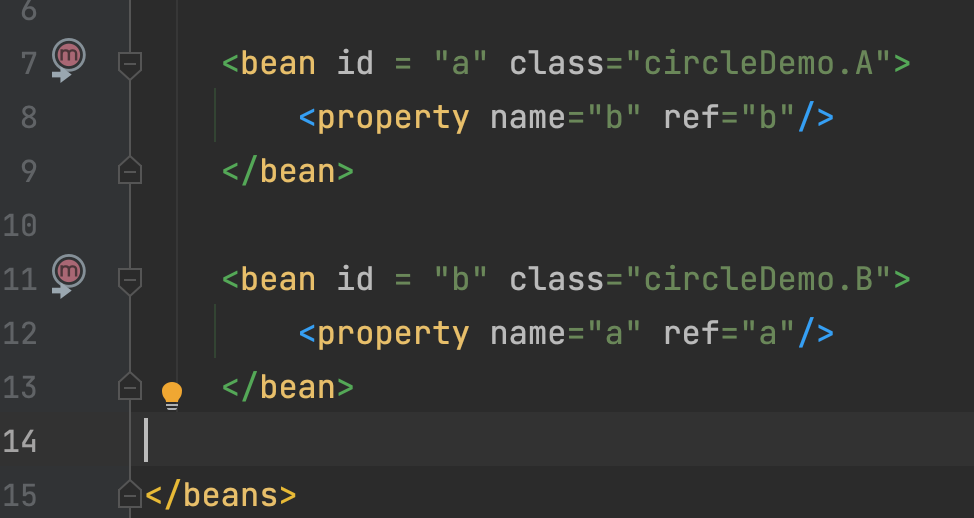
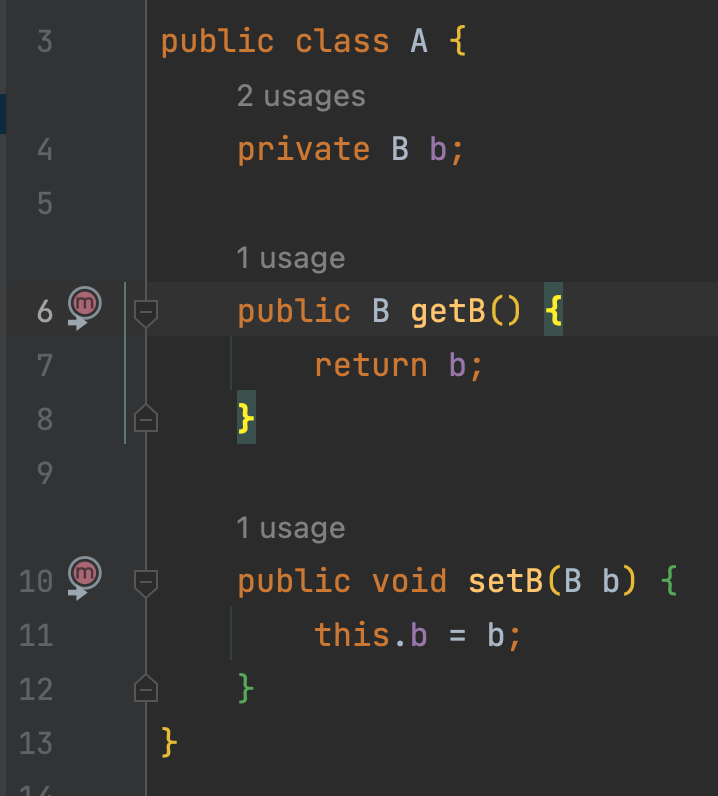
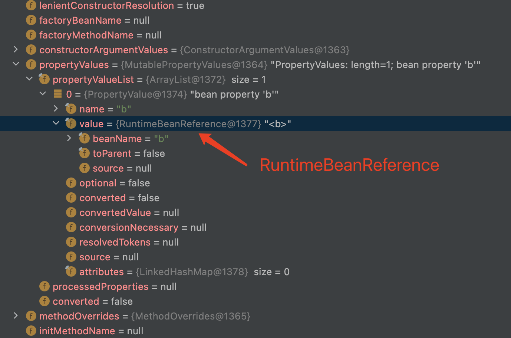
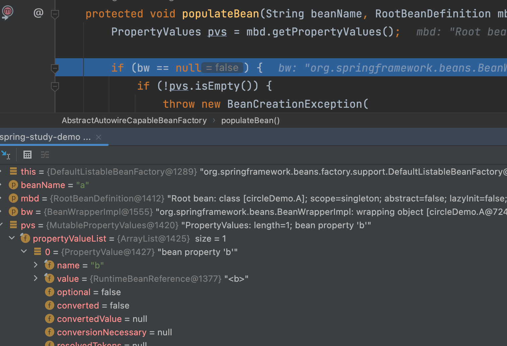
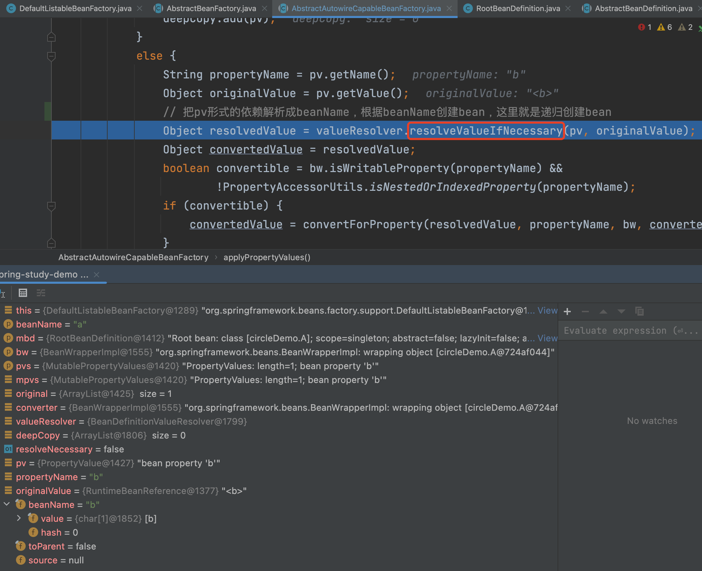
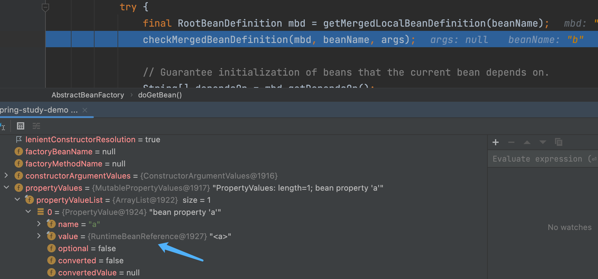
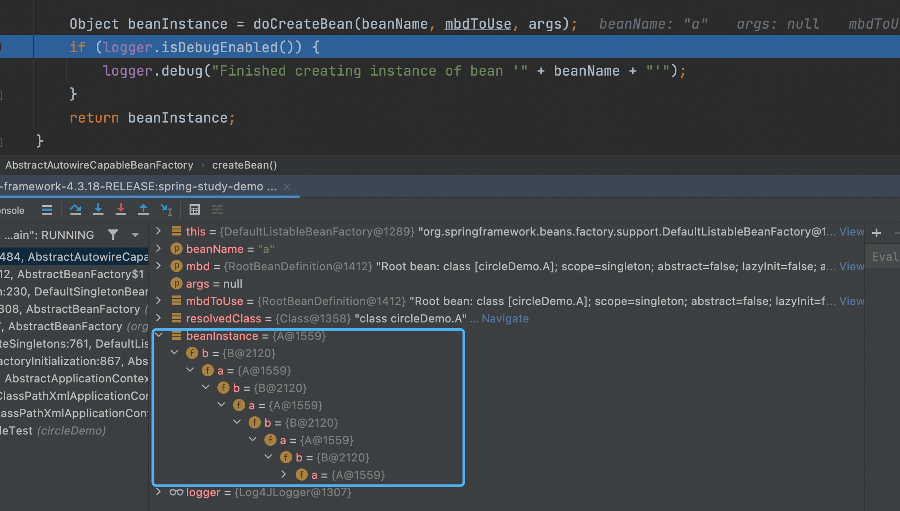
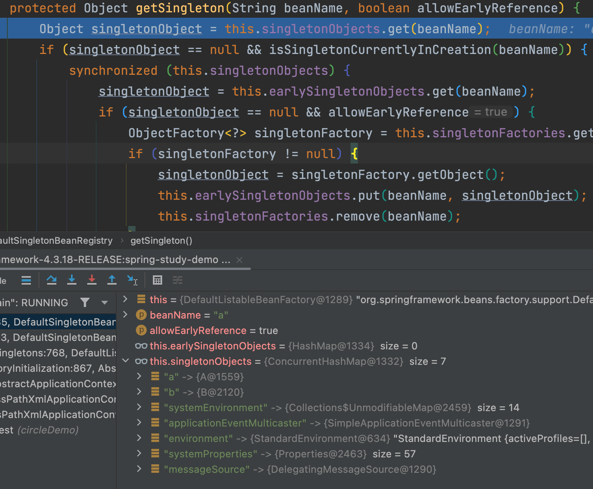

### 1，CAS
* CAS存在的问题
  
  （1）只能操作一个变量

  （2）ABA问题

  （3）CPU开销问题

* CAS的本质
  在 Java 中，Java 并没有直接实现 CAS，CAS 相关的实现是通过 C++ 内联汇编的形式实现的。Java 代码需通过 JNI 才能调用。

  CAS 是一条 CPU 的原子指令（cmpxchg指令），不会造成所谓的数据不一致问题，Unsafe 提供的 CAS 方法（如compareAndSwapXXX）底层实现即为 CPU 指令 cmpxchg

* unsafe源码
```cpp
// hotspot\src\share\vm\prims\unsafe.cpp
UNSAFE_ENTRY(jboolean, Unsafe_CompareAndSwapInt(JNIEnv *env, jobject unsafe, jobject obj, jlong offset, jint e, jint x))
  UnsafeWrapper("Unsafe_CompareAndSwapInt");
  oop p = JNIHandles::resolve(obj);
  jint* addr = (jint *) index_oop_from_field_offset_long(p, offset);
  return (jint)(Atomic::cmpxchg(x, addr, e)) == e;
UNSAFE_END

UNSAFE_ENTRY(jboolean, Unsafe_CompareAndSwapLong(JNIEnv *env, jobject unsafe, jobject obj, jlong offset, jlong e, jlong x))
  UnsafeWrapper("Unsafe_CompareAndSwapLong");
  Handle p (THREAD, JNIHandles::resolve(obj));
  jlong* addr = (jlong*)(index_oop_from_field_offset_long(p(), offset));
  if (VM_Version::supports_cx8())
    return (jlong)(Atomic::cmpxchg(x, addr, e)) == e;
  else {
    jboolean success = false;
    ObjectLocker ol(p, THREAD);
    if (*addr == e) { *addr = x; success = true; }
    return success;
  }
UNSAFE_END
```
* Atomic::cmpxchg源码
```cpp
// hotspot\src\os_cpu\linux_x86\vm\atomic_linux_x86.inline.hpp
inline jlong    Atomic::cmpxchg    (jlong    exchange_value, volatile jlong*    dest, jlong    compare_value) {
  bool mp = os::is_MP();
  __asm__ __volatile__ (LOCK_IF_MP(%4) "cmpxchgq %1,(%3)"
                        : "=a" (exchange_value)
                        : "r" (exchange_value), "a" (compare_value), "r" (dest), "r" (mp)
                        : "cc", "memory");
  return exchange_value;
}

// hotspot\src\os_cpu\linux_x86\vm\atomic_windows_x86.inline.hpp
inline jint     Atomic::cmpxchg    (jint     exchange_value, volatile jint*     dest, jint     compare_value) {
  return (*os::atomic_cmpxchg_func)(exchange_value, dest, compare_value);
}

inline jint Atomic::cmpxchg (jint exchange_value, volatile jint* dest, jint compare_value) {
	// alternative for InterlockedCompareExchange 
	int mp = os::is_MP(); 
	__asm { 
		mov edx, 
		dest mov ecx, 
		exchange_value mov eax, 
		compare_value LOCK_IF_MP(mp) 
		cmpxchg dword ptr [edx], ecx 
	} 
}
```

### 2，CPU指令环

Intel的CPU将特权级别分为4个级别：RING0,RING1,RING2,RING3。

Windows只使用其中的两个级别RING0和RING3，RING0只给操作系统用，RING3谁都能用。如果普通应用程序企图执行RING0指令，则Windows会显示“非法指令”错误信息。

ring0是指CPU的运行级别，ring0是最高级别，ring1次之，ring2更次之……

### 3，垃圾回收器

* 种类
  
  （1）Serial收集器 + Serial Old收集器
  （2）ParNew收集器：Serial收集器的多线程版本
  （3）Parallel Scavenge收集器 + Parallel Old收集器
  （4）CMS：concurrent mark sweep
  （5）G1

* CMS收集器
  阶段：
  （1）初始标记

  （2）并发标记

  （3）重新标记

  （4）并发清除
  缺点：
    a. 对CPU资源敏感（会和服务抢资源）
    b. 无法处理浮动垃圾，有可能出现“Concurrent Mode Failure"失败进而导致另一次完全"stop the world"的Full GC的产生，临时启用Serial Old收集器来重新进行老年代的垃圾收集，但这样停顿时间就很长了
    c. 大量空间碎片的产生

* 三色标记

  漏标，两种解决方案：增量更新，原始快照SATB

  增量更新：黑色对象一旦新插入了指向白色对象的引用之后，它就变回灰色对象了

  SATB：无论引用关系删除与否，都会按照刚刚开始扫描那一刻的对象图快照来进行搜索

* G1收集器

  （1）初始标记

  （2）并发标记：同CMS的并发标记

  （3）最终标记：同CMS的重新标记

  （4）筛选回收

* ZGC收集器

  （1）并发标记

  （2）并发预备重分配

  （3）并发重分配

  （4）并发重映射

### 4，动态分派
* 概念：在运行期根据实际类型确定方法执行版本的分派过程
  
* 多态性的根源：虚方法调用指令invokevirtual的执行逻辑
  
* invokevirtual指令的运行时解析过程
  1）找到操作数栈顶的第一个元素所指向的对象的实际类型，记作C。
  2）如果在类型C中找到与常量中的描述符和简单名称都相符的方法，则进行访问权限校验，如果通过则返回这个方法的直接引用，查找过程结束；不通过则返回java.lang.IllegalAccessError异常。
  3）否则，按照继承关系从下往上依次对C的各个父类进行第二步的搜索和验证过程。
  4）如果始终没有找到合适的方法，则抛出java.lang.AbstractMethodError异常。

* 方法重写的本质
  因为invokevirtual指令执行的第一步就是在运行期确定接收者的实际类型，所以2次调用中的invokevirtual指令并不是把常量池中方法的符号引用解析到直接引用上就结束了，还会根据方法接收者的实际类型来选择方法版本。

* 虚拟机动态分派的实现
  动态分派是执行非常频繁的动作，而且动态分派的方法版本选择过程需要运行时在接收者类型的方法元数据中搜索合适的目标方法，因此，Java虚拟机实现基于执行性能的考虑，真正运行时一般不会如此频繁地去反复搜索类型元数据。面对这种情况，一种基础而且常见的优化手段是为类型在方法区中建立一个虚方法表，使用虚方法表索引来代替元数据查找，以提高性能。

* 虚方法
  Java对象里面的方法默认（即不使用final修饰）就是虚方法。

### 5，符号引用，直接引用
* 符号引用：以字符串的形式存在。
* 直接引用：运行时实际内存地址
* 解析：目标主要是将常量池中的以下4类符号引用转换为直接引用
  1）类；
  2）接口；
  3）字段；
  4）类方法和接口方法

### 6，DMA(Direct Memory Access)
DMA的工作原理是，如果按数据块进行I/O，即需要传输大量数据时，就无须CPU的介入。在这种情况下，我们可以让I/O设备与计算机内存进行直接数据交换。而CPU则可以去忙别的事情。这种将CPU的介入减少的I/O模式称为直接内存访问。

问题是，将CPU从繁忙等待中解脱出来，难道DMA的整个数据读写过程不需要使用处理器的功能吗？当然不是。数据传输当然使用CPU，只不过这里使用的CPU不是计算机里面所有进程共享的CPU，而是由另外一个CPU来负责数据传输。这个另外的CPU就是DMA控制器。

也许读者会问，这有什么意思，还是需要CPU繁忙等待，只不过换成一个不同的CPU来进行繁忙等待。何必这么麻烦呢？还不如就让通用CPU来处理。这里的关键是DMA里面的CPU可以比通用CPU简单，而且价格便宜很多，它只需要能够以不慢于I/O设备的速度进行数据读写即可。其他复杂功能，如算数运算、移位、逻辑运算等功能皆可以不要。

DMA控制器既可以构建在设备控制器里面，也可以作为独立的实体挂在计算机主板上。而以独立形式存在的DMA控制器更为常见。

原文链接：https://blog.csdn.net/u010711495/article/details/119075935

### 8，推荐用自定义的线程池

```java
/** 
FixedThreadPool和SingleThreadPool使用的队列是LinkedBlockingQueue,这是无界队列，允许请求的最大长度为：Integer.MAX_VALUE，
可能会堆积大量的请求，从而导致OOM
*/
public static ExecutorService newFixedThreadPool(int nThreads) {
    return new ThreadPoolExecutor(nThreads, nThreads, 
                                  0L, TimeUnit.MILLISECONDS, 
                                  new LinkedBlockingQueue<Runnable>());
}

public static ExecutorService newSingleThreadExecutor() {
    return new FinalizableDelegatedExecutorService
        (new ThreadPoolExecutor(1, 1,
                                0L, TimeUnit.MILLISECONDS,
                                new LinkedBlockingQueue<Runnable>()));
}

/**
看看LinkedBlockingQueue的容量大小：Integer.MAX_VALUE
*/
public LinkedBlockingQueue() {
    this(Integer.MAX_VALUE);
}


/**
CachedThreadPool和ScheduleThreadPool允许的创建线程数量为：Integer.MAX_VALUE，可能会创建大量的线程，从而导致OOM
*/
public static ExecutorService newCachedThreadPool() {
    return new ThreadPoolExecutor(0, Integer.MAX_VALUE,
                                      60L, TimeUnit.SECONDS,
                                      new SynchronousQueue<Runnable>());
}

public static ScheduledExecutorService newScheduledThreadPool(int corePoolSize) {
    return new ScheduledThreadPoolExecutor(corePoolSize);
}

// ScheduledThreadPoolExecutor类
public ScheduledThreadPoolExecutor(int corePoolSize) {
    super(corePoolSize, Integer.MAX_VALUE, 0, NANOSECONDS,
          new DelayedWorkQueue());
}

/**
线程池参数分析
corePoolSize : 核心线程数
maximumPoolSize : 最大线程数
keepAliveTime : 非核心线程的超时时长,如果非核心线程闲置时间超过keepAliveTime之后，就会被回收。如果设置allowCoreThreadTimeOut为true，则该参数也表示           核心线程的超时时长
unit : 超时时长单位
workQueue : 线程池中的任务队列，该队列主要用来存储已经被提交但是尚未执行的任务
handler : 拒绝策略
*/
public ThreadPoolExecutor(int corePoolSize,
        int maximumPoolSize,
        long keepAliveTime,
        TimeUnit unit,
        BlockingQueue<Runnable> workQueue,
        RejectedExecutionHandler handler)
```

### 9，HashMap中能保证有序的是哪个Map ？

```java
/**
The iteration ordering method for this linked hash map: true for access-order, false for insertion-order.
true 访问顺序，false 插入顺序
*/
final boolean accessOrder;
```

### 10，Spring的事务传播和隔离级别有哪些？

查看Spring的Propagation枚举类：

```java
public enum Propagation {

   REQUIRED(TransactionDefinition.PROPAGATION_REQUIRED),

   SUPPORTS(TransactionDefinition.PROPAGATION_SUPPORTS),

   MANDATORY(TransactionDefinition.PROPAGATION_MANDATORY),

   REQUIRES_NEW(TransactionDefinition.PROPAGATION_REQUIRES_NEW),

   NOT_SUPPORTED(TransactionDefinition.PROPAGATION_NOT_SUPPORTED),

   NEVER(TransactionDefinition.PROPAGATION_NEVER),

   NESTED(TransactionDefinition.PROPAGATION_NESTED);

   private final int value;

   Propagation(int value) {
      this.value = value;
   }

   public int value() {
      return this.value;
   }

}

// 查看org.springframework.transaction.TransactionDefinition   
int PROPAGATION_REQUIRED = 0;

int PROPAGATION_SUPPORTS = 1;

int PROPAGATION_MANDATORY = 2;

int PROPAGATION_REQUIRES_NEW = 3;

int PROPAGATION_NOT_SUPPORTED = 4;

int PROPAGATION_NEVER = 5;

int PROPAGATION_NESTED = 6;

int ISOLATION_DEFAULT = -1;

int ISOLATION_READ_UNCOMMITTED = Connection.TRANSACTION_READ_UNCOMMITTED;

int ISOLATION_READ_COMMITTED = Connection.TRANSACTION_READ_COMMITTED;

int ISOLATION_REPEATABLE_READ = Connection.TRANSACTION_REPEATABLE_READ;

int ISOLATION_SERIALIZABLE = Connection.TRANSACTION_SERIALIZABLE;

int TIMEOUT_DEFAULT = -1;

int getPropagationBehavior();

int getIsolationLevel();

int getTimeout();

boolean isReadOnly();

String getName();

// 隔离级别，java.sql.Connection
int TRANSACTION_NONE             = 0;

int TRANSACTION_READ_UNCOMMITTED = 1;

int TRANSACTION_READ_COMMITTED   = 2;

int TRANSACTION_REPEATABLE_READ  = 4;

int TRANSACTION_SERIALIZABLE     = 8;
```

### 11，死锁

（1）产生死锁必须具备以下4个条件

**互斥**

**请求与保持**

**不剥夺**

**循环等待**

（2）避免死锁

**破坏互斥**   无法破坏

**破坏请求与保持**  一次性申请所有的资源

**破坏不剥夺**  占用部分资源的线程，进一步申请其他资源时，如果申请不到，可以主动释放已占有的资源

**破坏循环等待**  按序申请资源

### 12，Raft选举算法

（1）节点A发生故障，节点B和节点C没有收到领导者节点A的心跳信息，等待超时

（2）节点C（175 ms）先发生超时，节点C成为候选人。

（3）节点C向节点A和节点B发起请求投票信息

（4）节点B响应投票，将票投给了C，而节点A因为发生故障，无法响应C的投票请求

（5）节点C收到2票（大多数票数），成为新的领导者

（6）节点C向节点A和节点B发送心跳信息，节点B响应心跳信息，节点A不响应心跳信息

（7）节点A恢复后，收到节点C的高任期消息，自身将成为跟随者，接收节点C的消息

### 13，Raft算法的几个关键机制

（1）任期机制

（2）领导者心跳信息

（3）随机选举的超时时间

（4）先来先服务的投票原则

（5）大多数选票原则

### 14，HashMap的put方法

```java
final V putVal(int hash, K key, V value, boolean onlyIfAbsent,
                   boolean evict) {
    Node<K,V>[] tab; Node<K,V> p; int n, i;
    // 懒加载：table一开始并未初始化或者长度为0，在put元素之后才加载
    if ((tab = table) == null || (n = tab.length) == 0)
        n = (tab = resize()).length;
    /** 
    (n - 1) & hash 确定元素存放在哪个桶中，桶为空，新生成结点放入桶中(此时，这个结点是放在数组中)
    哈希值赋值给i，tab[i]赋值给p，即 p = tab[i = (n - 1) & hash]，虽然是在if分支里，但p变量在方法内第一行，所以能在后续else中使用
    相当于在if之前赋值，if和else都能使用此赋值
    p = tab[i = (n - 1) & hash];
    if (p == null)
        tab[i] = newNode(hash, key, value, null);
    else {
        ......
    }
    */
    if ((p = tab[i = (n - 1) & hash]) == null)
        tab[i] = newNode(hash, key, value, null);
    // 桶中已经存在元素：hash值相同
    else {
        Node<K,V> e; K k;
        // 比较桶中第一个元素(数组中的结点), 如果hash值相等，key相等
        if (p.hash == hash &&
            ((k = p.key) == key || (key != null && key.equals(k))))
                // 将第一个元素赋值给e，用e来记录，后面将e进行旧值覆盖
                e = p;
        // key不相等且为红黑树结点
        else if (p instanceof TreeNode)
            // 放入树中
            e = ((TreeNode<K,V>)p).putTreeVal(this, tab, hash, key, value);
        // 为链表结点
        else {
            // 在链表最末插入结点
            for (int binCount = 0; ; ++binCount) {
                // 到达链表的尾部
                if ((e = p.next) == null) {
                    // 在尾部插入新结点
                    p.next = newNode(hash, key, value, null);
                    // 结点数量达到阈值，转化为红黑树
                    if (binCount >= TREEIFY_THRESHOLD - 1) // -1 for 1st
                        treeifyBin(tab, hash);
                    // 跳出循环
                    break;
                }
                // 判断链表中结点的key值与插入的元素的key值是否相等
                if (e.hash == hash &&
                    ((k = e.key) == key || (key != null && key.equals(k))))
                    // 相等，跳出循环，等待后续操作覆盖旧值
                    break;
                // 用于遍历桶中的链表，与前面的e = p.next组合，可以遍历链表
                p = e;
            }
        }
        // 表示在桶中找到key值、hash值与插入元素相等的结点，进行旧值覆盖
        if (e != null) { 
            // 记录e的value
            V oldValue = e.value;
            // onlyIfAbsent为false或者旧值为null
            if (!onlyIfAbsent || oldValue == null)
                //用新值替换旧值
                e.value = value;
            // 访问后回调
            afterNodeAccess(e);
            // 返回旧值
            return oldValue;
        }
    }
    // 结构性修改
    ++modCount;
    // 实际大小大于阈值则扩容
    if (++size > threshold)
        resize();
    // 插入后回调
    afterNodeInsertion(evict);
    return null;
}
```

### 15，GC Root对象有哪些

（1）虚拟机栈（栈桢中的本地变量表）中引用的对象

（2）方法区中类静态属性引用的对象

（3）方法区中常量引用的对象

（4）本地方法栈中JNI即一般说的native方法引用的对象

（5）Java虚拟机内部的引用：基本数据类型对应的Class对象，一些常驻的异常对象（比如NullPorintException, OutOfMemeryError）等，还有系统类加载器

（6）所有被同步锁（synchronized关键字）持有的对象

（7）反映Java虚拟机内部的JMXBean, JVMTI中注册的回调、本地代码缓存等

### 16，引用的分类

（1）强引用

（2）软引用：内存不够时，会被回收

（3）弱引用：不管内存够不够用，都会被回收

（4）虚引用

### 17，不再被使用的类

（1）该类所有的实例都已经被回收

（2）加载该类的类加载器已被回收

（3）该类对应的java.lang.Class对象没有任何地方引用

### 18，跳跃表

#### （1）Redis中的实现

​    Server.h类中的zskiplist

#### （2）JDK中的实现

​    ConcurrentSkipListMap.java


### 19，dubbo的整体架构设计和分层

#### （1）5个角色<br>

* 注册中心registry：服务注册与发现<br>

* 服务提供者provider：暴露服务<br>

* 服务消费者consumer：调用远程服务<br>

* 监控中心monitor：统计服务的调用次数和调用时间<br>

* 容器container：服务允许容器<br>

#### （2）调用流程<br>

* container容器负责启动、加载、运行provider<br>

* provider在启动时，向registry中心注册自己提供的服务<br>

* consumer在启动时，向registry中心订阅自己所需的服务<br>

* registry返回服务提供者列表给consumer，如果有变更，registry将基于长连接发送变更给consumer<br>

* consumer调用provider服务，基于负载均衡算法进行调用<br>

* consumer调用provider的统计，基于短连接定时每分钟一次统计到monitor<br>

#### （3）分层<br>

* 接口服务层（Service）：面向开发者、业务代码、接口、实现等<br>

* 配置层（Config）：对外配置接口，以ServiceConfig与ReferenceConfig为中心<br>

* 服务代理层（Proxy）：对生产者和消费者、dubbo都会产生一个代理类封装调用细节，业务层对调用细节无感<br>

* 服务注册层（Registry）：封装服务地址的注册与发现，以服务URL为中心<br>

* 路由层（Cluster）：封装多个提供者的路由和负载均衡，并桥接注册中心<br>

* 监控层（Monitor）：RPC调用次数和调用时间监控<br>

* 远程调用层（Protocol）：封装RPC调用<br>

* 信息交换层（Exchange）：封装请求响应模式，同步转异步<br>

* 网络传输层（Transport）：抽象mina和netty为统一接口，统一网络传输接口<br>

* 数据序列化层（Serialize）：数据传输的序列化和反序列化<br>

### 20，ZAB协议与RAFT协议的区别

#### （1）ZAB<br>

* Leader 一个zookeeper集群同一时刻仅能有一个Leader。Leader负责接收所有的客户端的请求。<br>
* Follower 提供读服务，参与选举。<br>
* Observer 仅提供读服务。<br>

#### （2）Raft<br>

* Leader 负责接收所有的客户端的请求。<br>
* Follower 读写请求都转发到Leader，参与选举。<br>
* Candidate 每个节点上都有一个倒计时器 (Election Timeout)，时间随机在 150ms 到 300ms 之间。在一个节点倒计时结束 (Timeout) 后，这个节点的状态变成 Candidate 开始选举，它给其他几个节点发送选举请求 (RequestVote)。选举成功则变为Leader。<br>

### 21，缓存雪崩、缓存穿透、缓存击穿

#### （1）缓存雪崩

同一时间缓存大面积失效，导致后面的请求都会落到数据库上，造成数据库短时间内承受大量请求而崩掉

#### 解决方案

* 缓存数据的过期时间设置随机，防止同一时间大量数据过期现象发生
* 给每一个缓存数据增加相应的缓存标记，记录缓存是否失效，如果缓存标记失效，则更新数据的缓存
* 缓存预热
* 互斥锁

#### （2）缓存穿透

缓存和数据库中都没有的数据，导致所有的请求都落到数据库上，造成数据库短时间内承受大量请求而崩掉

#### 解决方案：

* 接口层增加校验，如用户鉴权校验，id做基础校验，id<=0的直接拦截
* 从缓存取不到的数据，在数据库中也没有取到，这时也可以将key-value写为key-null，缓存有效时间可以设置短一点，比如30秒（设置太长会导致正常情况也没法使用）。这样可以防止攻击用户反复用同一个id暴力攻击
* 采用布隆过滤器，将所有可能存在的数据哈希到一个足够大的bitmap中，一个一定不存在的数据会被这个bitmap拦截掉，从而避免了对底层存储系统的查询压力

#### （3）缓存击穿

缓存中没有，但数据库中有的数据（一般是缓存时间到期），这时并发用户特别多，同时读缓存没读到数据，又数据库取数据，引起数据库压力瞬间增大，造成过大压力。和缓存雪崩不同的是，缓存击穿指并发查同一条数据，缓存雪崩是不同数据都过期了，很多数据都查不到从而查数据库

#### 解决方案

* 设置热点数据永远不过期
* 互斥锁

### 22，JVM性能监控工具

* jps
  
  ```
  jps -l
  ```

* jstat
  
  ```
  jstat -gc 2764 250 20
  ```

* jmap
  
  ```
  jmap -heap 158
  ```

* jstack
  
  ```
  jstack -l 3500
  ```

### 23，主动调用gc的方法

```java
System.gc();

// 源码
public static void gc() {
  Runtime.getRuntime().gc();
}
```

### 24，gitee开源许可证怎么选


参考：[代码开源如何选择开源许可证_JackieDYH的博客-CSDN博客_gitee开源许可证选哪个](https://blog.csdn.net/JackieDYH/article/details/105800230?utm_term=%E6%80%8E%E4%B9%88%E9%80%89%E6%8B%A9gitte%E7%9A%84%E5%BC%80%E6%BA%90%E8%AE%B8%E5%8F%AF%E8%AF%81&utm_medium=distribute.pc_aggpage_search_result.none-task-blog-2~all~sobaiduweb~default-1-105800230&spm=3001.4430)

### 25，dubbo服务暴露和服务消费机制


### 26，dubbo协议的魔数

```java
public class ExchangeCodec extends TelnetCodec {

    // header length.
    protected static final int HEADER_LENGTH = 16;
    // magic header.
    protected static final short MAGIC = (short) 0xdabb;
    protected static final byte MAGIC_HIGH = Bytes.short2bytes(MAGIC)[0];
    protected static final byte MAGIC_LOW = Bytes.short2bytes(MAGIC)[1];
    // 省略其它代码
}
```

### 27，dubbo protocol继承图


### 28，dubbo服务暴露代码分析

```java
export()
--> ServiceConfig.export()
--> doExport()
--> doExportUrls()
--> loadRegistries(true)
--> doExportFor1Protocol(ProtocolConfig protocolConfig, List<URL> registryURLs)
--> exportLocal(URL url)
--> proxyFactory.getInvoker(ref, (Class) interfaceClass, local)
--> ExtensionLoader.getExtensionLoader(ProxyFactory.class).getExtension("javassist")
--> extension.getInvoker(arg0, arg1, arg2)
--> StubProxyFactoryWrapper.getInvoker(T proxy, Class<T> type, URL url)
...
```

### 29，泛型

1，ParameterizedType

```
Set<String> set;
Class<Integer> clazz;
MyClass<String> myClass;
List<String> list;
class MyClass<V>{

}
```

2，TypeVariable

```
<T extends KnownType-1 & KnownType-2>

public interface TypeVariable<D extends GenericDeclaration> extends Type {

   //获得泛型的上限，若未明确声明上边界则默认为Object
    Type[] getBounds();

    //获取声明该类型变量实体(即获得类、方法或构造器名)
    D getGenericDeclaration();

    //获得名称，即K、V、E之类名称
    String getName();

    //获得注解类型的上限，若未明确声明上边界则默认为长度为0的数组
    AnnotatedType[] getAnnotatedBounds()

}
```

3，WildcardType

```
<? extends Number>
```

4，GenericArrayType

```
List<String>[] listArray; //是GenericArrayType,元素是List<String>类型，也就是ParameterizedType类型

T[] tArray; //是GenericArrayType,元素是T类型，也就是TypeVariable类型


Person[] persons; //不是GenericArrayType

List<String> strings; //不是GenericArrayType
```

### 30，hotspot源码中的juint类型

```cpp
// globalDefinitions_visCPP.hpp

// Additional Java basic types

typedef unsigned char    jubyte;
typedef unsigned short   jushort;
typedef unsigned int     juint;
typedef unsigned __int64 julong;
```

### 31，堆转储的转储是什么意思


### 32，Hotspot中定义的5种对象状态


### 33，JVM内部定义的类状态

```cpp
// hotspot/src/share/vm/oops/instanceKlass.hpp

// See "The Java Virtual Machine Specification" section 2.16.2-5 for a detailed description
// of the class loading & initialization procedure, and the use of the states.
enum ClassState {
  allocated,                          // allocated (but not yet linked)
  loaded,                             // loaded and inserted in class hierarchy (but not linked yet)
  linked,                             // successfully linked/verified (but not initialized yet)
  being_initialized,                  // currently running class initializer
  fully_initialized,                  // initialized (successfull final state)
  initialization_error                // error happened during initialization
};
```

### 34，spring源码编译，版本号：4.3.18

* 命令：./gradlew :spring-oxm:compileTestJava  编译成功


* sync 成功


### 35，调试循环依赖

（1）配置文件和依赖bean的准备





Class B的内容类似A，这里省略。

（2）开始调试，一直进入到refresh()方法 --> finishBeanFactoryInitialization --> preInstantiateSingletons()方法


可以看到，要实例化的beanNames有2个，就是我们想要的a和b。

首先是处理a，重点关注bd即beanDefinition中的propertyValues，可以看到在propertyValuesList只有一个元素：属性b，name是b，value是一个RuntimeBeanReference对象，属性beanName为b。



这是在什么时候保存的？答案是在beanDefinition解析阶段，有一个处理步骤是解析property子元素：parsePropertyElements(ele, bd)，在此方法中，比如解析xml中的a的属性b，会把property标签中的ref="b"保存为RuntimeBeanReference，源码如下：

```java
public void parsePropertyElement(Element ele, BeanDefinition bd) {
        String propertyName = ele.getAttribute(NAME_ATTRIBUTE);
        if (!StringUtils.hasLength(propertyName)) {
            error("Tag 'property' must have a 'name' attribute", ele);
            return;
        }
        this.parseState.push(new PropertyEntry(propertyName));
        try {
            if (bd.getPropertyValues().contains(propertyName)) {
                error("Multiple 'property' definitions for property '" + propertyName + "'", ele);
                return;
            }
            Object val = parsePropertyValue(ele, bd, propertyName);
            PropertyValue pv = new PropertyValue(propertyName, val);
            parseMetaElements(ele, pv);
            pv.setSource(extractSource(ele));
            bd.getPropertyValues().addPropertyValue(pv);
        }
        finally {
            this.parseState.pop();
        }
    }


public Object parsePropertyValue(Element ele, BeanDefinition bd, String propertyName) {
        String elementName = (propertyName != null) ?
                        "<property> element for property '" + propertyName + "'" :
                        "<constructor-arg> element";

        // Should only have one child element: ref, value, list, etc.
        NodeList nl = ele.getChildNodes();
        Element subElement = null;
        for (int i = 0; i < nl.getLength(); i++) {
            Node node = nl.item(i);
            if (node instanceof Element && !nodeNameEquals(node, DESCRIPTION_ELEMENT) &&
                    !nodeNameEquals(node, META_ELEMENT)) {
                // Child element is what we're looking for.
                if (subElement != null) {
                    error(elementName + " must not contain more than one sub-element", ele);
                }
                else {
                    subElement = (Element) node;
                }
            }
        }

        boolean hasRefAttribute = ele.hasAttribute(REF_ATTRIBUTE);
        boolean hasValueAttribute = ele.hasAttribute(VALUE_ATTRIBUTE);
        if ((hasRefAttribute && hasValueAttribute) ||
                ((hasRefAttribute || hasValueAttribute) && subElement != null)) {
            error(elementName +
                    " is only allowed to contain either 'ref' attribute OR 'value' attribute OR sub-element", ele);
        }

        /**
         * <bean id="a" class="test.A>
         *     <property> name="b" ref="b"/>
         * </property></bean>
         */
        if (hasRefAttribute) {
            // 获取到refName，比如是B
            String refName = ele.getAttribute(REF_ATTRIBUTE);
            if (!StringUtils.hasText(refName)) {
                error(elementName + " contains empty 'ref' attribute", ele);
            }
            // 把refName封装成RuntimeBeanReference对象
            RuntimeBeanReference ref = new RuntimeBeanReference(refName);
            ref.setSource(extractSource(ele));
            return ref;
        }
        else if (hasValueAttribute) {
            TypedStringValue valueHolder = new TypedStringValue(ele.getAttribute(VALUE_ATTRIBUTE));
            valueHolder.setSource(extractSource(ele));
            return valueHolder;
        }
        else if (subElement != null) {
            return parsePropertySubElement(subElement, bd);
        }
        else {
            // Neither child element nor "ref" or "value" attribute found.
            error(elementName + " must specify a ref or value", ele);
            return null;
        }
    }
```

然后一路跟进populateBean方法，F7进入方法：



看到autowireMode的值是0，不会走这个if分支：


重点是applyPropertyValues方法，按F7进入，来到resolveValueIfNecessary方法。
```java
// org/springframework/beans/factory/support/AbstractAutowireCapableBeanFactory.java
protected void applyPropertyValues(String beanName, BeanDefinition mbd, BeanWrapper bw, PropertyValues pvs) {
    if (pvs == null || pvs.isEmpty()) {
        return;
    }

    if (System.getSecurityManager() != null && bw instanceof BeanWrapperImpl) {
        ((BeanWrapperImpl) bw).setSecurityContext(getAccessControlContext());
    }

    MutablePropertyValues mpvs = null;
    List<PropertyValue> original;

    if (pvs instanceof MutablePropertyValues) {
        mpvs = (MutablePropertyValues) pvs;
        if (mpvs.isConverted()) {
            // Shortcut: use the pre-converted values as-is.
            try {
                bw.setPropertyValues(mpvs);
                return;
            }
            catch (BeansException ex) {
                throw new BeanCreationException(
                        mbd.getResourceDescription(), beanName, "Error setting property values", ex);
            }
        }
        original = mpvs.getPropertyValueList();
    }
    else {
        original = Arrays.asList(pvs.getPropertyValues());
    }

    TypeConverter converter = getCustomTypeConverter();
    if (converter == null) {
        converter = bw;
    }
    BeanDefinitionValueResolver valueResolver = new BeanDefinitionValueResolver(this, beanName, mbd, converter);

    // Create a deep copy, resolving any references for values.
    List<PropertyValue> deepCopy = new ArrayList<PropertyValue>(original.size());
    boolean resolveNecessary = false;
    for (PropertyValue pv : original) {
        if (pv.isConverted()) {
            deepCopy.add(pv);
        }
        else {
            String propertyName = pv.getName();
            Object originalValue = pv.getValue();
            // 把pv形式的依赖解析成beanName，根据beanName创建bean，这里就是创建依赖bean的地方
            Object resolvedValue = valueResolver.resolveValueIfNecessary(pv, originalValue);
            Object convertedValue = resolvedValue;
            boolean convertible = bw.isWritableProperty(propertyName) &&
                    !PropertyAccessorUtils.isNestedOrIndexedProperty(propertyName);
            if (convertible) {
                convertedValue = convertForProperty(resolvedValue, propertyName, bw, converter);
            }
            // Possibly store converted value in merged bean definition,
            // in order to avoid re-conversion for every created bean instance.
            if (resolvedValue == originalValue) {
                if (convertible) {
                    pv.setConvertedValue(convertedValue);
                }
                deepCopy.add(pv);
            }
            else if (convertible && originalValue instanceof TypedStringValue &&
                    !((TypedStringValue) originalValue).isDynamic() &&
                    !(convertedValue instanceof Collection || ObjectUtils.isArray(convertedValue))) {
                pv.setConvertedValue(convertedValue);
                deepCopy.add(pv);
            }
            else {
                resolveNecessary = true;
                deepCopy.add(new PropertyValue(pv, convertedValue));
            }
        }
    }
    if (mpvs != null && !resolveNecessary) {
        mpvs.setConverted();
    }

    // Set our (possibly massaged) deep copy.
    try {
        bw.setPropertyValues(new MutablePropertyValues(deepCopy));
    }
    catch (BeansException ex) {
        throw new BeanCreationException(
                mbd.getResourceDescription(), beanName, "Error setting property values", ex);
    }
}
```



进入valueResolver的resolveValueIfNecessary方法，来到第一个分支，进入resolveReference方法，发现依赖bean（此处是b）是在这里创建的，熟悉的beanFactory.getBean()方法。

```java
public Object resolveValueIfNecessary(Object argName, Object value) {
        // We must check each value to see whether it requires a runtime reference
        // to another bean to be resolved.
        if (value instanceof RuntimeBeanReference) {
            RuntimeBeanReference ref = (RuntimeBeanReference) value;
            return resolveReference(argName, ref);
        }
        else if (value instanceof RuntimeBeanNameReference) {
            String refName = ((RuntimeBeanNameReference) value).getBeanName();
            refName = String.valueOf(doEvaluate(refName));
            if (!this.beanFactory.containsBean(refName)) {
                throw new BeanDefinitionStoreException(
                        "Invalid bean name '" + refName + "' in bean reference for " + argName);
            }
            return refName;
        }
// 省略
}

// 创建bean
private Object resolveReference(Object argName, RuntimeBeanReference ref) {
        try {
            String refName = ref.getBeanName();
            refName = String.valueOf(doEvaluate(refName));
            if (ref.isToParent()) {
                if (this.beanFactory.getParentBeanFactory() == null) {
                    throw new BeanCreationException(
                            this.beanDefinition.getResourceDescription(), this.beanName,
                            "Can't resolve reference to bean '" + refName +
                            "' in parent factory: no parent factory available");
                }
                return this.beanFactory.getParentBeanFactory().getBean(refName);
            }
            else {
                /**
                 * populateBean时发现有依赖bean，则创建依赖bean
                 */
                Object bean = this.beanFactory.getBean(refName);
                this.beanFactory.registerDependentBean(refName, this.beanName);
                return bean;
            }
        }
        catch (BeansException ex) {
            throw new BeanCreationException(
                    this.beanDefinition.getResourceDescription(), this.beanName,
                    "Cannot resolve reference to bean '" + ref.getBeanName() + "' while setting " + argName, ex);
        }
    }
```

创建b，又会重新进入getBean, doGetBean, createBean, doCreateBean

同样的，创建b时发现bd中propertyValues存放的a的value也是RuntimeBeanReference类型。



创建完成之后，a中有b，b中有a，循环往复：



一直按F8之后，回到这里：


因为以上所有的操作，都是这个循环开始处理beanName为a的情况，处理完之后回到这里，开始处理beanName为b的情况。


完成之后，可以看到缓存的情况：



### 36，mybatis调试sql

```java
// 一路F7，进入CachingExecutor类
public <E> List<E> query(MappedStatement ms, Object parameterObject, RowBounds rowBounds, ResultHandler resultHandler) throws SQLException {
  BoundSql boundSql = ms.getBoundSql(parameterObject);
  CacheKey key = createCacheKey(ms, parameterObject, rowBounds, boundSql);
  return query(ms, parameterObject, rowBounds, resultHandler, key, boundSql);
}
// MappedStatement类
public BoundSql getBoundSql(Object parameterObject) {
  BoundSql boundSql = sqlSource.getBoundSql(parameterObject);
  List<ParameterMapping> parameterMappings = boundSql.getParameterMappings();
  if (parameterMappings == null || parameterMappings.size() <= 0) {
    boundSql = new BoundSql(configuration, boundSql.getSql(), parameterMap.getParameterMappings(), parameterObject);
  }

  // check for nested result maps in parameter mappings (issue #30)
  for (ParameterMapping pm : boundSql.getParameterMappings()) {
    String rmId = pm.getResultMapId();
    if (rmId != null) {
      ResultMap rm = configuration.getResultMap(rmId);
      if (rm != null) {
        hasNestedResultMaps |= rm.hasNestedResultMaps();
      }
    }
  }

  return boundSql;
}

// 进入getBoundSql方法，来到DynamicSqlSource类
public BoundSql getBoundSql(Object parameterObject) {
  DynamicContext context = new DynamicContext(configuration, parameterObject);
  rootSqlNode.apply(context);
  SqlSourceBuilder sqlSourceParser = new SqlSourceBuilder(configuration);
  Class<?> parameterType = parameterObject == null ? Object.class : parameterObject.getClass();
  SqlSource sqlSource = sqlSourceParser.parse(context.getSql(), parameterType, context.getBindings());
  BoundSql boundSql = sqlSource.getBoundSql(parameterObject);
  for (Map.Entry<String, Object> entry : context.getBindings().entrySet()) {
    boundSql.setAdditionalParameter(entry.getKey(), entry.getValue());
  }
  return boundSql;
}
```


```java
// 进入rootSqlNode.apply方法,来到MixedSqlNode
public class MixedSqlNode implements SqlNode {
  private List<SqlNode> contents;

  public MixedSqlNode(List<SqlNode> contents) {
    this.contents = contents;
  }

  public boolean apply(DynamicContext context) {
    for (SqlNode sqlNode : contents) {
      sqlNode.apply(context);
    }
    return true;
  }
}

// 进入apply方法，来到TextSqlNode类
public boolean apply(DynamicContext context) {
  GenericTokenParser parser = createParser(new BindingTokenParser(context));
  context.appendSql(parser.parse(text));
  return true;
}

private GenericTokenParser createParser(TokenHandler handler) {
  return new GenericTokenParser("${", "}", handler);
}

// 进入apply方法，来到StaticTextSqlNode类
public class StaticTextSqlNode implements SqlNode {
  private String text;

  public StaticTextSqlNode(String text) {
    this.text = text;
  }

  public boolean apply(DynamicContext context) {
    context.appendSql(text);
    return true;
  }

}
```

### 37，创建对象
* 概述
  字节码new表示创建对象，虚拟机遇到该指令时，从栈顶取得目标对象在常量池中的索引，接着定位到目标对象的类型。接下来，虚拟机将根据该类的状态，采用相应的内存分配技术，在内存中分配实例空间，并完全实例数据和对象头的初始化。这样，一个对象就在JVM中创建好了
* 创建流程
  （1）获取目标对象在常量池中的索引
  （2）定位到目标对象的类型instanceKlass
  （3）验证类是否被解析，是否被初始化，是否满足快速分配条件
  （4）若满足快速分配条件，则进入快速分配流程
  （5）若不满足快速分配条件，或快速分配失败，则进入慢速分配流程
* 快速分配
  （1）分配内存：两种空间选择策略：TLAB，EDEN
  （2）初始化实例：填零
```cpp
// hotspot/src/share/vm/interpreter/bytecodeInterpreter.cpp
// Initialize object (if nonzero size and need) and then the header
if (need_zero ) {
  HeapWord* to_zero = (HeapWord*) result + sizeof(oopDesc) / oopSize;
  obj_size -= sizeof(oopDesc) / oopSize;
  if (obj_size > 0 ) {
    memset(to_zero, 0, obj_size * HeapWordSize);
  }
}
```
  （3）设置对象头
    设置Mark Word
    设置类型元数据指针
  （4）设置栈顶对象引用
* 慢速分配
  （1）解析：对类进行解析，确保类及依赖类已得到正确的解析和初始化
  （2）和快速分配一样的步骤
```cpp
// hotspot/src/share/vm/interpreter/interpreterRuntime.cpp
IRT_ENTRY(void, InterpreterRuntime::_new(JavaThread* thread, ConstantPool* pool, int index))
  Klass* k_oop = pool->klass_at(index, CHECK);
  instanceKlassHandle klass (THREAD, k_oop);

  // Make sure we are not instantiating an abstract klass
  klass->check_valid_for_instantiation(true, CHECK);

  // Make sure klass is initialized
  klass->initialize(CHECK);

  // At this point the class may not be fully initialized
  // because of recursive initialization. If it is fully
  // initialized & has_finalized is not set, we rewrite
  // it into its fast version (Note: no locking is needed
  // here since this is an atomic byte write and can be
  // done more than once).
  //
  // Note: In case of classes with has_finalized we don't
  //       rewrite since that saves us an extra check in
  //       the fast version which then would call the
  //       slow version anyway (and do a call back into
  //       Java).
  //       If we have a breakpoint, then we don't rewrite
  //       because the _breakpoint bytecode would be lost.
  oop obj = klass->allocate_instance(CHECK);
  thread->set_vm_result(obj);
IRT_END
```