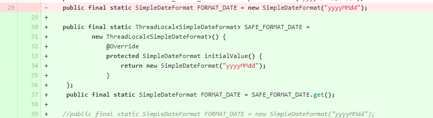

# jdk文档之一

## 序号（1~30）

### 1，CountDownLatch与CyclicBarrier的区别

(1) CountDownLatch适用于所有线程通过某一点后通知方法,而CyclicBarrier则适合让所有线程在同一点同时执行
(2) CountDownLatch利用继承AQS的共享锁来进行线程的通知,利用CAS来进行--,而CyclicBarrier则利用ReentrantLock的Condition来阻塞和通知线程

```java
// 1, CountDownLatch
public class CountDownLatch {
    /**
     * Synchronization control For CountDownLatch.
     * Uses AQS state to represent count.
     */
    private static final class Sync extends AbstractQueuedSynchronizer {
        private static final long serialVersionUID = 4982264981922014374L;

        Sync(int count) {
            setState(count);
        }
        // 省略
    }
    // 省略
}

// 2, CyclicBarrier
public class CyclicBarrier {
    /**
     * Each use of the barrier is represented as a generation instance.
     * The generation changes whenever the barrier is tripped, or
     * is reset. There can be many generations associated with threads
     * using the barrier - due to the non-deterministic way the lock
     * may be allocated to waiting threads - but only one of these
     * can be active at a time (the one to which {@code count} applies)
     * and all the rest are either broken or tripped.
     * There need not be an active generation if there has been a break
     * but no subsequent reset.
     */
    private static class Generation {
        boolean broken = false;
    }

    /** The lock for guarding barrier entry */
    private final ReentrantLock lock = new ReentrantLock();

    // 省略
}
```

### 2，jdk源码中类似的代码：

（1）HashMap中的tableSizeFor方法

```java
static final int tableSizeFor(int cap) {
    int n = cap - 1;
    n |= n >>> 1;
    n |= n >>> 2;
    n |= n >>> 4;
    n |= n >>> 8;
    n |= n >>> 16;
    return (n < 0) ? 1 : (n >= MAXIMUM_CAPACITY) ? MAXIMUM_CAPACITY : n + 1;
}

例如，参数cap为十进制的14，n就是13：
13      0000 1101

>>>1    0000 0110
|=      0000 1111
>>>2    0000 0011
|=      0000 1111    (15)
>>>4    0000 0000
|=      0000 1111    (15)
>>>8    0000 0000
|=      0000 1111    (15)

经过多次右移之后再进行 | 运算，结果是最右边四位都是1
n = 15
n + 1 = 16
```

（2）Integer中的highestOneBit方法

```java
public static int highestOneBit(int i) {
    // HD, Figure 3-1
    i |= (i >>  1);
    i |= (i >>  2);
    i |= (i >>  4);
    i |= (i >>  8);
    i |= (i >> 16);
    return i - (i >>> 1);
}
例如，i为十进制的13：
13      0000 1101
>>1     0000 0110
|=      0000 1111
>>2     0000 0011
|=      0000 1111    (15)
>>4     0000 0000
|=      0000 1111    (15)
>>8     0000 0000
|=      0000 1111    (15)
经过多次右移之后再进行 | 运算，结果是最右边四位都是1
i           0000 1111  (15)
i >>> 1     0000 0111  (7)
i - (i >>> 1) 得到
0000 1000  (8)
即15 - 7 = 8
```

* System.out.print方法都带synchronized锁

```java
public final static PrintStream out = null;    // System类中

// PrintStream类
public void print(String s) {
    if (s == null) {
        s = "null";
    }
    write(s);
}

// write方法带有synchronized
private void write(String s) {
    try {
        synchronized (this) {
            ensureOpen();
            textOut.write(s);
            textOut.flushBuffer();
            charOut.flushBuffer();
            if (autoFlush && (s.indexOf('\n') >= 0))
                out.flush();
        }
    }
    catch (InterruptedIOException x) {
        Thread.currentThread().interrupt();
    }
    catch (IOException x) {
        trouble = true;
    }
}
```

* System类的identityHashCode方法

```java
// java.lang.System 此方法返回由Object.hashCode返回的值
/**
 * Returns the same hash code for the given object as
 * would be returned by the default method hashCode(),
 * whether or not the given object's class overrides
 * hashCode().
 * The hash code for the null reference is zero.
 *
 * @param x object for which the hashCode is to be calculated
 * @return  the hashCode
 * @since   JDK1.1
 */
public static native int identityHashCode(Object x);
```

* java.util包中有一个Objects工具类

有equals, deepEquals, hashCode, hash, toString, compare等方法

```java
public static int hashCode(Object o) {
    return o != null ? o.hashCode() : 0;
}

public static int hash(Object... values) {
    return Arrays.hashCode(values);
}
```

* 在Arrays中有使用Array.newInstance方法

```java
public static <T,U> T[] copyOf(U[] original, int newLength, Class<? extends T[]> newType) {
    @SuppressWarnings("unchecked")
    T[] copy = ((Object)newType == (Object)Object[].class)
            ? (T[]) new Object[newLength]
            : (T[]) Array.newInstance(newType.getComponentType(), newLength);
    System.arraycopy(original, 0, copy, 0,
                         Math.min(original.length, newLength));
    return copy;
}

// Array.class在反射包(java.lang.reflect)中
```

### 3，HashMap允许null键和null值吗？
允许。因为key唯一，所以只能有一个null键，而value为null，可以有多个

### 4，HashMap中能保证元素有序的是哪个Map？

怎么保证有序？
查看源码，我们也会发现，linkedHashMap只是维护了一个链表Entry，并没有put、remove方法的具体实现。

```java
    static class Entry<K,V> extends HashMap.Node<K,V> {
        Entry<K,V> before, after;
        Entry(int hash, K key, V value, Node<K,V> next) {
            super(hash, key, value, next);
        }
    }

    private static final long serialVersionUID = 3801124242820219131L;

    /**
     * The head (eldest) of the doubly linked list.
     */
    transient LinkedHashMap.Entry<K,V> head;

    /**
     * The tail (youngest) of the doubly linked list.
     */
    transient LinkedHashMap.Entry<K,V> tail;
    /**
    The iteration ordering method for this linked hash map: true for access-order, false for insertion-order.
    true 访问顺序，false 插入顺序
    */
final boolean accessOrder;
```

添加元素要调用父类的put方法：
而linkedHashMap重写了newNode方法：

```java
/**
先new一个节点，然后调用linkNodeLast，将新的节点加到链表末尾
*/
Node<K,V> newNode(int hash, K key, V value, Node<K,V> e) {
    LinkedHashMap.Entry<K,V> p =
        new LinkedHashMap.Entry<K,V>(hash, key, value, e);
    linkNodeLast(p);
    return p;
}

/**
link at the end of list
原来的尾指向p，p指向原来的尾，双向链表
*/
private void linkNodeLast(LinkedHashMap.Entry<K,V> p) {
    LinkedHashMap.Entry<K,V> last = tail;
    tail = p;
    if (last == null)
        head = p;
    else {
        p.before = last;
        last.after = p;
    }
}


/**
如果在初始化linkedHashMap对象的时候，accessOrder设为true，则表示按照访问顺序有序，在get方法中，会对访问到的元素进行处理
*/
public V get(Object key) {
    Node<K,V> e;
    if ((e = getNode(hash(key), key)) == null)
        return null;
    if (accessOrder)
        afterNodeAccess(e);
    return e.value;
}

void afterNodeAccess(Node<K,V> e) { // move node to last
    LinkedHashMap.Entry<K,V> last;
    if (accessOrder && (last = tail) != e) {
        LinkedHashMap.Entry<K,V> p =
            (LinkedHashMap.Entry<K,V>)e, b = p.before, a = p.after;
        p.after = null;
        if (b == null)
            head = a;
        else
            b.after = a;
        if (a != null)
            a.before = b;
        else
            last = b;
        if (last == null)
            head = p;
        else {
            p.before = last;
            last.after = p;
        }
        tail = p;
        ++modCount;
    }
}

// LinkedHashMap的5个构造方法
public LinkedHashMap(int initialCapacity, float loadFactor) {
    super(initialCapacity, loadFactor);
    accessOrder = false;
}

public LinkedHashMap(int initialCapacity) {
    super(initialCapacity);
    accessOrder = false;
}

public LinkedHashMap() {
    super();
    accessOrder = false;
}

public LinkedHashMap(Map<? extends K, ? extends V> m) {
    super();
    accessOrder = false;
    putMapEntries(m, false);
}

// 只有这个方法，可以由外部设定accessOrder
public LinkedHashMap(int initialCapacity,
                         float loadFactor,
                         boolean accessOrder) {
    super(initialCapacity, loadFactor);
    this.accessOrder = accessOrder;
}
```
### 5，HashMap的put方法和扩容机制
* put方法
```java
final V putVal(int hash, K key, V value, boolean onlyIfAbsent,
                   boolean evict) {
    Node<K,V>[] tab; Node<K,V> p; int n, i;
    // table未初始化或者长度为0，进行扩容
    if ((tab = table) == null || (n = tab.length) == 0)
        n = (tab = resize()).length;
    /** 
    (n - 1) & hash 确定元素存放在哪个桶中，桶为空，新生成结点放入桶中(此时，这个结点是放在数组中)
    哈希值赋值给i，tab[i]赋值给p，即 p = tab[i = (n - 1) & hash]，虽然是在if分支里，但p变量在方法内第一行，所以能在后续else中使用
    相当于在if之前赋值，if和else都能使用此赋值
    p = tab[i = (n - 1) & hash];
    if (p == null)
        tab[i] = newNode(hash, key, value, null);
    else {
        ......
    }
    */
    if ((p = tab[i = (n - 1) & hash]) == null)
        tab[i] = newNode(hash, key, value, null);
    /**
    桶中已经存在元素
    例如new一个HashMap，key是Integer类型
    数字0和32，hash值分别是0和32，虽然hash值不同，但hash & (n - 1)相等，落入同一个桶
     */
    else {
        Node<K,V> e; K k;
        // 比较桶中第一个元素(数组中的结点), 如果hash值相等，key相等
        if (p.hash == hash &&
            ((k = p.key) == key || (key != null && key.equals(k))))
                // 将第一个元素赋值给e，用e来记录，后面将e进行旧值覆盖
                e = p;
        // hash不相等，且为红黑树结点
        else if (p instanceof TreeNode)
            // 放入树中
            e = ((TreeNode<K,V>)p).putTreeVal(this, tab, hash, key, value);
        // hash不相等，且为链表结点
        else {
            // 在链表最末插入结点
            for (int binCount = 0; ; ++binCount) {
                // 到达链表的尾部
                if ((e = p.next) == null) {
                    // 在尾部插入新结点
                    p.next = newNode(hash, key, value, null);
                    // 结点数量达到阈值，转化为红黑树
                    if (binCount >= TREEIFY_THRESHOLD - 1) // -1 for 1st
                        treeifyBin(tab, hash);
                    // 跳出循环
                    break;
                }
                // 判断链表中结点的key值与插入的元素的key值是否相等
                if (e.hash == hash &&
                    ((k = e.key) == key || (key != null && key.equals(k))))
                    // 相等，跳出循环，等待后续操作覆盖旧值
                    break;
                // 用于遍历桶中的链表，与前面的e = p.next组合，可以遍历链表
                p = e;
            }
        }
        // 表示在桶中找到key值、hash值与插入元素相等的结点，进行旧值覆盖
        if (e != null) { 
            // 记录e的value
            V oldValue = e.value;
            // onlyIfAbsent为false或者旧值为null
            if (!onlyIfAbsent || oldValue == null)
                //用新值替换旧值
                e.value = value;
            // 访问后回调
            afterNodeAccess(e);
            // 返回旧值
            return oldValue;
        }
    }
    // 结构性修改
    ++modCount;
    // 实际大小大于阈值则扩容
    if (++size > threshold)
        resize();
    // 插入后回调
    afterNodeInsertion(evict);
    return null;
} 
```
* 扩容机制

为什么 & oldCap == 0来判断？如上图所示，数字14，在原数组和新数组中的位置是一样的，而数字30，在旧数组和新数组的位置的值，二进制形式，相差最高位的1，也就是旧数组的长度
```java
do {
	next = e.next;
        // 因为oldCap的二进制形式只有一位是1，此举可以把元素按这一位分成2组
	if ((e.hash & oldCap) == 0) {
		if (loTail == null)
			loHead = e;
		else
			loTail.next = e;
		loTail = e;
	}
	else {
		if (hiTail == null)
			hiHead = e;
		else
			hiTail.next = e;
		hiTail = e;
	}
} while ((e = next) != null);
if (loTail != null) {
	loTail.next = null;
        // 把低位链表挂到数组上
	newTab[j] = loHead;
}
if (hiTail != null) {
	hiTail.next = null;
        // 把高位链表挂到数组上
	newTab[j + oldCap] = hiHead;
}
```
### 6，HashMap 1.7和1.8的区别

（1）数据结构

* Java 7及以前是数组+链表

* Java 8及以后是数组+链表+红黑树。当链表长度到达8的时候，会转化成红黑树。

（2）插入链表的方式

* 1.7是头插法

* 1.8是尾插法

（3）扩容时，调整数据的方式

* 1.7其实就是根据hash值重新计算索引位置，然后将数据重新放到应该在的位置。

* 1.8中按扩容后的位置要么等于原位置，要么等于原位置+旧容量

（4）hash值的计算方式不同

* jdk1.7获取hash值是9次扰动处理=4次位运算+5次异或

* JDK1.8只用了2次扰动处理=1次位运算+1次异或。jdk1.8获取hash值，是将高16位和低16位进行异或就得到了。

（5）新数据的插入时机不同

* 1.7中的新数据是扩容后插入，插入位置也是转移老数据之后，再单独计算的。

* 1.8中是扩容前插入，转移数据时统一计算插入位置。

原文链接：https://blog.csdn.net/a718515028/article/details/108265496

### 7，Happens-Before规则

（1）oracle官方文档：[Threads and Locks](https://docs.oracle.com/javase/specs/jls/se6/html/memory.html) 
（2）文档关于Happens-Before内容

```
17.4.4 Synchronization Order

Every execution has a synchronization order. A synchronization order is a total order over all of the synchronization actions of an execution. For each thread t, the synchronization order of the synchronization actions (§17.4.2) in t is consistent with the program order (§17.4.3) of t.
Synchronization actions induce the synchronized-with relation on actions, defined as follows:

An unlock action on monitor m synchronizes-with all subsequent lock actions on m (where subsequent is defined according to the synchronization order).
A write to a volatile variable (§8.3.1.4) v synchronizes-with all subsequent reads of v by any thread (where subsequent is defined according to the synchronization order).
An action that starts a thread synchronizes-with the first action in the thread it starts.
The write of the default value (zero, false or null) to each variable synchronizes-with the first action in every thread. Although it may seem a little strange to write a default value to a variable before the object containing the variable is allocated, conceptually every object is created at the start of the program with its default initialized values.
The final action in a thread T1 synchronizes-with any action in another thread T2 that detects that T1 has terminated. T2 may accomplish this by calling T1.isAlive() or T1.join().
If thread T1 interrupts thread T2, the interrupt by T1 synchronizes-with any point where any other thread (including T2) determines that T2 has been interrupted (by having an InterruptedException thrown or by invoking Thread.interrupted or Thread.isInterrupted).
The source of a synchronizes-with edge is called a release, and the destination is called an acquire.
17.4.5 Happens-before Order

Two actions can be ordered by a happens-before relationship. If one action happens-before another, then the first is visible to and ordered before the second.
If we have two actions x and y, we write hb(x, y) to indicate that x happens-before y.

If x and y are actions of the same thread and x comes before y in program order, then hb(x, y).
There is a happens-before edge from the end of a constructor of an object to the start of a finalizer (§12.6) for that object.
If an action x synchronizes-with a following action y, then we also have hb(x, y).
If hb(x, y) and hb(y, z), then hb(x, z).
It should be noted that the presence of a happens-before relationship between two actions does not necessarily imply that they have to take place in that order in an implementation. If the reordering produces results consistent with a legal execution, it is not illegal.
Discussion

For example, the write of a default value to every field of an object constructed by a thread need not happen before the beginning of that thread, as long as no read ever observes that fact.

More specifically, if two actions share a happens-before relationship, they do not necessarily have to appear to have happened in that order to any code with which they do not share a happens-before relationship. Writes in one thread that are in a data race with reads in another thread may, for example, appear to occur out of order to those reads.

The wait methods of class Object have lock and unlock actions associated with them; their happens-before relationships are defined by these associated actions. These methods are described further in §17.8.

The happens-before relation defines when data races take place.

A set of synchronization edges, S, is sufficient if it is the minimal set such that the transitive closure of S with the program order determines all of the happens-before edges in the execution. This set is unique.

Discussion

It follows from the above definitions that:

An unlock on a monitor happens-before every subsequent lock on that monitor.
A write to a volatile field (§8.3.1.4) happens-before every subsequent read of that field.
A call to start() on a thread happens-before any actions in the started thread.
All actions in a thread happen-before any other thread successfully returns from a join() on that thread.
The default initialization of any object happens-before any other actions (other than default-writes) of a program.
When a program contains two conflicting accesses (§17.4.1) that are not ordered by a happens-before relationship, it is said to contain a data race.

The semantics of operations other than inter-thread actions, such as reads of array lengths (§10.7), executions of checked casts (§5.5, §15.16), and invocations of virtual methods (§15.12), are not directly affected by data races.
```

（3）volatile
https://blog.csdn.net/weixin_34384681/article/details/88840660

### 8，两个质数1231与1237

在Boolean.java中发现其hashCode方法的返回值，true返回1231，false返回1237，为什么选这两个质数？

```java
public static int hashCode(boolean value) {
    return value ? 1231 : 1237;
}
```

### 9，死锁

（1）产生死锁必须具备以下四个条件：
a. 互斥条件：该资源任意一个时刻只由一个线程占用。
b. 请求与保持条件：一个进程因请求资源而阻塞时，对已获得的资源保持不放。
c. 不剥夺条件:线程已获得的资源在未使用完之前不能被其他线程强行剥夺，只有自己使用完毕后才释放资源。
d. 循环等待条件:若干进程之间形成一种头尾相接的循环等待资源关系。

（2）为了避免死锁，我们只要破坏产生死锁的四个条件中的其中一个就可以了。现在我们来挨个分析一下：
a. **破坏互斥条件** ：这个条件我们没有办法破坏，因为我们用锁本来就是想让他们互斥的（临界资源需要互斥访问）。
b. **破坏请求与保持条件** ：一次性申请所有的资源。
c. **破坏不剥夺条件** ：占用部分资源的线程进一步申请其他资源时，如果申请不到，可以主动释放它占有的资源。
d. **破坏循环等待条件** ：依靠按序申请资源来预防。按某一顺序申请资源，释放资源则反序释放。破坏循环等待条件。


### 10，线程池构造函数的参数

```java
/** 
FixedThreadPool和SingleThreadPool使用的队列是LinkedBlockingQueue,这是无界队列，允许请求的最大长度为：Integer.MAX_VALUE，
可能会堆积大量的请求，从而导致OOM
*/
public static ExecutorService newFixedThreadPool(int nThreads) {
    return new ThreadPoolExecutor(nThreads, nThreads, 
                                  0L, TimeUnit.MILLISECONDS, 
                                  new LinkedBlockingQueue<Runnable>());
}

public static ExecutorService newSingleThreadExecutor() {
    return new FinalizableDelegatedExecutorService
        (new ThreadPoolExecutor(1, 1,
                                0L, TimeUnit.MILLISECONDS,
                                new LinkedBlockingQueue<Runnable>()));
}

/**
看看LinkedBlockingQueue的容量大小：Integer.MAX_VALUE
*/
public LinkedBlockingQueue() {
    this(Integer.MAX_VALUE);
}


/**
CachedThreadPool和ScheduleThreadPool允许的创建线程数量为：Integer.MAX_VALUE，可能会创建大量的线程，从而导致OOM
*/
public static ExecutorService newCachedThreadPool() {
    return new ThreadPoolExecutor(0, Integer.MAX_VALUE,
                                      60L, TimeUnit.SECONDS,
                                      new SynchronousQueue<Runnable>());
}

public static ScheduledExecutorService newScheduledThreadPool(int corePoolSize) {
    return new ScheduledThreadPoolExecutor(corePoolSize);
}

// ScheduledThreadPoolExecutor类
public ScheduledThreadPoolExecutor(int corePoolSize) {
    super(corePoolSize, Integer.MAX_VALUE, 0, NANOSECONDS,
          new DelayedWorkQueue());
}

/**
线程池参数分析
corePoolSize : 核心线程数
maximumPoolSize : 最大线程数
keepAliveTime : 非核心线程的超时时长,如果非核心线程闲置时间超过keepAliveTime之后，就会被回收。如果设置allowCoreThreadTimeOut为true，则该参数也表示                核心线程的超时时长
unit : 超时时长单位
workQueue : 线程池中的任务队列，该队列主要用来存储已经被提交但是尚未执行的任务
handler : 拒绝策略
*/
public ThreadPoolExecutor(int corePoolSize,
        int maximumPoolSize,
        long keepAliveTime,
        TimeUnit unit,
        BlockingQueue<Runnable> workQueue,
        RejectedExecutionHandler handler)
```

### 11，单例模式，为什么枚举型单例是安全的？

因为反射包下的Constructor中的newInstance方法，不允许通过反射获取枚举的实例

```java
// java.lang.reflect.Constructor
public T newInstance(Object ... initargs)
        throws InstantiationException, IllegalAccessException,
               IllegalArgumentException, InvocationTargetException
{
   if (!override) {
     if (!Reflection.quickCheckMemberAccess(clazz, modifiers)) {
        Class<?> caller = Reflection.getCallerClass();
        checkAccess(caller, clazz, null, modifiers);
     }
   }
   /*
      如果是ENUM，抛出异常
      因为ENUM的二进制表示中，只有一位是1，其余都是0.
      再看看Modifier类中其他modifier的值，都是只有一位是1，其余位都是0.
      那么只有ENUM和ENUM做&运算，才是1，其他modifier和ENUM做&运算，结果都是0          
   */
   if ((clazz.getModifiers() & Modifier.ENUM) != 0)
      throw new IllegalArgumentException("Cannot reflectively create enum objects");
   ConstructorAccessor ca = constructorAccessor;   // read volatile
   if (ca == null) {
     ca = acquireConstructorAccessor();
   }
   @SuppressWarnings("unchecked")
   T inst = (T) ca.newInstance(initargs);
     return inst;
}

// Modifier.java
static final int BRIDGE    = 0x00000040;
static final int VARARGS   = 0x00000080;
static final int SYNTHETIC = 0x00001000;
static final int ANNOTATION  = 0x00002000;
static final int ENUM      = 0x00004000;
static final int MANDATED  = 0x00008000;
```

### 12，HashMap中转化为红黑树的阈值为什么是8，退化的阈值为什么是6？

```java
public class HashMap<K,V> extends AbstractMap<K,V>
    implements Map<K,V>, Cloneable, Serializable {

    private static final long serialVersionUID = 362498820763181265L;

    /*
        * Because TreeNodes are about twice the size of regular nodes, we
        * use them only when bins contain enough nodes to warrant use
        * (see TREEIFY_THRESHOLD). And when they become too small (due to
        * removal or resizing) they are converted back to plain bins.  In
        * usages with well-distributed user hashCodes, tree bins are
        * rarely used.  Ideally, under random hashCodes, the frequency of
        * nodes in bins follows a Poisson distribution
        * (http://en.wikipedia.org/wiki/Poisson_distribution) with a
        * parameter of about 0.5 on average for the default resizing
        * threshold of 0.75, although with a large variance because of
        * resizing granularity. Ignoring variance, the expected
        * occurrences of list size k are (exp(-0.5) * pow(0.5, k) /
        * factorial(k)). The first values are:
        *
        * 0:    0.60653066
        * 1:    0.30326533
        * 2:    0.07581633
        * 3:    0.01263606
        * 4:    0.00157952
        * 5:    0.00015795
        * 6:    0.00001316
        * 7:    0.00000094
        * 8:    0.00000006
        * more: less than 1 in ten million


        ......
        */
    /**
    在理想情况下,使用随机哈希码,节点出现的频率在hash桶中遵循泊松分布，同时给出了桶中元素个数和概率的对照表。
    从上面的表中可以看到当桶中元素到达8个的时候，概率已经变得非常小，也就是说用0.75作为加载因子，每个碰撞位置的链表长度超过８个是几乎不可能的。
    */
    static final int TREEIFY_THRESHOLD = 8;

    static final int UNTREEIFY_THRESHOLD = 6;
```

### 13，双亲委派模型

（1）三层类加载器
a. 启动类加载器（Bootstrap Class Loader）：
无父类加载器
加载范围：存放在<JAVA_HOME>\lib目录，或者被-Xbootclasspath参数所指定的路径中存放的，而且是Java虚拟机能够识别的类库
b. 扩展类加载器（Extension Class Loader）：
父类加载器就是Bootstrap Class Loader
加载范围：存放在<JAVA_HOME>\lib\ext目录，或者被java.ext.dirs系统变量所指定的路径中所有的类库
c. 应用程序类加载器（Application Class Loader）：
父类加载器就是Extension Class Loader
加载范围：用户类路径（ClassPath）上所有的类库

（2）工作过程
如果一个类加载器收到了类加载的请求，它首先不会自己去尝试加载这个类，而是把这个请求委派给父类加载器去完成，每一个层次的类加载器都是如此，因此所有的加载请求最终都应该传送到最顶层的启动类加载器中，只有当父加载器反馈自己无法完成这个加载请求（它的搜索范围中没有找到所需要的类）时，子加载器才会尝试自己去完成加载
（3）破坏双亲委派模型
a. JDK1.2以前
双亲委派模型是JDK1.2之后才引入的，已有的代码有很多重写ClassLoader中的loadClass()方法，而双亲委派的具体逻辑就在这个loadClass()方法里，所以Java设计者们引入双亲委派模型时不得不做出一些妥协，为了兼容这些已有代码，无法再以技术手段避免loadClass()被子类覆盖的可能性，只能在JDK1.2之后的java.lang.ClassLoader中添加一个新的protected方法findClass()，并引导用户编写的类加载逻辑时尽可能去重写这个方法，而不是在loadClass()中编写代码。

```java
protected Class<?> loadClass(String name, boolean resolve) throws ClassNotFoundException {
    synchronized (getClassLoadingLock(name)) {
        // First, check if the class has already been loaded
        Class<?> c = findLoadedClass(name);
        if (c == null) {
            long t0 = System.nanoTime();
            try {
                if (parent != null) {
                    c = parent.loadClass(name, false);
                } else {
                    c = findBootstrapClassOrNull(name);
                }
            } catch (ClassNotFoundException e) {
            // ClassNotFoundException thrown if class not found
            // from the non-null parent class loader
            }

            if (c == null) {
                // If still not found, then invoke findClass in order
                // to find the class.
                long t1 = System.nanoTime();
                c = findClass(name);

            // this is the defining class loader; record the stats
            sun.misc.PerfCounter.getParentDelegationTime().addTime(t1 - t0);
            sun.misc.PerfCounter.getFindClassTime().addElapsedTimeFrom(t1);
            sun.misc.PerfCounter.getFindClasses().increment();
            }
        }
        if (resolve) {
            resolveClass(c);
        }
        return c;
    }
}
/**
Finds the class with the specified binary name. This method should be overridden by class loader implementations that follow the delegation model for loading classes, and will be invoked by the loadClass method after checking the parent class loader for the requested class. The default implementation throws a ClassNotFoundException.
Params: name – The binary name of the class
Returns: The resulting Class object
Throws: ClassNotFoundException – If the class could not be found
Since: 1.2
*/
protected Class<?> findClass(String name) throws ClassNotFoundException {
        throw new ClassNotFoundException(name);
    }
```

b. Java SPI服务
比如JNDI、JDBC等的实现类是由不同厂商实现并部署在应该程序的ClassPath下的。解决方法：引入线程上下文类加载器（Thread Context ClassLoader）。这个类加载器可以通过java.lang.Thread类的setContextClassLoader()方法进行设置，如果创建线程时还未设置，它将会从父线程中继承一个，如果在应用程序的全局范围内都没有设置过的话，那这个类加载器默认就是应用程序类加载器。

```java
// since 1.2
public void setContextClassLoader(ClassLoader cl) {
    SecurityManager sm = System.getSecurityManager();
    if (sm != null) {
        sm.checkPermission(new RuntimePermission("setContextClassLoader"));
    }
    contextClassLoader = cl;
}
```

缺点：当SPI的服务提供者多于一个的时候，代码就只能根据具体提供者的类型来硬编码判断，为了解决这个问题，JDK 6提供了java.util.ServiceLoader类，以META-INF/services中的配置信息，辅以责任链模式，才给SPI的加载提供了一个相对合理的解决方案

```java
// since 1.6
public final class ServiceLoader<S>
    implements Iterable<S>
{
    // 省略其他

    public static <S> ServiceLoader<S> load(Class<S> service) {
        ClassLoader cl = Thread.currentThread().getContextClassLoader();
        return ServiceLoader.load(service, cl);
    }

    public static <S> ServiceLoader<S> loadInstalled(Class<S> service) {
        ClassLoader cl = ClassLoader.getSystemClassLoader();
        ClassLoader prev = null;
        while (cl != null) {
            prev = cl;
            cl = cl.getParent();
        }
        return ServiceLoader.load(service, prev);
    }

    // 省略其他

}
```

c. 用户对程序动态性的追求，OSGi实现模块化热部署，它自定义的类加载器机制

### 14，轻量级锁

工作过程：在代码即将进入同步块的时候，如果此同步对象没有被锁定（锁标志位为“01”状态），虚拟机首先将在当前线程的栈帧中建立一个名为锁记录（Lock Record）的空间，用于存储对象目前的mark word的拷贝（Displaced Mark Word）。

然后虚拟机将使用CAS操作尝试把对象的Mark Word更新为指向Lock Record的指针。

（1）如果这个更新动作成功了，即代表该线程拥有了这个对象的锁，并且对象Mark Word的锁标志位将转变了“00”，表示此对象处于轻量级锁定状态。

（2）如果更新失败，那就意味着至少存在一条线程与当前线程竞争获取该对象的锁。虚拟机首先会检查对象的Mark Word是否指向当前线程的栈帧，如果是，说明当前线程已经拥有了这个对象的锁，那直接进入同步块继续执行就可以了，否则说明这个锁对象已经被其他线程抢占了。如果出现2条以上的线程争用同一个锁的情况，那轻量级锁就不再有效，必须膨胀为重量级锁，锁标志的状态值变为“10”

### 15，AtomicInteger 线程安全原理

```java
public class AtomicInteger extends Number implements java.io.Serializable {
    private static final long serialVersionUID = 6214790243416807050L;

    // setup to use Unsafe.compareAndSwapInt for updates
    private static final Unsafe unsafe = Unsafe.getUnsafe();
    private static final long valueOffset;

    static {
        try {
            // 拿到“原来的值”的内存地址
            valueOffset = unsafe.objectFieldOffset
                (AtomicInteger.class.getDeclaredField("value"));
        } catch (Exception ex) { throw new Error(ex); }
    }

    // 省略代码

    // CAS
    public final boolean compareAndSet(int expect, int update) {
        return unsafe.compareAndSwapInt(this, valueOffset, expect, update);
    }

    // 省略代码

}
```

### 16，docker的优势

原文链接：https://blog.csdn.net/qq_37527715/article/details/79878891
（1）简化配置
这是Docker初始目的，虚拟机VM最大的好处是基于你的应用配置能够无缝运行在任何平台上。Docker提供同样类似VM的能力，但是没有任何副作用，它能让你将环境和配置放入代码然后部署，同样的Docker配置能够在各种环境中使用，这实际是将应用环境和底层环境实现了解耦。

（2）代码管道化管理
能够对代码以流式pipeline管道化进行管理，从开发者的机器到生产环境机器这个流程中都能有效管理。因为在这个流程中会有各种不同的环境，每个都可能有微小的区别，Docker提供了跨越这些异构环境以一致性的微环境，从开发到部署实现流畅发布。

（3）开发人员的生产化
在一个开发环境，我们希望我们的开发环境能更加接近于生产环境，我们会让每个服务运行在自己的VM中，这样能模拟生产环境，比如有时我们并不总是需要跨越网络连接，这样我们可以将多个Docker装载一系列服务运行在单机上最大程度模拟生产分布式部署的环境。

（4）应用隔离
有很多理由你需要在一台机器上运行多个应用，这就需要将原来铁板一块monolithic的应用切分为很多微服务。实现应用之间的解耦，将多个应用服务部署在多个Docker中能轻松达到这个目的。

（5）服务合并
使用Docker也能合并多个服务以降低费用，不多的操作系统内存占用，跨实例共享多个空闲的内存，这些技术Docker能以更加紧密资源提供更有效的服务合并。

（6）多租户
Docker能够作为云计算的多租户容器，使用Docker能容易为每个租户创建运行应该多个实例，这得益其灵活的快速环境以及有效diff命令。

（7）快速部署
Docker通过创建进程的容器，不必重新启动操作系统，几秒内能关闭，你可以在数据中心创建或销毁资源，不用担心额外消耗。典型的数据中心利用率是30%，通过更积极的资源分配，以低成本方式对一个新的实例实现一个更聚合的资源分配，我们很容易超过这个利用率，大大提高数据中心的利用效率。

（8）环境统一
docker将容器打包成镜像，创建符合docker hub规范的镜像，上传进个人的私有docker hub，转换环境时直接pull即可，最大程   度的保证了开发环境，正式环境统一

### 17，fail-fast机制与fail-safe机制

（1）fail-fast

直接在容器（Collection, Map）上进行遍历，在遍历过程中，一旦发现容器中的数据被修改了，会立刻抛出ConcurrentModificationException异常导致遍历失败。java.util包下的集合类都是快速失败机制的, 常见的的使用fail-fast方式遍历的容器有HashMap和ArrayList等。

```java
// ArrayList中的内部类Itr
private class Itr implements Iterator<E> {
    int cursor;       // index of next element to return
    int lastRet = -1; // index of last element returned; -1 if no such
    int expectedModCount = modCount;

    Itr() {}

    public boolean hasNext() {
        return cursor != size;
    }

    // 比较i与elementData.length
    public E next() {
        checkForComodification();
        int i = cursor;
        if (i >= size)
            throw new NoSuchElementException();
        Object[] elementData = ArrayList.this.elementData;
        if (i >= elementData.length)
            throw new ConcurrentModificationException();
        cursor = i + 1;
        return (E) elementData[lastRet = i];
    }


    public void remove() {
        if (lastRet < 0)
            throw new IllegalStateException();
        // 调用方法检测并发修改
        checkForComodification();

        try {
            ArrayList.this.remove(lastRet);
            cursor = lastRet;
            lastRet = -1;
            expectedModCount = modCount;
        } catch (IndexOutOfBoundsException ex) {
            throw new ConcurrentModificationException();
        }
    }

    // ......

    // 比较modCount与expectedModCount
    final void checkForComodification() {
        if (modCount != expectedModCount)
            throw new ConcurrentModificationException();
    }
}

// HashMap中的HashIterator
abstract class HashIterator {
    Node<K,V> next;        // next entry to return
    Node<K,V> current;     // current entry
    int expectedModCount;  // for fast-fail
    int index;             // current slot

    HashIterator() {
        expectedModCount = modCount;
        Node<K,V>[] t = table;
        current = next = null;
        index = 0;
        if (t != null && size > 0) { // advance to first entry
            do {} while (index < t.length && (next = t[index++]) == null);
        }
    }

    public final boolean hasNext() {
        return next != null;
    }

    final Node<K,V> nextNode() {
        Node<K,V>[] t;
        Node<K,V> e = next;
        if (modCount != expectedModCount)
            throw new ConcurrentModificationException();
        if (e == null)
            throw new NoSuchElementException();
        if ((next = (current = e).next) == null && (t = table) != null) {
            do {} while (index < t.length && (next = t[index++]) == null);
        }
        return e;
    }

    public final void remove() {
        Node<K,V> p = current;
        if (p == null)
            throw new IllegalStateException();
        if (modCount != expectedModCount)
            throw new ConcurrentModificationException();
        current = null;
        K key = p.key;
        removeNode(hash(key), key, null, false, false);
        expectedModCount = modCount;
    }
}

// HashMap中的HashMapSpliterator
static class HashMapSpliterator<K,V> {
    final HashMap<K,V> map;
    Node<K,V> current;          // current node
    int index;                  // current index, modified on advance/split
    int fence;                  // one past last index
    int est;                    // size estimate
    int expectedModCount;       // for comodification checks  并发检测

    HashMapSpliterator(HashMap<K,V> m, int origin,
                       int fence, int est,
                       int expectedModCount) {
        this.map = m;
        this.index = origin;
        this.fence = fence;
        this.est = est;
        this.expectedModCount = expectedModCount;
    }

    final int getFence() { // initialize fence and size on first use
        int hi;
        if ((hi = fence) < 0) {
            HashMap<K,V> m = map;
            est = m.size;
            expectedModCount = m.modCount;
            Node<K,V>[] tab = m.table;
            hi = fence = (tab == null) ? 0 : tab.length;
        }
        return hi;
    }

    public final long estimateSize() {
        getFence(); // force init
        return (long) est;
    }
}
```

（2）fail-safe ( 安全失败 )
java.util.concurrent包下的容器都是安全失败的，可以在多线程下并发使用，并发修改。常见的的使用fail-safe方式遍历的容器有ConcerrentHashMap和CopyOnWriteArrayList等。采用安全失败机制的集合容器，在遍历时不是直接在集合内容上访问，而是先copy原有集合内容，在copy的新集合上进行遍历，所以在遍历过程中对原集合所作的修改并不能被迭代器检测到，所以不会触发ConcurrentModificationException

### 18，ThreadLocal与SimpleDateFormat



```java
// ThreadLocal类中的方法
protected T initialValue() {
    return null;
}
```

ThreadLocal内存泄露的根源，由于ThreadLocalMap的生命周期跟Thread一样长，如果没有手动删除对应的key，就会导致内存泄露，而不是因为弱引用
ThreadLocal正确的使用方法：
（1）每次使用完ThreadLocal都手动调用remove()方法清除数据；
（2）将ThreadLocal变量定义成private static，这样就一直存在ThreadLocal强引用，也就能保证任何时候都能通过ThreadLocal的弱引用访问到Entry中的value，进而清除掉

### 19，进程间的通信

请看这篇博客：https://www.jianshu.com/p/c1015f5ffa74

### 20，并发模型

（1）共享内存
比如Java的加锁
（2）消息传递
比如go channel
对线程间共享状态的各种操作都被封装在线程之间传递的消息中，这通常要求：发送消息时对状态进行复制，并且在消息传递的边界上交出这个状态的所有权。从逻辑上看，这个操作与共享内存系统中执行的原子更新操作相同，
但从物理上来看则非常不同。由于需要执行复制操作，所以大多数消息传递的实现在性能上并不优越，但线程中的状态管理工作通常会变得更为简单。

### 21，垃圾回收器CMS，G1的区别

### 22，GC Root对象有哪些

（1）虚拟机栈（栈桢中的本地变量表）中引用的对象

（2）方法区中类静态属性引用的对象

（3）方法区中常量引用的对象

（4）本地方法栈中JNI即一般说的native方法引用的对象

（5）Java虚拟机内部的引用：基本数据类型对应的Class对象，一些常驻的异常对象（比如NullPorintException, OutOfMemeryError）等，还有系统类加载器

（6）所有被同步锁（synchronized关键字）持有的对象

（7）反映Java虚拟机内部的JMXBean, JVMTI中注册的回调、本地代码缓存等

### 23，Java对象的锁池和等待池

Java平台中，因为有内置锁的机制，每个对象都可以承担锁的功能。Java虚拟机会为每个对象维护两个“队列”（姑且称之为“队列”，尽管它不一定符合数据结构上队列的“先进先出”原则）：
一个叫Entry Set（入口集）;
另外一个叫Wait Set（等待集）。
对于任意的对象objectX，objectX的Entry Set用于存储等待获取objectX这个锁的所有线程，也就是传说中的锁池，objectX的Wait Set用于存储执行了objectX.wait()/wait(long)的线程，也就是等待池。
原文链接：https://blog.csdn.net/qq_22498277/article/details/82184419


（1）准备争抢会进入临界区的线程会进入Entry Set；
（2）只有一个线程会进去临界区，独占锁；
（3）获取锁的线程执行wait方法会让出锁，并进去Wait Set；
（4）Wait Set中的线程需要被唤醒才能进入Entry Set，然后再参与竞争；

作者：此间有道
链接：https://www.jianshu.com/p/a3f86c89eb54

### 24，并发的三大特性

（1）原子性
java内存模型保证原子性：lock, unlock, synchronized
（2）可见性
a. volatile
Java内存模型是通过在变量修改后将新值同步回主内存，在变量读取前从主内存刷新变量值这种依赖主内存作为传递媒介的方式来实现可见性的，无论是普通变量还是volatile变量都是如此。
普通变量与volatie变量的区别是，volatile的特殊规则保证了新值能立即同步到主内存，以及每次使用前立即从主内存刷新。因此我们可以说volatile保证了多线程操作时变量的可见性，而普通变量则不能保证这一点。
b. synchronized
同步块的可见性，是由“对一个变量执行unlock操作之前，必须先把此变量同步回主内存中（执行store、write操作）”这条规则获得的。
c. final
被final修饰的字段在构造器中一旦被初始化完成，并且构造器没有把“this”的引用传递出去，那么在其他线程中就能看见final字段的值
（3）有序性
a. volatile
volatile关键字本身就包含了禁止指令重排序的语义
b. synchronized
则是由“一个变量在同一个时刻只允许一条线程对其进行lock操作”这条规则获得的，这个规则决定了持有同一个锁的两个同步块只能串行地进入

### 25，java对象的二分模型

otSpot采用Oop-Klass模型来表示Java对象，其中Klass对应着Java对象的类型（Class），而Oop则对应着Java对象的实例（Instance）。

```cpp
// hotspot/src/share/vm/interpreter/interpreterRuntime.cpp
JRT_ENTRY(void, InterpreterRuntime::_new(JavaThread* current, ConstantPool* pool, int index))
  Klass* k = pool->klass_at(index, CHECK);
  InstanceKlass* klass = InstanceKlass::cast(k);

  // Make sure we are not instantiating an abstract klass
  klass->check_valid_for_instantiation(true, CHECK);

  // Make sure klass is initialized
  klass->initialize(CHECK);

  // At this point the class may not be fully initialized
  // because of recursive initialization. If it is fully
  // initialized & has_finalized is not set, we rewrite
  // it into its fast version (Note: no locking is needed
  // here since this is an atomic byte write and can be
  // done more than once).
  //
  // Note: In case of classes with has_finalized we don't
  //       rewrite since that saves us an extra check in
  //       the fast version which then would call the
  //       slow version anyway (and do a call back into
  //       Java).
  //       If we have a breakpoint, then we don't rewrite
  //       because the _breakpoint bytecode would be lost.
  oop obj = klass->allocate_instance(CHECK);
  current->set_vm_result(obj);
JRT_END
```

oop(Ordinary Object Pointer) 继承体系：

```cpp
// hotspot/src/share/vm/oops/oopsHierarchy.hpp
typedef class oopDesc*                    oop;
typedef class   instanceOopDesc*            instanceOop;
typedef class   arrayOopDesc*               arrayOop;
typedef class     objArrayOopDesc*            objArrayOop;
typedef class     typeArrayOopDesc*           typeArrayOop;
```

oopDesc类，对象头包括markword和元类型指针

```cpp
// hotspot/src/share/vm/oops/oop.hpp
class oopDesc {
  friend class VMStructs;
  friend class JVMCIVMStructs;
 private:
  volatile markWord _mark;
  union _metadata {
    Klass*      _klass;
    narrowKlass _compressed_klass;
  } _metadata;
  // ......
}
```

klass类

```cpp
class Klass : public Metadata {
  friend class VMStructs;
  friend class JVMCIVMStructs;
 protected:
  // If you add a new field that points to any metaspace object, you
  // must add this field to Klass::metaspace_pointers_do().

  // note: put frequently-used fields together at start of klass structure
  // for better cache behavior (may not make much of a difference but sure won't hurt)
  enum { _primary_super_limit = 8 };

  // The "layout helper" is a combined descriptor of object layout.
  // For klasses which are neither instance nor array, the value is zero.
  //
  // For instances, layout helper is a positive number, the instance size.
  // This size is already passed through align_object_size and scaled to bytes.
  // The low order bit is set if instances of this class cannot be
  // allocated using the fastpath.
  //
  // For arrays, layout helper is a negative number, containing four
  // distinct bytes, as follows:
  //    MSB:[tag, hsz, ebt, log2(esz)]:LSB
  // where:
  //    tag is 0x80 if the elements are oops, 0xC0 if non-oops
  //    hsz is array header size in bytes (i.e., offset of first element)
  //    ebt is the BasicType of the elements
  //    esz is the element size in bytes
  // This packed word is arranged so as to be quickly unpacked by the
  // various fast paths that use the various subfields.
  //
  // The esz bits can be used directly by a SLL instruction, without masking.
  //
  // Note that the array-kind tag looks like 0x00 for instance klasses,
  // since their length in bytes is always less than 24Mb.
  //
  // Final note:  This comes first, immediately after C++ vtable,
  // because it is frequently queried.
  jint        _layout_helper;

  // Klass identifier used to implement devirtualized oop closure dispatching.
  const KlassID _id;

  // Processed access flags, for use by Class.getModifiers.
  jint        _modifier_flags;

  // The fields _super_check_offset, _secondary_super_cache, _secondary_supers
  // and _primary_supers all help make fast subtype checks.  See big discussion
  // in doc/server_compiler/checktype.txt
  //
  // Where to look to observe a supertype (it is &_secondary_super_cache for
  // secondary supers, else is &_primary_supers[depth()].
  juint       _super_check_offset;

  // Class name.  Instance classes: java/lang/String, etc.  Array classes: [I,
  // [Ljava/lang/String;, etc.  Set to zero for all other kinds of classes.
  Symbol*     _name;

  // Cache of last observed secondary supertype
  Klass*      _secondary_super_cache;
  // Array of all secondary supertypes
  Array<Klass*>* _secondary_supers;
  // Ordered list of all primary supertypes
  Klass*      _primary_supers[_primary_super_limit];
  // java/lang/Class instance mirroring this class
  OopHandle   _java_mirror;
  // Superclass
  Klass*      _super;
  // First subclass (NULL if none); _subklass->next_sibling() is next one
  Klass* volatile _subklass;
  // Sibling link (or NULL); links all subklasses of a klass
  Klass* volatile _next_sibling;

  // All klasses loaded by a class loader are chained through these links
  Klass*      _next_link;

  // The VM's representation of the ClassLoader used to load this class.
  // Provide access the corresponding instance java.lang.ClassLoader.
  ClassLoaderData* _class_loader_data;

  int _vtable_len;              // vtable length. This field may be read very often when we
                                // have lots of itable dispatches (e.g., lambdas and streams).
                                // Keep it away from the beginning of a Klass to avoid cacheline
                                // contention that may happen when a nearby object is modified.
  AccessFlags _access_flags;    // Access flags. The class/interface distinction is stored here.

  // ...
}
```


HotSpot是基于c++实现，而c++是一门面向对象的语言，本身具备面向对象基本特征，所以Java中的对象表示，最简单的做法是为每个Java类生成一个c++类与之对应。

但HotSpot JVM并没有这么做，而是设计了一个OOP-Klass Model。这里的 OOP 指的是 Ordinary Object Pointer （普通对象指针），它用来表示对象的实例信息，看起来像个指针实际上是藏在指针里的对象。而 Klass 则包含元数据和方法信息，用来描述Java类。

之所以采用这个模型是因为HotSopt JVM的设计者不想让每个对象中都含有一个vtable（虚函数表），所以就把对象模型拆成klass和oop，其中oop中不含有任何虚函数，而Klass就含有虚函数表，可以进行method dispatch。

链接：<https://www.jianshu.com/p/424a920771a3>


C++多态类中的虚函数表是Compile-Time还是Run-Time建立的？

标准答案：虚拟函数表是在编译时期就建立的，各个虚拟函数这是被组织成了一个虚拟函数的入口地址的数组，而对象的隐藏成员---虚拟函数表指针，是在运行期----也就是构造函数被调用时进行初始化的，这是实现多态的关键。

### 26，isAssignableFrom()方法

```java
父类.class.isAssignableFrom(子类.class)

子类实例 instanceof 父类类型
```

### 27，线程池submit不抛异常的原因


```java
ThreadPoolExecutor executorService = new ThreadPoolExecutor(2, 2,30, TimeUnit.SECONDS, new ArrayBlockingQueue<>(10));
        Future future = executorService.submit(() -> {
            testThread();
        });

// AbstractExecutorService.java
public Future<?> submit(Runnable task) {
    if (task == null) throw new NullPointerException();
    RunnableFuture<Void> ftask = newTaskFor(task, null);
    execute(ftask);
    return ftask;
}

protected <T> RunnableFuture<T> newTaskFor(Runnable runnable, T value) {
    return new FutureTask<T>(runnable, value);
}

// 转到FutureTask.java
public FutureTask(Runnable runnable, V result) {
    this.callable = Executors.callable(runnable, result);
    this.state = NEW;       // ensure visibility of callable
}

// 转到Executors.java
public static <T> Callable<T> callable(Runnable task, T result) {
    if (task == null)
    throw new NullPointerException();
    return new RunnableAdapter<T>(task, result);
}

// 进入RunnableAdapter.java
// 实现了Callable接口，把Runnable转化为Callable
static final class RunnableAdapter<T> implements Callable<T> {
    final Runnable task;
    final T result;
    RunnableAdapter(Runnable task, T result) {
        this.task = task;
        this.result = result;
    }
    public T call() {
        task.run();
        return result;
    }
}

// 回到AbstractExecutorService，向下看execute方法
// 进入到实现类ThreadPoolExecutor
public void execute(Runnable command) {
    if (command == null)
        throw new NullPointerException();
    /*
     * Proceed in 3 steps:
     *
     * 1. If fewer than corePoolSize threads are running, try to
     * start a new thread with the given command as its first
     * task.  The call to addWorker atomically checks runState and
     * workerCount, and so prevents false alarms that would add
     * threads when it shouldn't, by returning false.
     *
     * 2. If a task can be successfully queued, then we still need
     * to double-check whether we should have added a thread
     * (because existing ones died since last checking) or that
     * the pool shut down since entry into this method. So we
     * recheck state and if necessary roll back the enqueuing if
     * stopped, or start a new thread if there are none.
     *
     * 3. If we cannot queue task, then we try to add a new
     * thread.  If it fails, we know we are shut down or saturated
     * and so reject the task.
     */
    int c = ctl.get();
    if (workerCountOf(c) < corePoolSize) {
        if (addWorker(command, true))
            return;
        c = ctl.get();
    }
    if (isRunning(c) && workQueue.offer(command)) {
        int recheck = ctl.get();
        if (! isRunning(recheck) && remove(command))
            reject(command);
        else if (workerCountOf(recheck) == 0)
            addWorker(null, false);
    }
    else if (!addWorker(command, false))
        reject(command);
}

// 进入addWorker方法
private boolean addWorker(Runnable firstTask, boolean core) {
    retry:
    for (;;) {
        int c = ctl.get();
        int rs = runStateOf(c);

        // Check if queue empty only if necessary.
        if (rs >= SHUTDOWN &&
                ! (rs == SHUTDOWN &&
                        firstTask == null &&
                        ! workQueue.isEmpty()))
            return false;

        for (;;) {
            int wc = workerCountOf(c);
            if (wc >= CAPACITY ||
                    wc >= (core ? corePoolSize : maximumPoolSize))
                return false;
            if (compareAndIncrementWorkerCount(c))
                break retry;
            c = ctl.get();  // Re-read ctl
            if (runStateOf(c) != rs)
                continue retry;
            // else CAS failed due to workerCount change; retry inner loop
        }
    }

    boolean workerStarted = false;
    boolean workerAdded = false;
    Worker w = null;
    try {
        w = new Worker(firstTask);
        final Thread t = w.thread;
        if (t != null) {
            final ReentrantLock mainLock = this.mainLock;
            mainLock.lock();
            try {
                // Recheck while holding lock.
                // Back out on ThreadFactory failure or if
                // shut down before lock acquired.
                int rs = runStateOf(ctl.get());

                if (rs < SHUTDOWN ||
                        (rs == SHUTDOWN && firstTask == null)) {
                    if (t.isAlive()) // precheck that t is startable
                        throw new IllegalThreadStateException();
                    workers.add(w);
                    int s = workers.size();
                    if (s > largestPoolSize)
                        largestPoolSize = s;
                    workerAdded = true;
                }
            } finally {
                mainLock.unlock();
            }
            if (workerAdded) {
                // 这一步debug是没法step into的，因为调用操作系统new线程
                t.start();
                workerStarted = true;
            }
        }
    } finally {
        if (! workerStarted)
            addWorkerFailed(w);
    }
    return workerStarted;
}

// t.start()方法，是新建一个线程去执行Work类的run方法
    // 内部类Worker.java
public void run() {
    runWorker(this);
}

final void runWorker(Worker w) {
    Thread wt = Thread.currentThread();
    Runnable task = w.firstTask;
    w.firstTask = null;
    w.unlock(); // allow interrupts
    boolean completedAbruptly = true;
    try {
        while (task != null || (task = getTask()) != null) {
            w.lock();
            // If pool is stopping, ensure thread is interrupted;
            // if not, ensure thread is not interrupted.  This
            // requires a recheck in second case to deal with
            // shutdownNow race while clearing interrupt
            if ((runStateAtLeast(ctl.get(), STOP) ||
                    (Thread.interrupted() &&
                            runStateAtLeast(ctl.get(), STOP))) &&
                    !wt.isInterrupted())
                wt.interrupt();
            try {
                beforeExecute(wt, task);
                Throwable thrown = null;
                try {
                    // 因为task是FutureTask，所以看FutureTask的run方法
                    task.run();
                } catch (RuntimeException x) {
                    thrown = x; throw x;
                } catch (Error x) {
                    thrown = x; throw x;
                } catch (Throwable x) {
                    thrown = x; throw new Error(x);
                } finally {
                    afterExecute(task, thrown);
                }
            } finally {
                task = null;
                w.completedTasks++;
                w.unlock();
            }
        }
        completedAbruptly = false;
    } finally {
        processWorkerExit(w, completedAbruptly);
    }
}

// FutureTask.java
public void run() {
    if (state != NEW ||
            !UNSAFE.compareAndSwapObject(this, runnerOffset,
                    null, Thread.currentThread()))
        return;
    try {
        Callable<V> c = callable;
        if (c != null && state == NEW) {
            V result;
            boolean ran;
            try {
                result = c.call();
                ran = true;
            } catch (Throwable ex) {
                result = null;
                ran = false;
                // 如果抛异常，异常被设置
                setException(ex);
            }
            if (ran)
                set(result);
        }
    } finally {
        // runner must be non-null until state is settled to
        // prevent concurrent calls to run()
        runner = null;
        // state must be re-read after nulling runner to prevent
        // leaked interrupts
        int s = state;
        if (s >= INTERRUPTING)
            handlePossibleCancellationInterrupt(s);
    }
}

// 异常被赋值给outcome属性
protected void setException(Throwable t) {
    if (UNSAFE.compareAndSwapInt(this, stateOffset, NEW, COMPLETING)) {
        outcome = t;
        UNSAFE.putOrderedInt(this, stateOffset, EXCEPTIONAL); // final state
        finishCompletion();
    }
}
```

### 28，HTTP消息结构


### 29，部分linux命令

（1）ping命令使用的是什么协议？ ICMP
（2）kill与kill -9的区别，kill命令的底层是什么？
    使用kill -l查看linux信号
    kill  默认发送15 SIGTERM
    kill -9 就是发送9 SIGKILL
    
（3）查询端口的命令是什么？ netstat

### 30，TCP相关

（1）TCP释放连接，哪一方处理time_await状态？


（2）TCP拥塞机制
（3）TCP为什么有粘包和拆包
