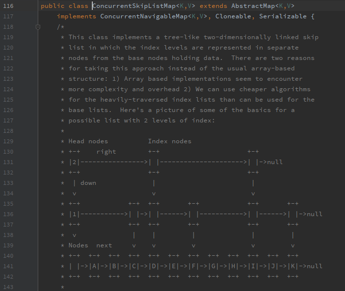
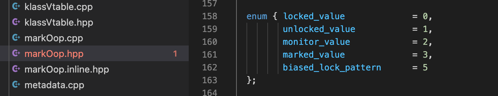

# jdk文档之二

## 序号（31~60）

### 31，CAS

* CAS存在的问题
  
  （1）只能操作一个变量

  （2）ABA问题

  （3）CPU开销问题

* CAS的本质
  在 Java 中，Java 并没有直接实现 CAS，CAS 相关的实现是通过 C++ 内联汇编的形式实现的。Java 代码需通过 JNI 才能调用。

  CAS 是一条 CPU 的原子指令（cmpxchg指令），不会造成所谓的数据不一致问题，Unsafe 提供的 CAS 方法（如compareAndSwapXXX）底层实现即为 CPU 指令 cmpxchg

* unsafe源码
  
```cpp
// hotspot\src\share\vm\prims\unsafe.cpp
UNSAFE_ENTRY(jboolean, Unsafe_CompareAndSwapInt(JNIEnv *env, jobject unsafe, jobject obj, jlong offset, jint e, jint x))
  UnsafeWrapper("Unsafe_CompareAndSwapInt");
  oop p = JNIHandles::resolve(obj);
  jint* addr = (jint *) index_oop_from_field_offset_long(p, offset);
  return (jint)(Atomic::cmpxchg(x, addr, e)) == e;
UNSAFE_END

UNSAFE_ENTRY(jboolean, Unsafe_CompareAndSwapLong(JNIEnv *env, jobject unsafe, jobject obj, jlong offset, jlong e, jlong x))
  UnsafeWrapper("Unsafe_CompareAndSwapLong");
  Handle p (THREAD, JNIHandles::resolve(obj));
  jlong* addr = (jlong*)(index_oop_from_field_offset_long(p(), offset));
  if (VM_Version::supports_cx8())
    return (jlong)(Atomic::cmpxchg(x, addr, e)) == e;
  else {
    jboolean success = false;
    ObjectLocker ol(p, THREAD);
    if (*addr == e) { *addr = x; success = true; }
    return success;
  }
UNSAFE_END
```

* Atomic::cmpxchg源码
  
```cpp
// hotspot\src\os_cpu\linux_x86\vm\atomic_linux_x86.inline.hpp
inline jlong    Atomic::cmpxchg    (jlong    exchange_value, volatile jlong*    dest, jlong    compare_value) {
  bool mp = os::is_MP();
  __asm__ __volatile__ (LOCK_IF_MP(%4) "cmpxchgq %1,(%3)"
                        : "=a" (exchange_value)
                        : "r" (exchange_value), "a" (compare_value), "r" (dest), "r" (mp)
                        : "cc", "memory");
  return exchange_value;
}

// hotspot\src\os_cpu\linux_x86\vm\atomic_windows_x86.inline.hpp
inline jint     Atomic::cmpxchg    (jint     exchange_value, volatile jint*     dest, jint     compare_value) {
  return (*os::atomic_cmpxchg_func)(exchange_value, dest, compare_value);
}

inline jint Atomic::cmpxchg (jint exchange_value, volatile jint* dest, jint compare_value) {
  // alternative for InterlockedCompareExchange 
  int mp = os::is_MP(); 
    __asm { 
    mov edx, 
    dest mov ecx, 
    exchange_value mov eax, 
    compare_value LOCK_IF_MP(mp) 
    cmpxchg dword ptr [edx], ecx 
  } 
}
```

### 32，CPU指令环

Intel的CPU将特权级别分为4个级别：RING0,RING1,RING2,RING3。

Windows只使用其中的两个级别RING0和RING3，RING0只给操作系统用，RING3谁都能用。如果普通应用程序企图执行RING0指令，则Windows会显示“非法指令”错误信息。

ring0是指CPU的运行级别，ring0是最高级别，ring1次之，ring2更次之……

### 33，垃圾回收器

* 种类
  
  （1）Serial收集器 + Serial Old收集器
  （2）ParNew收集器：Serial收集器的多线程版本
  （3）Parallel Scavenge收集器 + Parallel Old收集器
  （4）CMS：concurrent mark sweep
  （5）G1

* CMS收集器
  阶段：
  （1）初始标记

  （2）并发标记

  （3）重新标记

  （4）并发清除
  缺点：
    a. 对CPU资源敏感（会和服务抢资源）
    b. 无法处理浮动垃圾，有可能出现“Concurrent Mode Failure"失败进而导致另一次完全"stop the world"的Full GC的产生，临时启用Serial Old收集器来重新进行老年代的垃圾收集，但这样停顿时间就很长了
    c. 大量空间碎片的产生

* 三色标记

  漏标，两种解决方案：增量更新，原始快照SATB

  增量更新：黑色对象一旦新插入了指向白色对象的引用之后，它就变回灰色对象了

  SATB：无论引用关系删除与否，都会按照刚刚开始扫描那一刻的对象图快照来进行搜索

* G1收集器

  （1）初始标记

  （2）并发标记：同CMS的并发标记

  （3）最终标记：同CMS的重新标记

  （4）筛选回收

* ZGC收集器

  （1）并发标记

  （2）并发预备重分配

  （3）并发重分配

  （4）并发重映射

### 34，动态分派

* 概念：在运行期根据实际类型确定方法执行版本的分派过程
  
* 多态性的根源：虚方法调用指令invokevirtual的执行逻辑
  
* invokevirtual指令的运行时解析过程
  1）找到操作数栈顶的第一个元素所指向的对象的实际类型，记作C。
  2）如果在类型C中找到与常量中的描述符和简单名称都相符的方法，则进行访问权限校验，如果通过则返回这个方法的直接引用，查找过程结束；不通过则返回java.lang.IllegalAccessError异常。
  3）否则，按照继承关系从下往上依次对C的各个父类进行第二步的搜索和验证过程。
  4）如果始终没有找到合适的方法，则抛出java.lang.AbstractMethodError异常。

* 方法重写的本质
  因为invokevirtual指令执行的第一步就是在运行期确定接收者的实际类型，所以2次调用中的invokevirtual指令并不是把常量池中方法的符号引用解析到直接引用上就结束了，还会根据方法接收者的实际类型来选择方法版本。

* 虚拟机动态分派的实现
  动态分派是执行非常频繁的动作，而且动态分派的方法版本选择过程需要运行时在接收者类型的方法元数据中搜索合适的目标方法，因此，Java虚拟机实现基于执行性能的考虑，真正运行时一般不会如此频繁地去反复搜索类型元数据。面对这种情况，一种基础而且常见的优化手段是为类型在方法区中建立一个虚方法表，使用虚方法表索引来代替元数据查找，以提高性能。

* 虚方法
  Java对象里面的方法默认（即不使用final修饰）就是虚方法。

### 34，符号引用，直接引用

* 符号引用：以字符串的形式存在。
* 直接引用：运行时实际内存地址
* 解析：目标主要是将常量池中的以下4类符号引用转换为直接引用
  1）类；
  2）接口；
  3）字段；
  4）类方法和接口方法

### 35，DMA(Direct Memory Access)

* 工作原理：如果按数据块进行I/O，即需要传输大量数据时，就无须CPU的介入。在这种情况下，我们可以让I/O设备与计算机内存进行直接数据交换。而CPU则可以去忙别的事情。这种将CPU的介入减少的I/O模式称为直接内存访问。

* 疑问：将CPU从繁忙等待中解脱出来，难道DMA的整个数据读写过程不需要使用处理器的功能吗？当然不是。数据传输当然使用CPU，只不过这里使用的CPU不是计算机里面所有进程共享的CPU，而是由另外一个CPU来负责数据传输。这个另外的CPU就是DMA控制器。

* 作用：也许读者会问，这有什么意思，还是需要CPU繁忙等待，只不过换成一个不同的CPU来进行繁忙等待。何必这么麻烦呢？还不如就让通用CPU来处理。这里的关键是：
  * DMA里面的CPU可以比通用CPU简单，而且价格便宜很多，它只需要能够以不慢于I/O设备的速度进行数据读写即可。其他复杂功能，如算数运算、移位、逻辑运算等功能皆可以不要。

  * DMA控制器既可以构建在设备控制器里面，也可以作为独立的实体挂在计算机主板上。而以独立形式存在的DMA控制器更为常见。

原文链接：<https://blog.csdn.net/u010711495/article/details/119075935>

### 36，推荐用自定义的线程池

```java
/** 
FixedThreadPool和SingleThreadPool使用的队列是LinkedBlockingQueue,这是无界队列，允许请求的最大长度为：Integer.MAX_VALUE，
可能会堆积大量的请求，从而导致OOM
*/
public static ExecutorService newFixedThreadPool(int nThreads) {
    return new ThreadPoolExecutor(nThreads, nThreads, 
                                  0L, TimeUnit.MILLISECONDS, 
                                  new LinkedBlockingQueue<Runnable>());
}

public static ExecutorService newSingleThreadExecutor() {
    return new FinalizableDelegatedExecutorService
        (new ThreadPoolExecutor(1, 1,
                                0L, TimeUnit.MILLISECONDS,
                                new LinkedBlockingQueue<Runnable>()));
}

/**
看看LinkedBlockingQueue的容量大小：Integer.MAX_VALUE
*/
public LinkedBlockingQueue() {
    this(Integer.MAX_VALUE);
}


/**
CachedThreadPool和ScheduleThreadPool允许的创建线程数量为：Integer.MAX_VALUE，可能会创建大量的线程，从而导致OOM
*/
public static ExecutorService newCachedThreadPool() {
    return new ThreadPoolExecutor(0, Integer.MAX_VALUE,
                                      60L, TimeUnit.SECONDS,
                                      new SynchronousQueue<Runnable>());
}

public static ScheduledExecutorService newScheduledThreadPool(int corePoolSize) {
    return new ScheduledThreadPoolExecutor(corePoolSize);
}

// ScheduledThreadPoolExecutor类
public ScheduledThreadPoolExecutor(int corePoolSize) {
    super(corePoolSize, Integer.MAX_VALUE, 0, NANOSECONDS,
          new DelayedWorkQueue());
}

/**
线程池参数分析
corePoolSize : 核心线程数
maximumPoolSize : 最大线程数
keepAliveTime : 非核心线程的超时时长,如果非核心线程闲置时间超过keepAliveTime之后，
就会被回收。如果设置allowCoreThreadTimeOut为true，则该参数也表示核心线程的超时时长；
如果keepAliveTime是0，说明只要线程数比核心线程个数多并且当前空闲就回收
unit : 超时时长单位
workQueue : 线程池中的任务队列，该队列主要用来存储已经被提交但是尚未执行的任务
threadFactory : 线程工厂
handler : 拒绝策略
*/
public ThreadPoolExecutor(int corePoolSize,
                              int maximumPoolSize,
                              long keepAliveTime,
                              TimeUnit unit,
                              BlockingQueue<Runnable> workQueue,
                              ThreadFactory threadFactory,
                              RejectedExecutionHandler handler) {
    if (corePoolSize < 0 ||
        maximumPoolSize <= 0 ||
        maximumPoolSize < corePoolSize ||
        keepAliveTime < 0)
        throw new IllegalArgumentException();
    if (workQueue == null || threadFactory == null || handler == null)
        throw new NullPointerException();
    this.acc = System.getSecurityManager() == null ?
            null :
            AccessController.getContext();
    this.corePoolSize = corePoolSize;
    this.maximumPoolSize = maximumPoolSize;
    this.workQueue = workQueue;
    this.keepAliveTime = unit.toNanos(keepAliveTime);
    this.threadFactory = threadFactory;
    this.handler = handler;
}
```

### 37，引用的分类

（1）强引用

（2）软引用：内存不够时，会被回收

（3）弱引用：不管内存够不够用，都会被回收

（4）虚引用

### 38，不再被使用的类

（1）该类所有的实例都已经被回收

（2）加载该类的类加载器已被回收

（3）该类对应的java.lang.Class对象没有任何地方引用

### 39，跳跃表

#### （1）Redis中的实现

​    Server.h类中的zskiplist

#### （2）JDK中的实现

​    ConcurrentSkipListMap.java



### 40，JVM性能监控工具

* jps
  
  ```shell
  jps -l
  ```

* jstat
  
  ```shell
  jstat -gc 2764 250 20
  ```

* jmap
  
  ```shell
  jmap -heap 158
  ```

* jstack
  
  ```shell
  jstack -l 3500
  ```

### 41，主动调用gc的方法

```java
System.gc();

// 源码
public static void gc() {
  Runtime.getRuntime().gc();
}
```

### 42，gitee开源许可证怎么选


参考：[代码开源如何选择开源许可证_JackieDYH的博客-CSDN博客_gitee开源许可证选哪个](https://blog.csdn.net/JackieDYH/article/details/105800230?utm_term=%E6%80%8E%E4%B9%88%E9%80%89%E6%8B%A9gitte%E7%9A%84%E5%BC%80%E6%BA%90%E8%AE%B8%E5%8F%AF%E8%AF%81&utm_medium=distribute.pc_aggpage_search_result.none-task-blog-2~all~sobaiduweb~default-1-105800230&spm=3001.4430)

### 43，泛型

1，ParameterizedType

```java
Set<String> set;
Class<Integer> clazz;
MyClass<String> myClass;
List<String> list;
class MyClass<V>{

}
```

2，TypeVariable

```java
<T extends KnownType-1 & KnownType-2>

public interface TypeVariable<D extends GenericDeclaration> extends Type {

   //获得泛型的上限，若未明确声明上边界则默认为Object
    Type[] getBounds();

    //获取声明该类型变量实体(即获得类、方法或构造器名)
    D getGenericDeclaration();

    //获得名称，即K、V、E之类名称
    String getName();

    //获得注解类型的上限，若未明确声明上边界则默认为长度为0的数组
    AnnotatedType[] getAnnotatedBounds()

}
```

3，WildcardType

```java
<? extends Number>
```

4，GenericArrayType

```java
List<String>[] listArray; //是GenericArrayType,元素是List<String>类型，也就是ParameterizedType类型

T[] tArray; //是GenericArrayType,元素是T类型，也就是TypeVariable类型


Person[] persons; //不是GenericArrayType

List<String> strings; //不是GenericArrayType
```

### 44，hotspot源码中的juint类型

```cpp
// globalDefinitions_visCPP.hpp

// Additional Java basic types

typedef unsigned char    jubyte;
typedef unsigned short   jushort;
typedef unsigned int     juint;
typedef unsigned __int64 julong;
```

### 45，堆转储的转储是什么意思


### 46，Hotspot中定义的5种对象状态



### 47，JVM内部定义的类状态

```cpp
// hotspot/src/share/vm/oops/instanceKlass.hpp

// See "The Java Virtual Machine Specification" section 2.16.2-5 for a detailed description
// of the class loading & initialization procedure, and the use of the states.
enum ClassState {
  allocated,                          // allocated (but not yet linked)
  loaded,                             // loaded and inserted in class hierarchy (but not linked yet)
  linked,                             // successfully linked/verified (but not initialized yet)
  being_initialized,                  // currently running class initializer
  fully_initialized,                  // initialized (successfull final state)
  initialization_error                // error happened during initialization
};
```

### 48，创建对象

* 概述
  字节码new表示创建对象，虚拟机遇到该指令时，从栈顶取得目标对象在常量池中的索引，接着定位到目标对象的类型。接下来，虚拟机将根据该类的状态，采用相应的内存分配技术，在内存中分配实例空间，并完全实例数据和对象头的初始化。这样，一个对象就在JVM中创建好了
* 创建流程
  （1）获取目标对象在常量池中的索引
  （2）定位到目标对象的类型instanceKlass
  （3）验证类是否被解析，是否被初始化，是否满足快速分配条件
  （4）若满足快速分配条件，则进入快速分配流程
  （5）若不满足快速分配条件，或快速分配失败，则进入慢速分配流程
* 快速分配
  （1）分配内存：两种空间选择策略：TLAB，EDEN
  （2）初始化实例：填零

```cpp
// hotspot/src/share/vm/interpreter/bytecodeInterpreter.cpp
// Initialize object (if nonzero size and need) and then the header
if (need_zero ) {
  HeapWord* to_zero = (HeapWord*) result + sizeof(oopDesc) / oopSize;
  obj_size -= sizeof(oopDesc) / oopSize;
  if (obj_size > 0 ) {
    memset(to_zero, 0, obj_size * HeapWordSize);
  }
}
```

  （3）设置对象头
    设置Mark Word
    设置类型元数据指针
  （4）设置栈顶对象引用

* 慢速分配
  
  （1）解析：对类进行解析，确保类及依赖类已得到正确的解析和初始化
  （2）和快速分配一样的步骤

```cpp
// hotspot/src/share/vm/interpreter/interpreterRuntime.cpp
IRT_ENTRY(void, InterpreterRuntime::_new(JavaThread* thread, ConstantPool* pool, int index))
  Klass* k_oop = pool->klass_at(index, CHECK);
  instanceKlassHandle klass (THREAD, k_oop);

  // Make sure we are not instantiating an abstract klass
  klass->check_valid_for_instantiation(true, CHECK);

  // Make sure klass is initialized
  klass->initialize(CHECK);

  // At this point the class may not be fully initialized
  // because of recursive initialization. If it is fully
  // initialized & has_finalized is not set, we rewrite
  // it into its fast version (Note: no locking is needed
  // here since this is an atomic byte write and can be
  // done more than once).
  //
  // Note: In case of classes with has_finalized we don't
  //       rewrite since that saves us an extra check in
  //       the fast version which then would call the
  //       slow version anyway (and do a call back into
  //       Java).
  //       If we have a breakpoint, then we don't rewrite
  //       because the _breakpoint bytecode would be lost.
  oop obj = klass->allocate_instance(CHECK);
  thread->set_vm_result(obj);
IRT_END
```

### 49，volatile

* 使用 volatile
   修饰共享变量后，每个线程要操作变量时会从主内存中将变量拷贝到本地内存作为副本，当线程操作变量副本并写回主内存后，会通过 CPU 总线嗅探机制告知其他线程该变量副本已经失效，需要重新从主内存中读取。
* 嗅探机制工作原理
  每个处理器通过监听在总线上传播的数据来检查自己的缓存值是不是过期了，如果处理器发现自己缓存行对应的内存地址修改，就会将当前处理器的缓存行设置无效状态，当处理器对这个数据进行修改操作的时候，会重新从主内存中把数据读到处理器缓存中。

### 50，生产环境，cpu占用过高怎么排查？

* （1）top命令查看进程id
* （2）ps命令
  
    ```shell
    ps H -eo pid,tid,%cpu | grep 进程pid
    ```

* （3）十进制tid转换为十六进制
  
    ```shell
    printf '%x' 十进制数
    ```

* （4）jstack命令
  
    ```shell
    jstack pid | grep tid(0x) -A20
    ```

* （5）排查结束

参考博文：https://www.jianshu.com/p/9a623ff8de71

### 51，ThreadPoolExecutor成员变量ctl

假设Integer类型是32位二进制表示，则其高3位用来表示线程池状态，后面29位用来记录线程池的线程个数

```java
// 默认是RUNNING状态，线程个数为0
private final AtomicInteger ctl = new AtomicInteger(ctlOf(RUNNING, 0));

/*
线程个数掩码位数，并不是所有平台的int类型都是32位，
所以准确地说，是具体平台下Integer的二进制位数-3后的剩余位数所表示的数，
才是线程的个数
*/
private static final int COUNT_BITS = Integer.SIZE - 3;

// 0001 1111 1111 1111 1111 1111 1111 1111 线程最大个数（低29位） 
private static final int CAPACITY = (1 << COUNT_BITS) - 1;

// 线程池状态
// 1110 0000 0000 0000 0000 0000 0000 0000 高3位
private static final int RUNNING = -1 << COUNT_BITS;

// 0000 0000 0000 0000 0000 0000 0000 0000 高3位
private static final int SHUTDOWN = 0 << COUNT_BITS;

// 0010 0000 0000 0000 0000 0000 0000 0000 高3位
private static final int STOP = 1 << COUNT_BITS;

// 0100 0000 0000 0000 0000 0000 0000 0000 高3位
private static final int TIDYING = 2 << COUNT_BITS;

// 0110 0000 0000 0000 0000 0000 0000 0000 高3位
private static final int TERMINATED = 3 << COUNT_BITS;

// 获取高3位（运行状态）
private static int runStateOf(int c) {
  return c & ~CAPACITY;
}

// 获取低29位（线程个数）
private static int workerCountOf(int c) {
  return c & CAPACITY;
}

// 计算ctl新值（线程状态与线程个数）
private static int ctlOf(int rs, int wc) {
  return rs | wc;
}
```

### 52，ThreadPoolExecutor的execute方法


```java
// execute方法
public void execute(Runnable command) {
    // 如果任务为null，则抛出NPE异常
    if (command == null)
        throw new NullPointerException();
    /*
     * Proceed in 3 steps:
     *
     * 1. If fewer than corePoolSize threads are running, try to
     * start a new thread with the given command as its first
     * task.  The call to addWorker atomically checks runState and
     * workerCount, and so prevents false alarms that would add
     * threads when it shouldn't, by returning false.
     *
     * 2. If a task can be successfully queued, then we still need
     * to double-check whether we should have added a thread
     * (because existing ones died since last checking) or that
     * the pool shut down since entry into this method. So we
     * recheck state and if necessary roll back the enqueuing if
     * stopped, or start a new thread if there are none.
     *
     * 3. If we cannot queue task, then we try to add a new
     * thread.  If it fails, we know we are shut down or saturated
     * and so reject the task.
     */
    // 获取当前线程池的状态 + 线程个数变量的组合值
    int c = ctl.get();
    if (workerCountOf(c) < corePoolSize) {
        if (addWorker(command, true))
            return;
        c = ctl.get();
    }
    if (isRunning(c) && workQueue.offer(command)) {
        int recheck = ctl.get();
        if (! isRunning(recheck) && remove(command))
            reject(command);
        else if (workerCountOf(recheck) == 0)
            addWorker(null, false);
    }
    else if (!addWorker(command, false))
        reject(command);
}

/* 
注意方法内的第一行有个retry:标记，
在后面的内循环中有break retry 和 continue retry
*/
private boolean addWorker(Runnable firstTask, boolean core) {
    retry:
    for (;;) {
        int c = ctl.get();
        int rs = runStateOf(c);

        // Check if queue empty only if necessary.
        if (rs >= SHUTDOWN &&
            ! (rs == SHUTDOWN &&
                firstTask == null &&
                ! workQueue.isEmpty()))
            return false;
        // 循环CAS增加线程个数
        for (;;) {
            int wc = workerCountOf(c);
            // 如果线程个数超限则返回false
            if (wc >= CAPACITY ||
                wc >= (core ? corePoolSize : maximumPoolSize))
                return false;
            // CAS增加线程个数，同时只有一个线程成功
            if (compareAndIncrementWorkerCount(c))
                break retry;
            // CAS失败了，则看线程池状态是否变化了，变化则跳到外层循环重新尝试获取线程池状态，否则内层循环重新CAS
            c = ctl.get();  // Re-read ctl
            if (runStateOf(c) != rs)
                continue retry;
            // else CAS failed due to workerCount change; retry inner loop
        }
    }

    // 到这里说明CAS成功了
    boolean workerStarted = false;
    boolean workerAdded = false;
    Worker w = null;
    try {
        w = new Worker(firstTask);
        final Thread t = w.thread;
        if (t != null) {
            final ReentrantLock mainLock = this.mainLock;
            mainLock.lock();
            try {
                // Recheck while holding lock.
                // Back out on ThreadFactory failure or if
                // shut down before lock acquired.
                int rs = runStateOf(ctl.get());

                if (rs < SHUTDOWN ||
                    (rs == SHUTDOWN && firstTask == null)) {
                    if (t.isAlive()) // precheck that t is startable
                        throw new IllegalThreadStateException();
                    workers.add(w);
                    int s = workers.size();
                    if (s > largestPoolSize)
                        largestPoolSize = s;
                    workerAdded = true;
                }
            } finally {
                mainLock.unlock();
            }
            if (workerAdded) {
                t.start();
                workerStarted = true;
            }
        }
    } finally {
        if (! workerStarted)
            addWorkerFailed(w);
    }
    return workerStarted;
}
```
