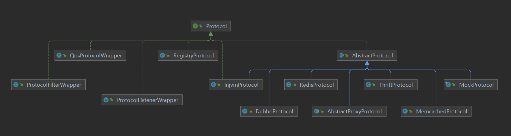
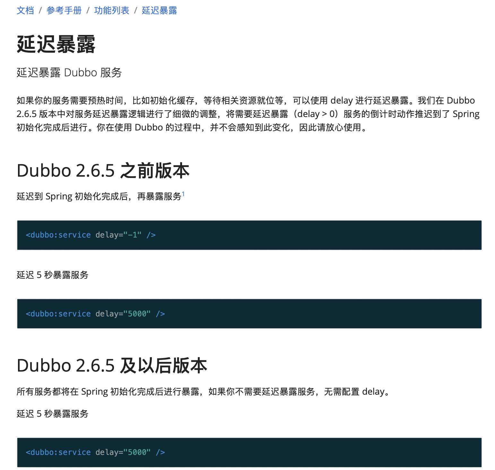

# 微服务、分布式、中间件笔记之一

## 序号（0~30）

### 1 项目中使用dubbo的版本

大致了解一下dubbo的版本更新事件：
2012年10月23号   2.5.3
2017年9月27号     2.5.4
2018年1月8号       2.6.0    此版本合并了dubbox
2019年5月             2.7.2

阿里的dubbo最后一个版本号是2.6.10.1，之后就捐赠给了apache

apache的dubbo版本从2.7.0开始

（1）引用的jar包的版本：2.6.8
（2）xml中配置的dubbo版本号

```xml
<!-- 使用的版本号为 1.0.0，此版本号为接口的版本号 ->
<dubbo:service registry="loan" version="1.0.0" scope="remote" register="true"
               interface="com.abc.pfs.service.api.QueryService" ref="queryService"/>
```

（3）默认的协议：序列化 hessian2，传输 dubbo

```xml
<!-- 序列化协议 hessian2 ->
<dubbo:provider serialization="hessian2" retries="0"  filter="setOrg" timeout="${dubbo.provider.timeout:3000}"
                threads="${dubbo.provider.threads:300}" />
<!-- 传输协议 dubbo ->
<dubbo:protocol name="dubbo" port="${dubbo.protocol.port}" />
```

### 2 dubbo服务暴露和服务消费机制

* 流程图


* 服务暴露
  ```java
  入口 export()
  -> ServiceBean.export()
  -> ServiceConfig.export()
  -> doExport()
  -> doExportUrls()
  -> loadRegistries(true)
  -> doExportFor1Protocol(ProtocolConfig protocolConfig, List<URL> registryURLs)
  -> exportLocal(URL url)
  -> proxyFactory.getInvoker(ref, (Class) interfaceClass, local)
  -> ExtensionLoader.getExtensionLoader(ProxyFactory.class).getExtension("javassist")
  -> extension.getInvoker(arg0, arg1, arg2)
  -> StubProxyFactoryWrapper.getInvoker(T proxy, Class<T> type, URL url)
  ...
  ```

* 服务消费
  ```java
  入口 getObject()
  -> ReferenceBean.getObject()
  -> ReferenceConfig.get()
  -> ReferenceConfig.init()
  -> ReferenceConfig.createProxy()
  ```
* 直连服务的消费原理
  * 源码
  ```java
  // com.alibaba.dubbo.config.ReferenceConfig
  private T createProxy(Map<String, String> map) {
    URL tmpUrl = new URL("temp", "localhost", 0, map);
    boolean isJvmRefer;
    if (this.isInjvm() == null) {
        if (this.url != null && this.url.length() > 0) {
            isJvmRefer = false;
        } else if (InjvmProtocol.getInjvmProtocol().isInjvmRefer(tmpUrl)) {
            isJvmRefer = true;
        } else {
            isJvmRefer = false;
        }
    } else {
        isJvmRefer = this.isInjvm();
    }

    if (isJvmRefer) {
        URL url = (new URL("injvm", "127.0.0.1", 0, this.interfaceClass.getName())).addParameters(map);
        this.invoker = refprotocol.refer(this.interfaceClass, url);
        if (logger.isInfoEnabled()) {
            logger.info("Using injvm service " + this.interfaceClass.getName());
        }
    } else {
        URL u;
        URL url;
        // 如果url不为空，说明是直连的方式
        if (this.url != null && this.url.length() > 0) {
            // 支持使用分号隔开指定的多个直连机器
            String[] us = Constants.SEMICOLON_SPLIT_PATTERN.split(this.url);
            if (us != null && us.length > 0) {
                String[] arr$ = us;
                int len$ = us.length;

                for(int i$ = 0; i$ < len$; ++i$) {
                    String u = arr$[i$];
                    URL url = URL.valueOf(u);
                    if (url.getPath() == null || url.getPath().length() == 0) {
                        url = url.setPath(this.interfaceName);
                    }
                    // 允许直连地址写成注册中心
                    if ("registry".equals(url.getProtocol())) {
                        this.urls.add(url.addParameterAndEncoded("refer", StringUtils.toQueryString(map)));
                    } else {
                        // 直连某一台服务提供者
                        this.urls.add(ClusterUtils.mergeUrl(url, map));
                    }
                }
            }
        } else {
            List<URL> us = this.loadRegistries(false);
            if (us != null && !us.isEmpty()) {
                for(Iterator i$ = us.iterator(); i$.hasNext(); this.urls.add(u.addParameterAndEncoded("refer", StringUtils.toQueryString(map)))) {
                    u = (URL)i$.next();
                    url = this.loadMonitor(u);
                    if (url != null) {
                        map.put("monitor", URL.encode(url.toFullString()));
                    }
                }
            }

            if (this.urls.isEmpty()) {
                throw new IllegalStateException("No such any registry to reference " + this.interfaceName + " on the consumer " + NetUtils.getLocalHost() + " use dubbo version " + Version.getVersion() + ", please config <dubbo:registry address=\"...\" /> to your spring config.");
            }
        }

        if (this.urls.size() == 1) {
            this.invoker = refprotocol.refer(this.interfaceClass, (URL)this.urls.get(0));
        } else {
            List<Invoker<?>> invokers = new ArrayList();
            URL registryURL = null;
            Iterator i$ = this.urls.iterator();

            while(i$.hasNext()) {
                url = (URL)i$.next();
                invokers.add(refprotocol.refer(this.interfaceClass, url));
                if ("registry".equals(url.getProtocol())) {
                    registryURL = url;
                }
            }

            if (registryURL != null) {
                u = registryURL.addParameter("cluster", "available");
                this.invoker = cluster.join(new StaticDirectory(u, invokers));
            } else {
                this.invoker = cluster.join(new StaticDirectory(invokers));
            }
        }
    }

    Boolean c = this.check;
    if (c == null && this.consumer != null) {
        c = this.consumer.isCheck();
    }

    if (c == null) {
        c = true;
    }

    if (c && !this.invoker.isAvailable()) {
        this.initialized = false;
        throw new IllegalStateException("Failed to check the status of the service " + this.interfaceName + ". No provider available for the service " + (this.group == null ? "" : this.group + "/") + this.interfaceName + (this.version == null ? "" : ":" + this.version) + " from the url " + this.invoker.getUrl() + " to the consumer " + NetUtils.getLocalHost() + " use dubbo version " + Version.getVersion());
    } else {
        if (logger.isInfoEnabled()) {
            logger.info("Refer dubbo service " + this.interfaceClass.getName() + " from url " + this.invoker.getUrl());
        }

        return proxyFactory.getProxy(this.invoker);
    }
  }
  ```

  * 直连的xml配置
  ```xml
  <!-- 直连 registry属性的值是 N/A -->
  <dubbo:reference id="userService" interface="com.md.dubbo.service.UserService"
                     url="dubbo://localhost:20880" registry="N/A"/>
  
  <!-- 注册中心 -->
  <dubbo:registry id="loan" address="${dubbo.registry.address}" group="${dubbo.registry.group}" protocol="zookeeper"/>
  <!-- 连接注册中心 registry属性的值是 一个注册中心的id -->
  <dubbo:reference registry="loan" version="1.0.0" id="generateSequenceService" retries="0" check="false"
        interface="com.xxx.service.api.GenerateSequenceService" />
  ```

### 3 dubbo协议的魔数

```java
public class ExchangeCodec extends TelnetCodec {

    // header length.
    protected static final int HEADER_LENGTH = 16;
    // magic header.
    protected static final short MAGIC = (short) 0xdabb;
    protected static final byte MAGIC_HIGH = Bytes.short2bytes(MAGIC)[0];
    protected static final byte MAGIC_LOW = Bytes.short2bytes(MAGIC)[1];
    // 省略其它代码
}
```

### 4 dubbo protocol继承图



### 5 dubbo服务暴露的入口

* export()方法

```java
// com.alibaba.dubbo.config.spring.ServiceBean
// spring容器初始化完成之后调用
public void onApplicationEvent(ContextRefreshedEvent event) {
    // 没有配置delay时为true
    if (isDelay() && !isExported() && !isUnexported()) {
        if (logger.isInfoEnabled()) {
            logger.info("The service ready on spring started. service: " + getInterface());
        }
        export();
    }

}

/**
如果没有配置delay，此方法返回true
如果配置了delay，此方法返回false

此函数名与实际逻辑相冲突：不配置delay（delay为null或-1），函数名却叫『是延迟』
*/
private boolean isDelay() {
    Integer delay = getDelay();
    ProviderConfig provider = getProvider();
    if (delay == null && provider != null) {
        delay = provider.getDelay();
    }
    return supportedApplicationListener && (delay == null || delay == -1);
}

// bean完成初始化之后调用
public void afterPropertiesSet() throws Exception {
    // 省略其他代码

    // 如果配置了delay，方法isDelay返回false
    if (!this.isDelay()) {
        this.export();
    }
}
```



* export() -> doExport()

```java
// com.alibaba.dubbo.config.ServiceConfig
public synchronized void export() {
    if (provider != null) {
        if (export == null) {
            export = provider.getExport();
        }
        if (delay == null) {
            delay = provider.getDelay();
        }
    }
    if (export != null && !export) {
        return;
    }
    // 真正处理delay
    if (delay != null && delay > 0) {
        // 定时任务
        delayExportExecutor.schedule(new Runnable() {
            @Override
            public void run() {
                doExport();
            }
        }, delay, TimeUnit.MILLISECONDS);
    } else {
        doExport();
    }
}
```

### 6 dubbo的整体架构设计和分层

#### （1）5个角色

* 注册中心registry：服务注册与发现

* 服务提供者provider：暴露服务

* 服务消费者consumer：调用远程服务

* 监控中心monitor：统计服务的调用次数和调用时间

* 容器container：服务允许容器

#### （2）调用流程

* container容器负责启动、加载、运行provider

* provider在启动时，向registry中心注册自己提供的服务

* consumer在启动时，向registry中心订阅自己所需的服务

* registry返回服务提供者列表给consumer，如果有变更，registry将基于长连接发送变更给consumer

* consumer调用provider服务，基于负载均衡算法进行调用

* consumer调用provider的统计，基于短连接定时每分钟一次统计到monitor

#### （3）分层

* 接口服务层（Service）：面向开发者、业务代码、接口、实现等

* 配置层（Config）：对外配置接口，以ServiceConfig与ReferenceConfig为中心

* 服务代理层（Proxy）：对生产者和消费者、dubbo都会产生一个代理类封装调用细节，业务层对调用细节无感

* 服务注册层（Registry）：封装服务地址的注册与发现，以服务URL为中心

* 路由层（Cluster）：封装多个提供者的路由和负载均衡，并桥接注册中心

* 监控层（Monitor）：RPC调用次数和调用时间监控

* 远程调用层（Protocol）：封装RPC调用

* 信息交换层（Exchange）：封装请求响应模式，同步转异步

* 网络传输层（Transport）：抽象mina和netty为统一接口，统一网络传输接口

* 数据序列化层（Serialize）：数据传输的序列化和反序列化

### 7 ZAB协议与RAFT协议的区别

#### （1）ZAB

* Leader 一个zookeeper集群同一时刻仅能有一个Leader。Leader负责接收所有的客户端的请求。
* Follower 提供读服务，参与选举。
* Observer 仅提供读服务。

#### （2）Raft

* Leader 负责接收所有的客户端的请求。
* Follower 读写请求都转发到Leader，参与选举。
* Candidate 每个节点上都有一个倒计时器 (Election Timeout)，时间随机在 150ms 到 300ms 之间。在一个节点倒计时结束 (Timeout) 后，这个节点的状态变成 Candidate 开始选举，它给其他几个节点发送选举请求 (RequestVote)。选举成功则变为Leader。

### 8 zookeeper分布式锁

* 节点特性
  * 节点类型
    PERSISTENT, EPHEMERAL, SEQUENTAIL
  * 组合可生成4种类型
    * PERSISTENT：Zookeeper中最常见的一种节点类型
    * PERSISTENT_SEQUENTIAL：基本特性和持久节点是一致的，额外的特性表现在顺序性上
    * EPHEMERAL：Zookeeper规定了不能基于临时节点来创建子节点，即临时节点只能作为叶子节点
    * EPHEMERAL_SEQUENTIAL：可以基于临时顺序节点创建子节点

* 排他锁
  * 获取锁
    * 在需要获取排他锁时，所有的客户端试图通过调用 create() 接口，在 /exclusive_lock 节点下创建临时子节点 /exclusive_lock/lock（临时节点只能作为叶子节点），最终只有一个客户端能创建成功，那么此客户端就获得了分布式锁。
    * 所有没有获取到锁的客户端可以在 /exclusive_lock 节点上注册一个子节点变更的 watcher 监听事件，以便重新争取获得锁。
  * 释放锁
    在定义锁时，我们已经提到，/exclusive_lock/lock是一个临时节点（只能作为叶子节点），因此以下两种情况下，都可能释放锁：
    * 当前获取锁的客户端机器发生宕机，那么Zookeeper上的这个临时节点就会被删除
    * 正常执行完业务逻辑后，客户端就会主动将自己创建的临时节点删除
* 共享锁（已优化步骤，不会有羊群效应）
  * 获取锁
  在需要获取共享锁时，所有客户端都会到/shared_lock这个节点下面创建一个临时顺序节点，例如：/shared_lock/host1-R-000000001
  * 判断读写顺序
    * 创建完节点后，获取/shared_lock节点下的所有子节点
    * 确定自己的节点序号在所有子节点中的顺序
    * 对于读请求：
      向比自己序号小的最后一个写请求节点注册Watcher监听
    * 对于写请求：
      向比自己序号小的最后一个节点注册Watcher监听
    * 等待Watcher通知，继续进入步骤2
  * 释放锁
* 排他锁与共享锁的比较
  * 排他锁是创建临时节点（只能作为叶子节点），共享锁是创建临时顺序节点
  * 羊群效应：排他锁有羊群效应，共享锁的羊群效应可经优化解决

### 9 Dubbo SPI

* 兼容Java SPI

* 与Java SPI相比，Dubbo SPI做了一定的改进和优化
  * a. JDK标准的SPI会一次性实例化扩展点所有实现，如果有扩展实现则初始化很耗时，如果没有用上也加载，则浪费资源
  * b. 如果扩展加载失败，则连扩展的名称都获取不到了，加载失败的真正原因被“吃掉”了，报的错并不是真正失败的原因
  * c. 增加了对扩展IOC和AOP的支持，一个扩展可以直接setter注入其他扩展。
  * d. 部分初始化
    * 在Java SPI使用中，java.util.ServiceLoader会一次把某接口下的所有实现类全部初始化，用户直接调用即可。
    * Dubbo SPI只是加载配置文件中的类，并分成不同的种类缓存在内存中，而不会立即全部初始化，在性能上有更好的表现。

```java
// ExtensionLoader.java
// IOC 向扩展类注入其依赖的属性，如扩展类A又依赖了扩展类B
injectExtension(instance);

// AOP
Set<Class<?>> wrapperClasses = cachedWrapperClasses;
if (wrapperClasses != null && !wrapperClasses.isEmpty()) {
    // 遍历扩展点包装类，用于初始化包装类实例
    for (Class<?> wrapperClass : wrapperClasses) {
        // 找到构造方法参数类型为type（扩展类的类型）的包装类，为其注入扩展类实例
        instance = injectExtension((T) wrapperClass.getConstructor(type).newInstance(instance));
    }
}
```

* 扩展点的分类与缓存
  * 缓存
    * Class缓存
    * 实例缓存
  * 分类
    * 普通扩展类  最基础的，配置在SPI配置文件中的扩展类实现
    * 包装扩展类  这种Wrapper类没有具体的实现，只是做了通用逻辑的抽象，并且需要在构造方法中传入一个具体的扩展接口的实现
    * 自适应扩展类  一个扩展接口会有很多实现类，具体使用哪个实现类可以不写死在配置或代码中，在运行时，通过传入URL中的某些参数动态来确定。使用@Adaptive注解
    * 其他缓存

* 扩展点的特性
  * 自动包装  装饰器模式
  * 自动加载  如果某个扩展类是另外一个扩展点类的成员属性，并且拥有setter方法，那么框架也会自动注入对应的扩展点实例
  * 自适应  使用@Adaptive注解
  * 自动激活  使用@Activate注解，可以标记对应的扩展点默认被激活启用

* ExtensionLoader的工作原理

  逻辑入口可以分为：
  * a. getExtension  获取普通扩展类
  * b. getAdaptiveExtension  获取自适应扩展类
  * c. getActivateExtension  根据不同的条件激活多个普通扩展类，对getExtension依赖比较重

```java
@SuppressWarnings("unchecked")
public T getAdaptiveExtension() {
    Object instance = cachedAdaptiveInstance.get();
    if (instance == null) {
        if (createAdaptiveInstanceError == null) {
            synchronized (cachedAdaptiveInstance) {
                instance = cachedAdaptiveInstance.get();
                if (instance == null) {
                    try {
                        instance = createAdaptiveExtension();
                        cachedAdaptiveInstance.set(instance);
                    } catch (Throwable t) {
                        createAdaptiveInstanceError = t;
                        throw new IllegalStateException("fail to create adaptive instance: " + t.toString(), t);
                    }
                }
            }
        } else {
            throw new IllegalStateException("fail to create adaptive instance: " + createAdaptiveInstanceError.toString(), createAdaptiveInstanceError);
        }
    }

    return (T) instance;
}

// 方法createAdaptiveExtension
private T createAdaptiveExtension() {
    try {
    return injectExtension((T) getAdaptiveExtensionClass().newInstance());
    } catch (Exception e) {
    throw new IllegalStateException("Can not create adaptive extension " + type + ", cause: " + e.getMessage(), e);
    }
}

private Class<?> getAdaptiveExtensionClass() {
    getExtensionClasses();
    if (cachedAdaptiveClass != null) {
    return cachedAdaptiveClass;
    }
    return cachedAdaptiveClass = createAdaptiveExtensionClass();
}

private Class<?> createAdaptiveExtensionClass() {
    // createAdaptiveExtensionClassCode方法生成code字符串
    String code = createAdaptiveExtensionClassCode();
    ClassLoader classLoader = findClassLoader();
    com.alibaba.dubbo.common.compiler.Compiler compiler = ExtensionLoader.getExtensionLoader(com.alibaba.dubbo.common.compiler.Compiler.class).getAdaptiveExtension();
    // 用编译器将字符串形式的java类编译成真正的java类
    return compiler.compile(code, classLoader);
}
```

* 自适应扩展点动态编译的实现

  * JdkCompiler
  * JavassitCompiler
  * AdaptiveCompiler

```java
/**
注解的默认值是javassist，即Javassist编译器将作为默认编译器。
如果用户想改变默认编译器，则可以通过<dubbo:application compiler="jdk" />标签进行配置
*/
@SPI("javassist")
public interface Compiler {
    Class<?> compile(String code, ClassLoader classLoader);
}
```

a. JdkCompiler使用了JDK自带的编译器

```java
import javax.tools.DiagnosticCollector;
import javax.tools.FileObject;
import javax.tools.ForwardingJavaFileManager;
import javax.tools.JavaCompiler;
import javax.tools.JavaFileManager;
import javax.tools.JavaFileObject;
import javax.tools.SimpleJavaFileObject;
import javax.tools.StandardJavaFileManager;
import javax.tools.StandardLocation;
import javax.tools.ToolProvider;
import javax.tools.JavaFileManager.Location;
import javax.tools.JavaFileObject.Kind;
public class JdkCompiler extends AbstractCompiler {.......}
```

b. Javassist编译器

```java
public class JavassitCompiler extends AbstractCompiler {.......}
```

c. Adaptive编译器

```java
/**
AdaptiveCompiler直接实现Compiler，没有继承AbstractCompiler
注解@Adaptive，说明AdaptiveCompiler会固定为默认实现，这个Compiler的主要作用就是为了管理其他compiler
*/
@Adaptive
public class AdaptiveCompiler implements Compiler {
    private static volatile String DEFAULT_COMPILER;

    public AdaptiveCompiler() {
    }

    // 设置默认的编译器名称
    public static void setDefaultCompiler(String compiler) {
        DEFAULT_COMPILER = compiler;
    }

    // 通过ExtensionLoader获取对应的编译器扩展类实现，并调用真正的compiler做编译
    public Class<?> compile(String code, ClassLoader classLoader) {
        ExtensionLoader<Compiler> loader = ExtensionLoader.getExtensionLoader(Compiler.class);
        String name = DEFAULT_COMPILER;
        Compiler compiler;
        if (name != null && name.length() > 0) {
            compiler = (Compiler)loader.getExtension(name);
        } else {
            compiler = (Compiler)loader.getDefaultExtension();
        }

        return compiler.compile(code, classLoader);
    }
}
```

### 10 服务的熔断与降级

<https://www.jianshu.com/p/98e8cfbf1b12>

（1）限流
限流是从用户访问压力的角度来考虑如何应对系统故障。
限流为了对服务端的接口接受请求的频率进行限制，防止服务挂掉。比如某一接口的请求限制为 100 个每秒, 对超过限制的请求放弃处理或者放到队列中等待处理。限流可以有效应对突发请求过多。相关阅读：限流算法有哪些？
（2）降级
服务降级：作用在消费者
所谓降级，就是一般是从整体符合考虑，就是当某个服务熔断之后，服务器将不再被调用，此刻客户端可以自己准备一个本地的fallback回调，返回一个缺省值，这样做，虽然服务水平下降，但好歹可用，比直接挂掉要强。
(3)熔断
服务熔断（防止服务雪崩）:作用在服务提供者
当链路的某个微服务不可用或者响应时间太长时，会进行服务的降级，进而熔断该节点微服务的调用，快速返回“错误”的响应信息。当检测到该节点微服务响应正常后恢复调用链

### 11 RabbitMQ如何确保消息发送？消息接收？

（1）信道需要设置为confirm模式，则所有在信道上发布的消息都会分配一个唯一ID。
一旦消息被投递到queue（可持久化的消息需要定稿磁盘），信道会发送一个确诊给生产者（包含消息唯一ID），如果RabbitMQ发生内部错误从而导致消息丢失，会发送一条nack（未确诊）消息给生产者。
在channel 被设置成Confirm模式之后，所有被publish的后续消息都将被Confirm（即 ack）或者被nack一次。但是没有对消息被Confirm的快慢做任何保证，并且同一条消息不会既被Confirm又被nack。
（2）消费者(Consumer)的Confirm模式
为了保证消息从队列可靠地到达消费者，RabbitMQ提供消息确认机制(message acknowledgment)。消费者在声明队列时，可以指定noAck参数，当noAck=false时，RabbitMQ会等待消费者显式发回ack信号后才从内存(和磁盘，如果是持久化消息的话)中移去消息。否则，RabbitMQ会在队列中消息被消费后立即删除它。
采用消息确认机制后，只要令noAck=false，消费者就有足够的时间处理消息(任务)，不用担心处理消息过程中消费者进程挂掉后消息丢失的问题，因为RabbitMQ会一直持有消息直到消费者显式调用basicAck为止。
在Consumer中Confirm模式中分为手动确认和自动确认。

### 12 Raft选举算法

（1）节点A发生故障，节点B和节点C没有收到领导者节点A的心跳信息，等待超时

（2）节点C（175 ms）先发生超时，节点C成为候选人。

（3）节点C向节点A和节点B发起请求投票信息

（4）节点B响应投票，将票投给了C，而节点A因为发生故障，无法响应C的投票请求

（5）节点C收到2票（大多数票数），成为新的领导者

（6）节点C向节点A和节点B发送心跳信息，节点B响应心跳信息，节点A不响应心跳信息

（7）节点A恢复后，收到节点C的高任期消息，自身将成为跟随者，接收节点C的消息

### 13 Raft算法的几个关键机制

（1）任期机制

（2）领导者心跳信息

（3）随机选举的超时时间

（4）先来先服务的投票原则

（5）大多数选票原则

### 14 Netty

#### NioEventLoopGroup 默认的构造函数会起多少线程呢

```java
public abstract class MultithreadEventLoopGroup extends MultithreadEventExecutorGroup implements EventLoopGroup {

    private static final InternalLogger logger = InternalLoggerFactory.getInstance(MultithreadEventLoopGroup.class);

    private static final int DEFAULT_EVENT_LOOP_THREADS;

    static {
        DEFAULT_EVENT_LOOP_THREADS = Math.max(1, SystemPropertyUtil.getInt(
                "io.netty.eventLoopThreads", NettyRuntime.availableProcessors() * 2));
    
```

### 15 判断一个数是不是2的幂

#### netty源码

```java
// io.netty.util.concurrent.DefaultEventExecutorChooserFactory#newChooser
/**
  为什么可以这样判断？
  关键在于：负数的补码：正数的二进制每位取反之后，加1

  分析三个数
  （1）如果val是8，二进制是0000 1000
  而-8的补码是8取反再加1，
  8取反，得到二进制是1111 0111，
  加1，得到1111 1000
  二者做与运算
  0000 1000   ->  8
  1111 1000   -> -8
  0000 1000   ->  8（8 & -8的结果）

  （2）如果val是4，二进制是0000 0100
  而-4的补码是4取反再加1
  4取反，得到二进制是1111 1011，
  加1，得到1111 1100，
  二者做与运算
  0000 0100   ->  4
  1111 1100   -> -4
  0000 0100   ->  4（4 & -4的结果）

  （3）如果val是5，二进制是0000 0101
  5取反，得到1111 1010，
  加1，得到1111 1011，
  二者做与运算
  0000 0101   ->  5
  1111 1011   -> -5
  0000 0001   ->  1（5 & -5的结果）

  总结：2的幂，二进制只有1个1，其余都是0，取反之后，原来那个唯一的1变成0，其他都是1，
  再加1，则0变成1，它的右边全部变成0，左边全是1.
  即正数与负数的区别是，正数高位全是0，负数高位全是1，其余都相同，所以做与运算，结果是该正数
*/
private static boolean isPowerOfTwo(int val) {
    return (val & -val) == val;
}
```

### 16 项目中rabbitmq使用方式

* xml配置

```xml
<task:executor id="amqpConnectionTaskExecutor" pool-size="${rabbitmq.executor.pool.size:1}"/>
<rabbit:connection-factory id="rabbitConnectionFactory"
	channel-cache-size="${rabbitmq.channel.cache.size:10}" executor="amqpConnectionTaskExecutor"
	addresses="${rabbitmq.addresses}" virtual-host="${rabbitmq.vhost:'/dev'}"
	username="${rabbitmq.user:'guest'}" password="${rabbitmq.password:'guest'}"/>

<!-- 标准的建立Queue的参数 -->
<rabbit:queue-arguments id="amqpQueueArguments" />

<bean id="aMessageConverter" class="com.xxx.a.mq.config.AMessageConverter"/>

<rabbit:template id="amqpTemplate" connection-factory="rabbitConnectionFactory" />

<!-- 供自动创建队列 -->
<rabbit:admin connection-factory="rabbitConnectionFactory"/>

<rabbit:queue queue-arguments="amqpQueueArguments" id="bAsyncQueue" name="${listen_queue_name}"/>

<bean id="listenerHandler" class="com.xxx.b.service.impl.BMqListenerService">    
</bean>   

<!-- 监听b发送 -->    
<bean id="receiveListenerAdapter" class="org.springframework.amqp.rabbit.listener.adapter.MessageListenerAdapter">    
  <constructor-arg ref="listenerHandler" />    
  <property name="defaultListenerMethod" value="handleRequest" />
  <property name="messageConverter" ref="aMessageConverter" />
</bean>    

<!-- 监听b发送 -->    
<bean id="listenerContainer"    
  class="org.springframework.amqp.rabbit.listener.SimpleMessageListenerContainer">
  <property name="queueNames" value="${listen_queue_name}" />
  <property name="connectionFactory" ref="rabbitConnectionFactory" />
  <property name="messageListener" ref="receiveListenerAdapter" />
</bean>
```

* java代码

```java
public class AMessageConverter extends SimpleMessageConverter {
    public static final String ORG_HEADER = "a.org";
    public static final String SID_HEADER = "a.sid";
    public static final String ORG = "org";
    private Logger logger = LoggerFactory.getLogger(this.getClass());

    public AMessageConverter() {
    }

    protected Message createMessage(Object object, MessageProperties messageProperties) throws MessageConversionException {
        messageProperties.setHeader("a.org", OrganizationContextHolder.getOrg());
        messageProperties.setHeader("a.sid", OrganizationContextHolder.getSid());
        this.logger.info("client 机构号:" + OrganizationContextHolder.getOrg());
        return super.createMessage(object, messageProperties);
    }

    public Object fromMessage(Message message) throws MessageConversionException {
        if (message != null) {
            Map<String, Object> headers = message.getMessageProperties().getHeaders();
            OrganizationContextHolder.setOrg((String)headers.get("a.org"));
            OrganizationContextHolder.setSid((String)headers.get("a.sid"));
            if (StringUtils.isEmpty(OrganizationContextHolder.getOrg())) {
                OrganizationContextHolder.setOrg(SystemPropertyUtil.get("org"));
            }

            this.logger.info("server 机构号:" + OrganizationContextHolder.getOrg());
        }

        return super.fromMessage(message);
    }
}

public class BMqListenerService {    

    /**
     * 解析MQ请求
     *
     * @param requestParam MQ请求参数
     */
    public void handleRequest(String requestParam) {
        

        try {
            // do sth.
        } catch (Exception e) {
            //
        }
    }
}
```

### 17 What's the difference between SpringBoot and SpringCloud ?

* springboot
  Spring Boot makes it easy to create stand-alone, production-grade Spring based Applications that you can "just run".
  We take an opinionated view of the Spring platform and third-party libraries so you can get started with minimum fuss. Most Spring Boot applications need minimal Spring configuration.
  If you’re looking for information about a specific version, or instructions about how to upgrade from an earlier release, check out the project release notes section on our wiki.

  **Features**
  * Create stand-alone Spring applications
  * Embed Tomcat, Jetty or Undertow directly (no need to deploy WAR files)
  * Provide opinionated 'starter' dependencies to simplify your build configuration
  * Automatically configure Spring and 3rd party libraries whenever possible
  * Provide production-ready features such as metrics, health checks, and externalized configuration
  * Absolutely no code generation and no requirement for XML configuration
* spring cloud
  Spring Cloud provides tools for developers to quickly build some of the common patterns in distributed systems (e.g. configuration management, service discovery, circuit breakers, intelligent routing, micro-proxy, control bus). Coordination of distributed systems leads to boiler plate patterns, and using Spring Cloud developers can quickly stand up services and applications that implement those patterns. They will work well in any distributed environment, including the developer’s own laptop, bare metal data centres, and managed platforms such as Cloud Foundry.
* the difference
  * SpringBoot focuses on the rapid and convenient development of individual microservices and SpringCloud focuses on the global service governance framework.
  * SpringCloud is a microservice coordination and management framework that focuses on the overall situation. It integrates and manages individual microservices developed by SpringBoot.
  * Provide integrated services between various microservices, such as configuration management, service discovery, circuit breakers, routing, microagents, event bus, global locks, decision-making campaigns, distributed conversations, etc.
  * SpringBoot can leave SpringCloud to use development projects independently, but SpringCloud cannot do without SpringBoot, which belongs to the relationship of dependency

### 18 What's the difference between SpringCloud and dubbo ?

* (1) The service calling method
  dubbo is RPC, springcloud Rest Api
* (2) Registration center
  dubbo is zookeeper and springcloud is eureka, or zookeeper
* (3) Service gateway
  * dubbo itself is not implemented, and can only be integrated through other third-party technologies.
  * Springcloud has Zuul routing gateway as a routing server for consumer request distribution. Springcloud supports circuit breakers and is perfectly integrated with git. Configuration file support version Control, transaction bus to achieve configuration file update and service automatic assembly, and a series of microservice architecture elements.

### 19 What's Cloud Native ?

技术的变革，一定是思想先行，云原生是一种构建和运行应用程序的方法，是一套技术体系和方法论。云原生（CloudNative）是一个组合词，Cloud+Native。Cloud表示应用程序位于云中，而不是传统的数据中心；Native表示应用程序从设计之初即考虑到云的环境，原生为云而设计，在云上以最佳姿势运行，充分利用和发挥云平台的弹性+分布式优势。

Pivotal公司的Matt Stine于2013年首次提出云原生（CloudNative）的概念；2015年，云原生刚推广时，Matt Stine在《迁移到云原生架构》一书中定义了符合云原生架构的几个特征：12因素、微服务、自敏捷架构、基于API协作、扛脆弱性；到了2017年，Matt Stine在接受InfoQ采访时又改了口风，将云原生架构归纳为模块化、可观察、可部署、可测试、可替换、可处理6特质；而Pivotal最新官网对云原生概括为4个要点：DevOps+持续交付+微服务+容器。
微服务：几乎每个云原生的定义都包含微服务，跟微服务相对的是单体应用，微服务有理论基础，那就是康威定律，指导服务怎么切分，很玄乎，凡是能称为理论定律的都简单明白不了，不然就忒没b格，大概意思是组织架构决定产品形态，不知道跟马克思的生产关系影响生产力有无关系。

* 微服务
  微服务架构的好处就是按function切了之后，服务解耦，内聚更强，变更更易；另一个划分服务的技巧据说是依据DDD来搞。

* 容器化
  Docker是应用最为广泛的容器引擎，在思科谷歌等公司的基础设施中大量使用，是基于LXC技术搞的，容器化为微服务提供实施保障，起到应用隔离作用，K8S是容器编排系统，用于容器管理，容器间的负载均衡，谷歌搞的，Docker和K8S都采用Go编写，都是好东西。

* DevOps
  这是个组合词，Dev+Ops，就是开发和运维合体，不像开发和产品，经常刀刃相见，实际上DevOps应该还包括测试，DevOps是一个敏捷思维，是一个沟通文化，也是组织形式，为云原生提供持续交付能力。

* 持续交付
  持续交付是不误时开发，不停机更新，小步快跑，反传统瀑布式开发模型，这要求开发版本和稳定版本并存，其实需要很多流程和工具支撑。

### 20 What's IaaS, Paas, SaaS ?

* IaaS
  Infrastructure as a server，把客户需要的基础设施环境搭建好，然后开放虚拟机或者硬件的租赁服务。
* PaaS
  Platform as a server，云端把客户所需的软件的平台作出租。云端已经给大家搭建好了平台。一般来说，在用户使用的时候，云端已经搭建好了操作系统、数据库、中间件，运行库等等。用户只需要在这个搭建好的平台上下载、安装并使用自己需要的软件就可以了。
* SaaS
  Software as a server，云端已经把操作系统、中间件、数据库、运行库、软件应用都部署好了。连软件都不用安装了，用户登录之后直接可以上手操作。

### 21 Netty高性能的原因

* 传统RPC调用性能差的三个原因
  * 网络传输方式还在弊端  大多采用BIO
  * Java序列化存在弊端
    * 无法跨语言使用
    * 序列化后的字节码流占用的空间太大
    * 序列化性能差，在编解码过程中需要占用更高的CPU资源
  * 线程模型存在弊端  传统RPC框架均采用BIO模型，这使得每个TCP连接都需要分配1个线程
* Netty高性能的三个主题
  * I/O传输模型
  * 数据协议
  * 线程模型
* Netty高性能之核心法宝
  * 异步非阻塞通信
  * 零拷贝
    * Netty接收和发送ByteBuffer采用DirectBuffer，使用堆外内存进行Socket读写，不需要进行字节缓冲区的二次拷贝。
    * Netty提供了组合Buffer对象，可以聚合多个ByteBuffer对象，用户可以像操作一个Buffer那样方便地对组合Buffer进行操作
    * Netty文件传输采用了transferTo()方法，它可以直接将文件缓冲区的数据发送到目标Channel，避免了传统通过循环write()方式导致的内存拷贝问题
  * 内存池
  * 高效的Reactor线程模型
    * Reactor单 线程模型
    * Reactor多 线程模型
    * 主从Reactor多 线程模型    Netty官方推荐
  * 无锁化的串行设计理念
  * 高效的并发编程
    * volatile
    * CAS和原子类
    * 线程安全容器
    * 读写锁
  * 支持多种高性能的序列化框架
  * 灵活的TCP参数配置能力

### 22 序列化与反序列化：通过网络传输结构化的数据

在TCP的连接上，它传输数据的基本形式就是二进制流，也就是一段一段的1和0。在一般编程语言或者网络框架提供的API中，传输数据的基本形式是字节，也就是Byte。一个字节就是8个二进制位，8个Bit，所以在这里，二进制流和字节流本质上是一样的。对于我们编写的程序来说，它需要通过网络传输的数据是结构化的数据，比如，一条命令、一段文本或者一条消息。对应代码中，这些结构化的数据都可以用一个类或者一个结构体来表示。

要想使用网络框架的API来传输结构化的数据，必须得先实现结构化的数据与字节流之间的双向转换。这种将结构化数据转换成字节流的过程，称为序列化，反过来转换，就是反序列化。序列化的用途除了用于在网络上传输数据以外，另外一个重要用途是，将结构化数据保存在文件中，因为文件内保存数据的形式也是二进制序列。

问题：在内存里存放的任何数据，它最基础的存储单元也是二进制比特，也就是说，我们应用程序操作的对象，它在内存中也是使用二进制存储的，既然都是二进制，为什么不能直接把内存中，对象对应的二进制数据直接通过网络发送出去，或者保存在文件中呢？为什么还需要序列化和反序列化呢？
<https://www.cnblogs.com/chjxbt/p/11458815.html>

### 23 Netty的编解码

* 编码（Encode）：序列化，将对象序列化为字节数组
* 解码（Decode）：反序列化，把从网络、磁盘等读取的字节数组还原成原始对象
* 常用的解码器
  * ByteToMessageDecoder
  * LineBasedFrameDecoder
  * DelimiterBasedFrameDecoder
  * FixedLengthFrameDecoder
  * LengthFieldBasedFrameDecoder

### 24 分布式锁的实现方式

* 基于数据库
  * 类的全路径名 + 方法名 是唯一索引
  * mysql的InnoDB的表锁：select xxx from table where lock_name = 'yyy' for update
* Redis
* Zookeeper
