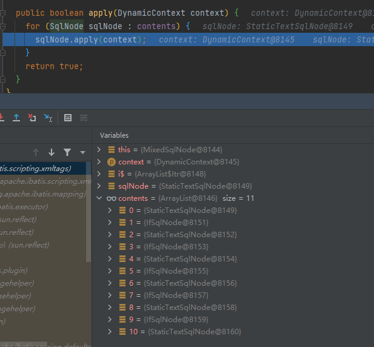
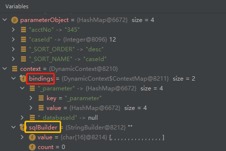

# mybatis笔记之一

## 序号（0~30）

### 1，mybatis调试sql

```java
// 一路F7，进入CachingExecutor类
public <E> List<E> query(MappedStatement ms, Object parameterObject, RowBounds rowBounds, ResultHandler resultHandler) throws SQLException {
  BoundSql boundSql = ms.getBoundSql(parameterObject);
  CacheKey key = createCacheKey(ms, parameterObject, rowBounds, boundSql);
  return query(ms, parameterObject, rowBounds, resultHandler, key, boundSql);
}
// MappedStatement类
public BoundSql getBoundSql(Object parameterObject) {
  BoundSql boundSql = sqlSource.getBoundSql(parameterObject);
  List<ParameterMapping> parameterMappings = boundSql.getParameterMappings();
  if (parameterMappings == null || parameterMappings.size() <= 0) {
    boundSql = new BoundSql(configuration, boundSql.getSql(), parameterMap.getParameterMappings(), parameterObject);
  }

  // check for nested result maps in parameter mappings (issue #30)
  for (ParameterMapping pm : boundSql.getParameterMappings()) {
    String rmId = pm.getResultMapId();
    if (rmId != null) {
      ResultMap rm = configuration.getResultMap(rmId);
      if (rm != null) {
        hasNestedResultMaps |= rm.hasNestedResultMaps();
      }
    }
  }

  return boundSql;
}

// 进入getBoundSql方法，来到DynamicSqlSource类
public BoundSql getBoundSql(Object parameterObject) {
  DynamicContext context = new DynamicContext(configuration, parameterObject);
  rootSqlNode.apply(context);
  SqlSourceBuilder sqlSourceParser = new SqlSourceBuilder(configuration);
  Class<?> parameterType = parameterObject == null ? Object.class : parameterObject.getClass();
  SqlSource sqlSource = sqlSourceParser.parse(context.getSql(), parameterType, context.getBindings());
  BoundSql boundSql = sqlSource.getBoundSql(parameterObject);
  for (Map.Entry<String, Object> entry : context.getBindings().entrySet()) {
    boundSql.setAdditionalParameter(entry.getKey(), entry.getValue());
  }
  return boundSql;
}
```





```java
// 进入rootSqlNode.apply方法,来到MixedSqlNode
public class MixedSqlNode implements SqlNode {
  private List<SqlNode> contents;

  public MixedSqlNode(List<SqlNode> contents) {
    this.contents = contents;
  }

  public boolean apply(DynamicContext context) {
    for (SqlNode sqlNode : contents) {
      sqlNode.apply(context);
    }
    return true;
  }
}

// 进入apply方法，来到TextSqlNode类
public boolean apply(DynamicContext context) {
  GenericTokenParser parser = createParser(new BindingTokenParser(context));
  context.appendSql(parser.parse(text));
  return true;
}

private GenericTokenParser createParser(TokenHandler handler) {
  return new GenericTokenParser("${", "}", handler);
}

// 进入apply方法，来到StaticTextSqlNode类
public class StaticTextSqlNode implements SqlNode {
  private String text;

  public StaticTextSqlNode(String text) {
    this.text = text;
  }

  public boolean apply(DynamicContext context) {
    context.appendSql(text);
    return true;
  }

}
```

.jpg)

contents中是把mybatis中的sql解析成11个片段。执行完apply方法之后，context中的sqlBuilder的value如下：${}已经被解析，而#{}还没有解析。


> ${}符号在哪儿被替换的？是在IfSqlNode中替换的：


按F7跳转到TextSqlNode，在GenericTokenParser中完成替换。


```java
// 进入parse方法，来到SqlSourceBuilder类
public SqlSource parse(String originalSql, Class<?> parameterType, Map<String, Object> additionalParameters) {
  ParameterMappingTokenHandler handler = new ParameterMappingTokenHandler(configuration, parameterType, additionalParameters);
  GenericTokenParser parser = new GenericTokenParser("#{", "}", handler);
  String sql = parser.parse(originalSql);
  return new StaticSqlSource(configuration, sql, handler.getParameterMappings());
}
```


解析之后，#{}变成了问号。进入下一行的sqlSource.getBoundSql方法：

```java
// DynamicSqlSource.java
public BoundSql getBoundSql(Object parameterObject) {
    DynamicContext context = new DynamicContext(configuration, parameterObject);
    rootSqlNode.apply(context);
    SqlSourceBuilder sqlSourceParser = new SqlSourceBuilder(configuration);
    Class<?> parameterType = parameterObject == null ? Object.class : parameterObject.getClass();
    SqlSource sqlSource = sqlSourceParser.parse(context.getSql(), parameterType, context.getBindings());
    BoundSql boundSql = sqlSource.getBoundSql(parameterObject);
    for (Map.Entry<String, Object> entry : context.getBindings().entrySet()) {
        boundSql.setAdditionalParameter(entry.getKey(), entry.getValue());
    }
    return boundSql;
}

// 来到StaticSqlSource.java
public BoundSql getBoundSql(Object parameterObject) {
    return new BoundSql(configuration, sql, parameterMappings, parameterObject);
}
```


```java
// 最后来到BaseExecutor
public <E> List<E> query(MappedStatement ms, Object parameter, RowBounds rowBounds, ResultHandler resultHandler, CacheKey key, BoundSql boundSql) throws SQLException {
  ErrorContext.instance().resource(ms.getResource()).activity("executing a query").object(ms.getId());
  if (closed) throw new ExecutorException("Executor was closed.");
  if (queryStack == 0 && ms.isFlushCacheRequired()) {
    clearLocalCache();
  }
  List<E> list;
  try {
    queryStack++;
    list = resultHandler == null ? (List<E>) localCache.getObject(key) : null;
    if (list != null) {
      handleLocallyCachedOutputParameters(ms, key, parameter, boundSql);
    } else {
      list = queryFromDatabase(ms, parameter, rowBounds, resultHandler, key, boundSql);
    }
  } finally {
    queryStack--;
  }
  if (queryStack == 0) {
    for (DeferredLoad deferredLoad : deferredLoads) {
      deferredLoad.load();
    }
    deferredLoads.clear(); // issue #601
    if (configuration.getLocalCacheScope() == LocalCacheScope.STATEMENT) {
      clearLocalCache(); // issue #482
    }
  }
  return list;
}
```


最终走到PreparedStatementHandler类


### 2，resultMap对于联合主键怎么写

答案是写2个id列：

```xml
<resultMap id = "BaseResultMap" >
    <id column = "CONTRACT_NO" property = "contractNo" jdbcType = "VARCHAR"/>
    <id column = "CUST_ID" property = "custId" jdbcType = "VARCHAR"/>

</resultMap>
```

mybatis源码对于id的处理：

```java
// XMLMapperBuilder.java
  private ResultMap resultMapElement(XNode resultMapNode, List<ResultMapping> additionalResultMappings, Class<?> enclosingType) throws Exception {
    ErrorContext.instance().activity("processing " + resultMapNode.getValueBasedIdentifier());
    String type = resultMapNode.getStringAttribute("type",
        resultMapNode.getStringAttribute("ofType",
            resultMapNode.getStringAttribute("resultType",
                resultMapNode.getStringAttribute("javaType"))));
    Class<?> typeClass = resolveClass(type);
    if (typeClass == null) {
      typeClass = inheritEnclosingType(resultMapNode, enclosingType);
    }
    Discriminator discriminator = null;
    List<ResultMapping> resultMappings = new ArrayList<>();
    resultMappings.addAll(additionalResultMappings);
    List<XNode> resultChildren = resultMapNode.getChildren();
    for (XNode resultChild : resultChildren) {
      if ("constructor".equals(resultChild.getName())) {
        processConstructorElement(resultChild, typeClass, resultMappings);
      } else if ("discriminator".equals(resultChild.getName())) {
        discriminator = processDiscriminatorElement(resultChild, typeClass, resultMappings);
      } else {
        List<ResultFlag> flags = new ArrayList<>();
        // 如果含有id列，在flags集合中加入id标志，是List集合，允许多个id列
        if ("id".equals(resultChild.getName())) {
          flags.add(ResultFlag.ID);
        }
        resultMappings.add(buildResultMappingFromContext(resultChild, typeClass, flags));
      }
    }
    String id = resultMapNode.getStringAttribute("id",
            resultMapNode.getValueBasedIdentifier());
    String extend = resultMapNode.getStringAttribute("extends");
    Boolean autoMapping = resultMapNode.getBooleanAttribute("autoMapping");
    ResultMapResolver resultMapResolver = new ResultMapResolver(builderAssistant, id, typeClass, extend, discriminator, resultMappings, autoMapping);
    try {
      return resultMapResolver.resolve();
    } catch (IncompleteElementException  e) {
      configuration.addIncompleteResultMap(resultMapResolver);
      throw e;
    }
  }

// ResultMapping类，对应resultMap中的一列，id列或result列


// ResultMap类
public class ResultMap {
  // 全局配置信息
  private Configuration configuration;

  // resultMap的编号
  private String id;

  // 最终输出结果对应的Java类
  private Class<?> type;

  // XML中的<result>的列表，即ResultMapping列表
  private List<ResultMapping> resultMappings;

  // XML中的<id>的列表
  private List<ResultMapping> idResultMappings;

  // XML中的<constructor>中各个属性的列表
  private List<ResultMapping> constructorResultMappings;

  // XML中非<constructor>相关的属性列表
  private List<ResultMapping> propertyResultMappings;

  // 所有参与映射的数据库中字段的集合
  private Set<String> mappedColumns;

  // 所有参与映射的Java对象属性集合
  private Set<String> mappedProperties;

  // 鉴别器
  private Discriminator discriminator;

  // 是否存在嵌套映射
  private boolean hasNestedResultMaps;

  // 是否存在嵌套查询
  private boolean hasNestedQueries;

  // 是否启动自动映射
  private Boolean autoMapping;
// 省略
}


// ResultMap中的内部类Builder
// 遍历这个resultMap的所有resultMapping
for (ResultMapping resultMapping : resultMap.resultMappings) {
                resultMap.hasNestedQueries = resultMap.hasNestedQueries || resultMapping.getNestedQueryId() != null;
                resultMap.hasNestedResultMaps = resultMap.hasNestedResultMaps || (resultMapping.getNestedResultMapId() != null && resultMapping.getResultSet() == null);
                final String column = resultMapping.getColumn();
    if (column != null) {
        resultMap.mappedColumns.add(column.toUpperCase(Locale.ENGLISH));
    } else if (resultMapping.isCompositeResult()) {
        for (ResultMapping compositeResultMapping : resultMapping.getComposites()) {
            final String compositeColumn = compositeResultMapping.getColumn();
            if (compositeColumn != null) {
                resultMap.mappedColumns.add(compositeColumn.toUpperCase(Locale.ENGLISH));
            }
        }
    }
    final String property = resultMapping.getProperty();
    if (property != null) {
        resultMap.mappedProperties.add(property);
    }
    /**
    如果是<id column = "CASE_ID" property = "caseId" jdbcType = "VARCHAR"/>
    因为不含有constructor标签，所以会加到propertyResultMappings集合
    又因为含有id标签，所以会加到idResultMappings集合
    可见id标签的这条，既在propertyResultMappings集合里，又在idResultMappings集合里
    */
    if (resultMapping.getFlags().contains(ResultFlag.CONSTRUCTOR)) {
        resultMap.constructorResultMappings.add(resultMapping);
        if (resultMapping.getProperty() != null) {
            constructorArgNames.add(resultMapping.getProperty());
        }
    } else {
        resultMap.propertyResultMappings.add(resultMapping);
    }

    /*
        如果这个resultMapping有id标志，就把这个resultMapping加入
        idResultMapping集合
    */
    if (resultMapping.getFlags().contains(ResultFlag.ID)) {
        resultMap.idResultMappings.add(resultMapping);
    }
}


/**
 * 获取idResultMappings，用来生成rowKey
 * 如果idResultMappings是空的，则使用propertyResultMappings
 * @param resultMap
 * @return
 */
private List<ResultMapping> getResultMappingsForRowKey(ResultMap resultMap) {
    // 获取idResultMappings
    List<ResultMapping> resultMappings = resultMap.getIdResultMappings();
    // 如果idResultMappings是空的，则使用propertyResultMappings
    if (resultMappings.isEmpty()) {
        resultMappings = resultMap.getPropertyResultMappings();
    }
    return resultMappings;
}

/**
 * 生成rowKey，它是一个java类
 * @param resultMap
 * @param rsw
 * @param columnPrefix
 * @return
 * @throws SQLException
 */
private CacheKey createRowKey(ResultMap resultMap, ResultSetWrapper rsw, String columnPrefix) throws SQLException {
    final CacheKey cacheKey = new CacheKey();
    cacheKey.update(resultMap.getId());
    List<ResultMapping> resultMappings = getResultMappingsForRowKey(resultMap);
    if (resultMappings.isEmpty()) {
        if (Map.class.isAssignableFrom(resultMap.getType())) {
            createRowKeyForMap(rsw, cacheKey);
        } else {
            createRowKeyForUnmappedProperties(resultMap, rsw, cacheKey, columnPrefix);
        }
    } else {
        createRowKeyForMappedProperties(resultMap, rsw, cacheKey, resultMappings, columnPrefix);
    }
    if (cacheKey.getUpdateCount() < 2) {
        return CacheKey.NULL_CACHE_KEY;
    }
    return cacheKey;
}


private void createRowKeyForMappedProperties(ResultMap resultMap, ResultSetWrapper rsw, CacheKey cacheKey, List<ResultMapping> resultMappings, String columnPrefix) throws SQLException {
    /*
     * 方法中的参数List<ResultMapping> resultMappings
     * （1）如果idResultMappings只有一个值，即只有一个id标签，例如<id column = "CASE_ID" property = "caseId" />
     * （2）如果idResultMappings有2个或多个值，即有2个或多个id标签
     * （3）如果idResultMappings没有值，即没有配置id标签，那就是用propertyResultMappings
     */
    for (ResultMapping resultMapping : resultMappings) {
        // 联合查询
        if (resultMapping.getNestedResultMapId() != null && resultMapping.getResultSet() == null) {
            // Issue #392
            final ResultMap nestedResultMap = configuration.getResultMap(resultMapping.getNestedResultMapId());
            /*
             * 递归调用
             */
            createRowKeyForMappedProperties(nestedResultMap, rsw, cacheKey, nestedResultMap.getConstructorResultMappings(),
                    prependPrefix(resultMapping.getColumnPrefix(), columnPrefix));
        }
        // 非联合查询
        else if (resultMapping.getNestedQueryId() == null) {
            // 使到id标签中的column（如果有id标签，否则是普通result标签）
            final String column = prependPrefix(resultMapping.getColumn(), columnPrefix);
            final TypeHandler<?> th = resultMapping.getTypeHandler();
            List<String> mappedColumnNames = rsw.getMappedColumnNames(resultMap, columnPrefix);
            // Issue #114
            if (column != null && mappedColumnNames.contains(column.toUpperCase(Locale.ENGLISH))) {
                // 从结果中取出该column对应的值
                final Object value = th.getResult(rsw.getResultSet(), column);
                if (value != null || configuration.isReturnInstanceForEmptyRow()) {
                    // cacheKey中有一个List: updateList，表示更新历史
                    cacheKey.update(column);
                    cacheKey.update(value);
                }
            }
        }
    }
}
```
