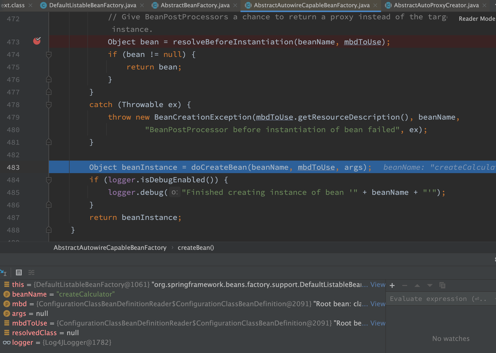
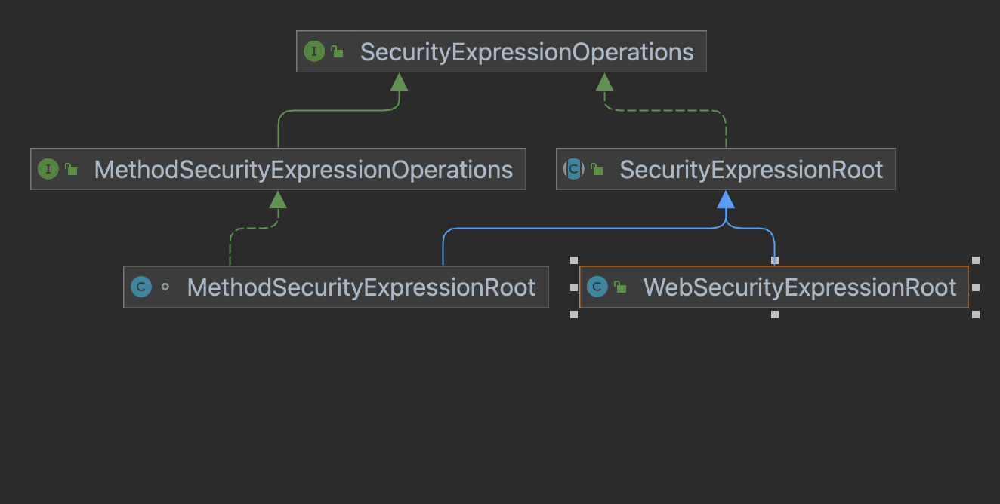

# Spring笔记之一

## 序号（1~30）

### 1 @Resource注解是在哪儿解析的

```java
// CommonAnnotationBeanPostProcessor.java
private InjectionMetadata buildResourceMetadata(final Class<?> clazz) {
    LinkedList<InjectionMetadata.InjectedElement> elements = new LinkedList<InjectionMetadata.InjectedElement>();
    Class<?> targetClass = clazz;

    do {
        final LinkedList<InjectionMetadata.InjectedElement> currElements =
                new LinkedList<InjectionMetadata.InjectedElement>();

        // 先处理属性上的注解
        ReflectionUtils.doWithLocalFields(targetClass, new ReflectionUtils.FieldCallback() {
            @Override
            public void doWith(Field field) throws IllegalArgumentException, IllegalAccessException {
                if (webServiceRefClass != null && field.isAnnotationPresent(webServiceRefClass)) {
                    if (Modifier.isStatic(field.getModifiers())) {
                        throw new IllegalStateException("@WebServiceRef annotation is not supported on static fields");
                    }
                    currElements.add(new WebServiceRefElement(field, field, null));
                }
                else if (ejbRefClass != null && field.isAnnotationPresent(ejbRefClass)) {
                    if (Modifier.isStatic(field.getModifiers())) {
                        throw new IllegalStateException("@EJB annotation is not supported on static fields");
                    }
                    currElements.add(new EjbRefElement(field, field, null));
                }
                /*
                    属性上的@Resource注解，如果存在则生成一个ResourceElement对象，加入List
                    */
                else if (field.isAnnotationPresent(Resource.class)) {
                    if (Modifier.isStatic(field.getModifiers())) {
                        throw new IllegalStateException("@Resource annotation is not supported on static fields");
                    }
                    if (!ignoredResourceTypes.contains(field.getType().getName())) {
                        currElements.add(new ResourceElement(field, field, null));
                    }
                }
            }
        });

        // 再处理方法上的注解
        ReflectionUtils.doWithLocalMethods(targetClass, new ReflectionUtils.MethodCallback() {
            @Override
            public void doWith(Method method) throws IllegalArgumentException, IllegalAccessException {
                Method bridgedMethod = BridgeMethodResolver.findBridgedMethod(method);
                if (!BridgeMethodResolver.isVisibilityBridgeMethodPair(method, bridgedMethod)) {
                    return;
                }
                if (method.equals(ClassUtils.getMostSpecificMethod(method, clazz))) {
                    if (webServiceRefClass != null && bridgedMethod.isAnnotationPresent(webServiceRefClass)) {
                        if (Modifier.isStatic(method.getModifiers())) {
                            throw new IllegalStateException("@WebServiceRef annotation is not supported on static methods");
                        }
                        if (method.getParameterTypes().length != 1) {
                            throw new IllegalStateException("@WebServiceRef annotation requires a single-arg method: " + method);
                        }
                        PropertyDescriptor pd = BeanUtils.findPropertyForMethod(bridgedMethod, clazz);
                        currElements.add(new WebServiceRefElement(method, bridgedMethod, pd));
                    }
                    else if (ejbRefClass != null && bridgedMethod.isAnnotationPresent(ejbRefClass)) {
                        if (Modifier.isStatic(method.getModifiers())) {
                            throw new IllegalStateException("@EJB annotation is not supported on static methods");
                        }
                        if (method.getParameterTypes().length != 1) {
                            throw new IllegalStateException("@EJB annotation requires a single-arg method: " + method);
                        }
                        PropertyDescriptor pd = BeanUtils.findPropertyForMethod(bridgedMethod, clazz);
                        currElements.add(new EjbRefElement(method, bridgedMethod, pd));
                    }
                    // 方法上的@Resource，如果存在，生成一个ResourceElement对象，加入List
                    else if (bridgedMethod.isAnnotationPresent(Resource.class)) {
                        if (Modifier.isStatic(method.getModifiers())) {
                            throw new IllegalStateException("@Resource annotation is not supported on static methods");
                        }
                        Class<?>[] paramTypes = method.getParameterTypes();
                        if (paramTypes.length != 1) {
                            throw new IllegalStateException("@Resource annotation requires a single-arg method: " + method);
                        }
                        if (!ignoredResourceTypes.contains(paramTypes[0].getName())) {
                            PropertyDescriptor pd = BeanUtils.findPropertyForMethod(bridgedMethod, clazz);
                            currElements.add(new ResourceElement(method, bridgedMethod, pd));
                        }
                    }
                }
            }
        });

        elements.addAll(0, currElements);
        targetClass = targetClass.getSuperclass();
    }
    while (targetClass != null && targetClass != Object.class);

    return new InjectionMetadata(clazz, elements);
}

// 内部类
private class ResourceElement extends LookupElement {

    private final boolean lazyLookup;

    public ResourceElement(Member member, AnnotatedElement ae, PropertyDescriptor pd) {
        super(member, pd);
        // 获取注解 @Resource并解析
        Resource resource = ae.getAnnotation(Resource.class);
        String resourceName = resource.name();
        Class<?> resourceType = resource.type();
        this.isDefaultName = !StringUtils.hasLength(resourceName);
        if (this.isDefaultName) {
            resourceName = this.member.getName();
            if (this.member instanceof Method && resourceName.startsWith("set") && resourceName.length() > 3) {
                resourceName = Introspector.decapitalize(resourceName.substring(3));
            }
        }
        else if (embeddedValueResolver != null) {
            resourceName = embeddedValueResolver.resolveStringValue(resourceName);
        }
        if (resourceType != null && Object.class != resourceType) {
            checkResourceType(resourceType);
        }
        else {
            // No resource type specified... check field/method.
            resourceType = getResourceType();
        }
        this.name = resourceName;
        this.lookupType = resourceType;
        String lookupValue = (lookupAttribute != null ?
                (String) ReflectionUtils.invokeMethod(lookupAttribute, resource) : null);
        this.mappedName = (StringUtils.hasLength(lookupValue) ? lookupValue : resource.mappedName());
        Lazy lazy = ae.getAnnotation(Lazy.class);
        this.lazyLookup = (lazy != null && lazy.value());
    }

    @Override
    protected Object getResourceToInject(Object target, String requestingBeanName) {
        return (this.lazyLookup ? buildLazyResourceProxy(this, requestingBeanName) :
                getResource(this, requestingBeanName));
    }
}
```

对比@Autowired注解的解析：AutowiredAnnotationBeanPostProcessor

Spring处理@Autowired注解，有2处：

（1）postProcessMergedBeanDefinition方法：预处理，缓存属性或方法

（2）populateBean方法：注入属性或方法

```java
// AutowiredAnnotationBeanPostProcessor
public class AutowiredAnnotationBeanPostProcessor extends InstantiationAwareBeanPostProcessorAdapter
        implements MergedBeanDefinitionPostProcessor, PriorityOrdered, BeanFactoryAware {

    protected final Log logger = LogFactory.getLog(getClass());

    private final Set<Class<? extends Annotation>> autowiredAnnotationTypes =
            new LinkedHashSet<Class<? extends Annotation>>();

    private String requiredParameterName = "required";

    private boolean requiredParameterValue = true;

    private int order = Ordered.LOWEST_PRECEDENCE - 2;

    private ConfigurableListableBeanFactory beanFactory;

    private final Set<String> lookupMethodsChecked =
            Collections.newSetFromMap(new ConcurrentHashMap<String, Boolean>(256));

    private final Map<Class<?>, Constructor<?>[]> candidateConstructorsCache =
            new ConcurrentHashMap<Class<?>, Constructor<?>[]>(256);

    private final Map<String, InjectionMetadata> injectionMetadataCache =
            new ConcurrentHashMap<String, InjectionMetadata>(256);


    /**
     * Create a new AutowiredAnnotationBeanPostProcessor
     * for Spring's standard {@link Autowired} annotation.
     * <p>Also supports JSR-330's {@link javax.inject.Inject} annotation, if available.
     */
    @SuppressWarnings("unchecked")
    public AutowiredAnnotationBeanPostProcessor() {
        // @Autowired
        this.autowiredAnnotationTypes.add(Autowired.class);
        // @Value
        this.autowiredAnnotationTypes.add(Value.class);
        try {
            this.autowiredAnnotationTypes.add((Class<? extends Annotation>)
                    ClassUtils.forName("javax.inject.Inject", AutowiredAnnotationBeanPostProcessor.class.getClassLoader()));
            logger.info("JSR-330 'javax.inject.Inject' annotation found and supported for autowiring");
        }
        catch (ClassNotFoundException ex) {
            // JSR-330 API not available - simply skip.
        }
    }

    /*
      doCreateBean方法中的方法applyMergedBeanDefinitionPostProcessors：
      protected void applyMergedBeanDefinitionPostProcessors(RootBeanDefinition mbd, Class<?> beanType, String beanName) {
        for (BeanPostProcessor bp : getBeanPostProcessors()) {
            if (bp instanceof MergedBeanDefinitionPostProcessor) {
                MergedBeanDefinitionPostProcessor bdp = (MergedBeanDefinitionPostProcessor) bp;
                bdp.postProcessMergedBeanDefinition(mbd, beanType, beanName);
            }
        }
    }
    */
    @Override
    public void postProcessMergedBeanDefinition(RootBeanDefinition beanDefinition, Class<?> beanType, String beanName) {
        if (beanType != null) {
            InjectionMetadata metadata = findAutowiringMetadata(beanName, beanType, null);
            metadata.checkConfigMembers(beanDefinition);
        }
    }

    // populateBean方法中遍历BeanPostProcessors来调用此方法
    @Override
    public PropertyValues postProcessPropertyValues(
            PropertyValues pvs, PropertyDescriptor[] pds, Object bean, String beanName) throws BeanCreationException {

        InjectionMetadata metadata = findAutowiringMetadata(beanName, bean.getClass(), pvs);
        try {
            metadata.inject(bean, beanName, pvs);
        }
        catch (BeanCreationException ex) {
            throw ex;
        }
        catch (Throwable ex) {
            throw new BeanCreationException(beanName, "Injection of autowired dependencies failed", ex);
        }
        return pvs;
    }
    // 省略
}
```

看一下PostProcessor的调用关系：


```java
// CommonAnnotationBeanPostProcessor.java的部分注释
/**
org.springframework.beans.factory.config.BeanPostProcessor implementation 
that supports common Java annotations out of the box, in particular the 
JSR-250 annotations in the javax.annotation package. These common Java 
annotations are supported in many Java EE 5 technologies (e.g. JSF 1.2), 
as well as in Java 6's JAX-WS.

This post-processor includes support for the PostConstruct and PreDestroy 
annotations - as init annotation and destroy annotation, respectively - 
through inheriting from InitDestroyAnnotationBeanPostProcessor with 
pre-configured annotation types.

The central element is the Resource annotation for annotation-driven injection
of named beans, by default from the containing Spring BeanFactory, with only 
mappedName references resolved in JNDI. The "alwaysUseJndiLookup" flag enforces
JNDI lookups equivalent to standard Java EE 5 resource injection for name 
references and default names as well. The target beans can be simple POJOs, 
with no special requirements other than the type having to match.

*/
```

### 2 BeanFactory与FactoryBean

（1）BeanFactory 是接口，提供了IOC容器最基本的形式，给具体的IOC容器的实现提供了规范，功能非常复杂。
（2）FactoryBean 也是接口，为IOC容器中Bean的实现提供了更加灵活的方式，FactoryBean在IOC容器的基础上给Bean的实现加上了一个简单的
工厂模式和装饰模式 ，我们可以在getObject()方法中灵活配置.
如果我们想要编写一些比较复杂点儿的逻辑就会触及到其他一些不必要的接口，或者只是想简单的去构造Bean，不希望实现IOC容器原有的大量方法，这时候就可以使用FactoryBean
（3）FactoryBean的实际应用
a. 使用MyBatis时就用到了FactoryBean

```xml
<!-- SqlSessionFactory -->
<bean id="dgSqlSessionFactory"  class="org.mybatis.spring.SqlSessionFactoryBean">
    <property name="dataSource" ref="dgDataSource"/>
    <!-- mybatis配置文件路径-->
    <property name="configLocation"  value="classpath:mybatis-config.xml"/>   
    <!-- 实体类映射文件路径-->
    <property name="mapperLocations" value="classpath*:query-mapping/**/*.xml"/>
</bean>
```

```java
package org.mybatis.spring;

// 省略imports

public class SqlSessionFactoryBean implements FactoryBean<SqlSessionFactory>, InitializingBean, ApplicationListener<ApplicationEvent> {
    private static final Log LOGGER = LogFactory.getLog(SqlSessionFactoryBean.class);
    private Resource configLocation;
    private Resource[] mapperLocations;
    private DataSource dataSource;
    private TransactionFactory transactionFactory;
    private Properties configurationProperties;
    private SqlSessionFactoryBuilder sqlSessionFactoryBuilder = new SqlSessionFactoryBuilder();
    private SqlSessionFactory sqlSessionFactory;

    // 中间省略很多代码

    public SqlSessionFactory getObject() throws Exception {
        if (this.sqlSessionFactory == null) {
            this.afterPropertiesSet();
        }

        return this.sqlSessionFactory;
    }

    public Class<? extends SqlSessionFactory> getObjectType() {
        return this.sqlSessionFactory == null ? SqlSessionFactory.class : this.sqlSessionFactory.getClass();
    }

    public boolean isSingleton() {
        return true;
    }

}
```

b. quartz定时器

```java
package org.springframework.scheduling.quartz;

// 省略imports

public class SchedulerFactoryBean extends SchedulerAccessor implements FactoryBean<Scheduler>, BeanNameAware, ApplicationContextAware, InitializingBean, DisposableBean, SmartLifecycle {
    public static final String PROP_THREAD_COUNT = "org.quartz.threadPool.threadCount";
    public static final int DEFAULT_THREAD_COUNT = 10;
    private static final ThreadLocal<ResourceLoader> configTimeResourceLoaderHolder = new ThreadLocal();
    private static final ThreadLocal<Executor> configTimeTaskExecutorHolder = new ThreadLocal();
    private static final ThreadLocal<DataSource> configTimeDataSourceHolder = new ThreadLocal();
    private static final ThreadLocal<DataSource> configTimeNo

    // 省略代码    

}
```

### 3 Spring的事务传播机制

查看Spring的Propagation枚举类：

```java
// org.springframework.transaction.annotation.Propagation
public enum Propagation {

   REQUIRED(TransactionDefinition.PROPAGATION_REQUIRED),

   SUPPORTS(TransactionDefinition.PROPAGATION_SUPPORTS),

   MANDATORY(TransactionDefinition.PROPAGATION_MANDATORY),

   REQUIRES_NEW(TransactionDefinition.PROPAGATION_REQUIRES_NEW),

   NOT_SUPPORTED(TransactionDefinition.PROPAGATION_NOT_SUPPORTED),

   NEVER(TransactionDefinition.PROPAGATION_NEVER),

   NESTED(TransactionDefinition.PROPAGATION_NESTED);

   private final int value;

   Propagation(int value) {
      this.value = value;
   }

   public int value() {
      return this.value;
   }

}

// 查看org.springframework.transaction.TransactionDefinition   
int PROPAGATION_REQUIRED = 0;

int PROPAGATION_SUPPORTS = 1;

int PROPAGATION_MANDATORY = 2;

int PROPAGATION_REQUIRES_NEW = 3;

int PROPAGATION_NOT_SUPPORTED = 4;

int PROPAGATION_NEVER = 5;

int PROPAGATION_NESTED = 6;

int ISOLATION_DEFAULT = -1;

int ISOLATION_READ_UNCOMMITTED = Connection.TRANSACTION_READ_UNCOMMITTED;

int ISOLATION_READ_COMMITTED = Connection.TRANSACTION_READ_COMMITTED;

int ISOLATION_REPEATABLE_READ = Connection.TRANSACTION_REPEATABLE_READ;

int ISOLATION_SERIALIZABLE = Connection.TRANSACTION_SERIALIZABLE;

int TIMEOUT_DEFAULT = -1;

int getPropagationBehavior();

int getIsolationLevel();

int getTimeout();

boolean isReadOnly();

String getName();

// 隔离级别，java.sql.Connection
int TRANSACTION_NONE             = 0;

int TRANSACTION_READ_UNCOMMITTED = 1;

int TRANSACTION_READ_COMMITTED   = 2;

int TRANSACTION_REPEATABLE_READ  = 4;

int TRANSACTION_SERIALIZABLE     = 8;
```

### 4 Spring事务什么时候会失效

Spring事务的原理是AOP，进行了切面增强，那么失效的根本原因就是这个AOP不起作用了。常见情况有以下几种：
（1）自调用
类里面使用this调用本类的方法（this通常省略），此时这个this对象不是代理类，而是对象本身
解决方法有二种:
a. 使用代理类调用该方法
b. <aop:aspectj-autoproxy expose-proxy=“true”> ，设置expose-proxy属性为true，将代理暴露出来，使用AopContext.currentProxy()获取当前代理，将this.b()改为((UserService)AopContext.currentProxy()).b()
AopContext.currentProxy()的本质是使用ThreadLocal保存代理对象

```java
public abstract class AopContext {

    /**
     * ThreadLocal holder for AOP proxy associated with this thread.
     * Will contain {@code null} unless the "exposeProxy" property on
     * the controlling proxy configuration has been set to "true".
     * @see ProxyConfig#setExposeProxy
     */
    private static final ThreadLocal<Object> currentProxy = new NamedThreadLocal<Object>("Current AOP proxy");

    public static Object currentProxy() throws IllegalStateException {
        Object proxy = currentProxy.get();
        if (proxy == null) {
            throw new IllegalStateException(
                    "Cannot find current proxy: Set 'exposeProxy' property on Advised to 'true' to make it available.");
        }
        return proxy;
    }

    static Object setCurrentProxy(Object proxy) {
        Object old = currentProxy.get();
        if (proxy != null) {
            currentProxy.set(proxy);
        }
        else {
            currentProxy.remove();
        }
        return old;
    }

}
```

（2）方法不是public
@Transactional只能用于public方法上，否则事务不会生效，如果偏要用在非public方法上，可以开启AspectJ代理模式
（3）数据库不支持事务
（4）没有被Spring管理
（5）异常被吃掉，事务不会回滚（或者抛出的异常没有被定义，默认为RuntimeException）

### 5 Spring三级缓存

* singletonObjects 一级缓存，用于保存实例化、注入、初始化完成的bean实例
* earlySingletonObjects 二级缓存，用于保存实例化完成的bean实例
* singletonFactories 三级缓存，用于保存bean创建工厂，以便于后面扩展有机会创建代理对象。

摘自博客：[spring: 我是如何解决循环依赖的？ - Mars独行侠 - 博客园 (cnblogs.com)](https://www.cnblogs.com/wjxzs/p/14239052.html)

### 6 Spring中的DependsOn注解

AbstractBeanFactory中DependsOn相关代码：

```java
try {
    RootBeanDefinition mbd = this.getMergedLocalBeanDefinition(beanName);
    this.checkMergedBeanDefinition(mbd, beanName, args);
    String[] dependsOn = mbd.getDependsOn();
    String[] var11;
    if (dependsOn != null) {
        var11 = dependsOn;
        int var12 = dependsOn.length;

        for(int var13 = 0; var13 < var12; ++var13) {
            String dep = var11[var13];
            if (this.isDependent(beanName, dep)) {
                throw new BeanCreationException(mbd.getResourceDescription(), beanName, "Circular depends-on relationship between '" + beanName + "' and '" + dep + "'");
            }

            this.registerDependentBean(dep, beanName);

            try {
                this.getBean(dep);
            } catch (NoSuchBeanDefinitionException var24) {
                throw new BeanCreationException(mbd.getResourceDescription(), beanName, "'" + beanName + "' depends on missing bean '" + dep + "'", var24);
            }
        }
    }
 // 省略代码   
}
```

### 7 Spring的bean加载

* 获取Bean

* 缓存中获取单例bean

* 准备创建bean
  
  ```java
  protected Object createBean(String beanName, RootBeanDefinition mbd, Object[] args) throws BeanCreationException {
      if (this.logger.isDebugEnabled()) {
          this.logger.debug("Creating instance of bean '" + beanName + "'");
      }
  
      RootBeanDefinition mbdToUse = mbd;
      Class<?> resolvedClass = this.resolveBeanClass(mbd, beanName, new Class[0]);
      if (resolvedClass != null && !mbd.hasBeanClass() && mbd.getBeanClassName() != null) {
          mbdToUse = new RootBeanDefinition(mbd);
          mbdToUse.setBeanClass(resolvedClass);
      }
  
      try {
          // 1，处理override属性
          mbdToUse.prepareMethodOverrides();
      } catch (BeanDefinitionValidationException var7) {
          throw new BeanDefinitionStoreException(mbdToUse.getResourceDescription(), beanName, "Validation of method overrides failed", var7);
      }
  
      Object beanInstance;
      try {
          // 2，实例化的前置处理
          beanInstance = this.resolveBeforeInstantiation(beanName, mbdToUse);
          if (beanInstance != null) {
              return beanInstance;
          }
      } catch (Throwable var8) {
          throw new BeanCreationException(mbdToUse.getResourceDescription(), beanName, "BeanPostProcessor before instantiation of bean failed", var8);
      }
  
      // 3，创建bean
      beanInstance = this.doCreateBean(beanName, mbdToUse, args);
      if (this.logger.isDebugEnabled()) {
          this.logger.debug("Finished creating instance of bean '" + beanName + "'");
      }
  
      return beanInstance;
  }
  ```
  
  （1）处理override属性

```java
  mbd.prepareMethodOverrides();
```

  （2）实例化的前置处理

```java
// 给BeanPostProcessors一个机会来返回代理来替代真正的实例
Object bean = resolveBeforeInstantiation(beanName, mbdToUse);
if (bean != null) {
    return bean;
}

// 
protected Object resolveBeforeInstantiation(String beanName, RootBeanDefinition mbd) {
    Object bean = null;
    if (!Boolean.FALSE.equals(mbd.beforeInstantiationResolved)) {
        if (!mbd.isSynthetic() && this.hasInstantiationAwareBeanPostProcessors()) {
            Class<?> targetType = this.determineTargetType(beanName, mbd);
            if (targetType != null) {
                bean = this.applyBeanPostProcessorsBeforeInstantiation(targetType, beanName);
                if (bean != null) {
                    bean = this.applyBeanPostProcessorsAfterInitialization(bean, beanName);
                }
            }
        }

        mbd.beforeInstantiationResolved = bean != null;
    }

    return bean;
}
```

* 创建bean

```java
// AbstractAutowireCapableBeanFactory.doCreateBean
protected Object doCreateBean(final String beanName, final RootBeanDefinition mbd, Object[] args) throws BeanCreationException {
    BeanWrapper instanceWrapper = null;
    // 1，如果是单例，则需要清除缓存
    if (mbd.isSingleton()) {
        instanceWrapper = (BeanWrapper)this.factoryBeanInstanceCache.remove(beanName);
    }
    // 2，实例化bean，将beanDefinition转换为BeanWrapper
    if (instanceWrapper == null) {
        instanceWrapper = this.createBeanInstance(beanName, mbd, args);
    }

    final Object bean = instanceWrapper != null ? instanceWrapper.getWrappedInstance() : null;
    Class<?> beanType = instanceWrapper != null ? instanceWrapper.getWrappedClass() : null;
    mbd.resolvedTargetType = beanType;
    synchronized(mbd.postProcessingLock) {
        if (!mbd.postProcessed) {
            try {
                // 3，bean合并后的处理，预解析Autowired注解
                this.applyMergedBeanDefinitionPostProcessors(mbd, beanType, beanName);
            } catch (Throwable var17) {
                throw new BeanCreationException(mbd.getResourceDescription(), beanName, "Post-processing of merged bean definition failed", var17);
            }

            mbd.postProcessed = true;
        }
    }
    // 4，是否需要提早曝光：单例 & 允许循环依赖 & 当前bean正在创建中，检测循环依赖
    boolean earlySingletonExposure = mbd.isSingleton() && this.allowCircularReferences && this.isSingletonCurrentlyInCreation(beanName);
    if (earlySingletonExposure) {
        if (this.logger.isDebugEnabled()) {
            this.logger.debug("Eagerly caching bean '" + beanName + "' to allow for resolving potential circular references");
        }

        this.addSingletonFactory(beanName, new ObjectFactory<Object>() {
            public Object getObject() throws BeansException {
                // AOP就是在这里将advice动态织入bean中
                return this.getEarlyBeanReference(beanName, mbd, bean);
            }
        });
    }

    Object exposedObject = bean;
    try {
        // 5，填充属性
        this.populateBean(beanName, mbd, instanceWrapper);
        if (exposedObject != null) {
            // 调用初始化方法，先执行afterPropertiesSet，后执行init-method
            exposedObject = this.initializeBean(beanName, exposedObject, mbd);
        }
    } catch (Throwable var18) {
        if (var18 instanceof BeanCreationException && beanName.equals(((BeanCreationException)var18).getBeanName())) {
            throw (BeanCreationException)var18;
        }

        throw new BeanCreationException(mbd.getResourceDescription(), beanName, "Initialization of bean failed", var18);
    }
    // 6，循环依赖检查
    if (earlySingletonExposure) {
        Object earlySingletonReference = this.getSingleton(beanName, false);
        if (earlySingletonReference != null) {
            if (exposedObject == bean) {
                exposedObject = earlySingletonReference;
            } else if (!this.allowRawInjectionDespiteWrapping && this.hasDependentBean(beanName)) {
                String[] dependentBeans = this.getDependentBeans(beanName);
                Set<String> actualDependentBeans = new LinkedHashSet(dependentBeans.length);
                String[] var12 = dependentBeans;
                int var13 = dependentBeans.length;

                for(int var14 = 0; var14 < var13; ++var14) {
                    String dependentBean = var12[var14];
                    if (!this.removeSingletonIfCreatedForTypeCheckOnly(dependentBean)) {
                        actualDependentBeans.add(dependentBean);
                    }
                }

                if (!actualDependentBeans.isEmpty()) {
                    throw new BeanCurrentlyInCreationException(beanName, "Bean with name '" + beanName + "' has been injected into other beans [" + StringUtils.collectionToCommaDelimitedString(actualDependentBeans) + "] in its raw version as part of a circular reference, but has eventually been wrapped. This means that said other beans do not use the final version of the bean. This is often the result of over-eager type matching - consider using 'getBeanNamesOfType' with the 'allowEagerInit' flag turned off, for example.");
                }
            }
        }
    }

    try {
        // 7 注册DisposableBean
        this.registerDisposableBeanIfNecessary(beanName, bean, mbd);
        // 8 完成创建并返回
        return exposedObject;
    } catch (BeanDefinitionValidationException var16) {
        throw new BeanCreationException(mbd.getResourceDescription(), beanName, "Invalid destruction signature", var16);
    }
}

protected Object getEarlyBeanReference(String beanName, RootBeanDefinition mbd, Object bean) {
    Object exposedObject = bean;
    if (bean != null && !mbd.isSynthetic() && hasInstantiationAwareBeanPostProcessors()) {
        for (BeanPostProcessor bp : getBeanPostProcessors()) {
            /* 实现SmartInstantiationAwareBeanPostProcessor接口的有2大类
            而@Autowired的处理类和AOP的处理类分别处于不同的分支
            */
            if (bp instanceof SmartInstantiationAwareBeanPostProcessor) {
                SmartInstantiationAwareBeanPostProcessor ibp = (SmartInstantiationAwareBeanPostProcessor) bp;
                exposedObject = ibp.getEarlyBeanReference(exposedObject, beanName);
                if (exposedObject == null) {
                    return null;
                }
            }
        }
    }
    return exposedObject;
}


// 如果已创建，则删除缓存
protected boolean removeSingletonIfCreatedForTypeCheckOnly(String beanName) {
    if (!this.alreadyCreated.contains(beanName)) {
        this.removeSingleton(beanName);
        return true;
    } else {
        return false;
    }
}


protected void removeSingleton(String beanName) {
    synchronized(this.getSingletonMutex()) {
        super.removeSingleton(beanName);
        this.factoryBeanObjectCache.remove(beanName);
    }
}


protected void removeSingleton(String beanName) {
    synchronized(this.singletonObjects) {
        this.singletonObjects.remove(beanName);
        this.singletonFactories.remove(beanName);
        this.earlySingletonObjects.remove(beanName);
        this.registeredSingletons.remove(beanName);
    }
}
```


### 8 Spring的依赖注入（DI）

#### Constructor-based Dependency Injection

Constructor-based DI is accomplished by the container invoking a constructor with a number of arguments, each representing a dependency. Calling a static factory method with specific arguments to construct the bean is nearly equivalent, and this discussion treats arguments to a constructor and to a static factory method similarly.

#### Setter-based Dependency Injection

Setter-based DI is accomplished by the container calling setter methods on your beans after invoking a no-argument constructor or a no-argument static factory method to instantiate your bean.

基于Setter的DI是由容器在调用无参数构造函数或无参数`静态`工厂方法实例化bean后调用bean上的Setter方法来实现的。

#### Constructor-based or setter-based DI?

Since you can mix constructor-based and setter-based DI, it is a good rule of thumb to use constructors for mandatory dependencies and setter methods or configuration methods for optional dependencies. Note that use of the @Required annotation on a setter method can be used to make the property be a required dependency; however, constructor injection with programmatic validation of arguments is preferable.

The Spring team generally advocates constructor injection, as it lets you implement application components as immutable objects and ensures that required dependencies are not null. Furthermore, constructor-injected components are always returned to the client (calling) code in a fully initialized state. As a side note, a large number of constructor arguments is a bad code smell, implying that the class likely has too many responsibilities and should be refactored to better address proper separation of concerns.

Setter injection should primarily only be used for optional dependencies that can be assigned reasonable default values within the class. Otherwise, not-null checks must be performed everywhere the code uses the dependency. One benefit of setter injection is that setter methods make objects of that class amenable to reconfiguration or re-injection later. Management through JMX MBeans is therefore a compelling use case for setter injection.

Use the DI style that makes the most sense for a particular class. Sometimes, when dealing with third-party classes for which you do not have the source, the choice is made for you. For example, if a third-party class does not expose

### 9 Spring启动流程

（1）在创建Spring容器，即启动Spring时：

* a. 扫描xml文件，得到所有的BeanDefinition对象，并保存在一个Map中
  
* b. 筛选出非懒加载的单例BeanDefinition进行创建，对于多例不需要在启动过程中创建，会在每次获取Bean时利用BeanDefinition创建
* c. 利用BeanDefinition创建Bean就是Bean的创建的生命周期，这过程包括了合并BeanDefinition、推断构造方法、实例化、属性填充、初始化前、初始化、初始化后等步骤，其中AOP就是改重在初始化后这一步骤中

（2）单例Bean创建完成之后，Spring会发布一个容器启动事件
（3）Spring启动结束

### 10 Spring源码阅读

#### Spring的核心类介绍

* DefaultListableBeanFactory


AliasRegistry  定义对alias的简单增删改等操作
SimpleAliasRegistry  主要使用map作为alias的缓存，并对接口AliasRegistry进行实现
SingletonBeanRegistry  定义对单例的注册及获取
BeanFactory  定义获取bean及bean的各种属性
DefaultSingletonBeanRegistry  对接口SingletonBeanRegistry各函数的实现
HierarchicalBeanFactory  继承BeanFactory，也就是在BeanFactory定义的功能的基础上增加了对parentFactory的支持
BeanDefinitionRegistry 定义对BeanDefinition的各种增删改操作
FactoryBeanRegistrySupport  在DefaultSingletonBeanRegistry基础上增加了对FactoryBean的特殊处理功能
ConfigurableBeanFactory  提供配置Factory的各种办法
ListableBeanFactory  根据各种条件获取bean的配置清单
AbstractBeanFactory  综合FactoryBeanRegistrySupport和ConfigurableBeanFactory的功能
AutowireCapableBeanFactory  提供创建bean、自动注入、初始化以及应用bean的后处理器
AbstractAutowireCapableBeanFactory  综合AbstractBeanFactory并对接口AutowireCapableBeanFactory进行实现
ConfigurableListableBeanFactory  BeanFactory配置清单，指定忽略糊弄及接口等
DefaultListableBeanFactory  综合上面所有功能，主要是对bean注册后的处理

* XmlBeanDefinitionReader


ResourceLoader  定义资源加载器，主要应用于根据给定的资源文件地址返回对应的Resource
BeanDefinitionReader  主要定义资源文件读取并置换为BeanDefinition的各个功能
EnvironmentCapable  定义获取Environment方法
DocumentLoader  定义从资源文件加载到置换为Document的功能
AbstractBeanDefinitionReader  对EnvironmentCapable、BeanDefinitionReader类定义的功能进行实现
BeanDefinitionDocumentReader  定义读取Document并注册BeanDefinition功能
BeanDefinitionParserDelegate  定义解析Element的各种方法

* 容器的基础XmlBeanFactory

  * 配置文件的封装


```java
    // AbstractAutowireCapableBeanFactory
    public AbstractAutowireCapableBeanFactory() {
        this.instantiationStrategy = new CglibSubclassingInstantiationStrategy();
        this.parameterNameDiscoverer = new DefaultParameterNameDiscoverer();
        this.allowCircularReferences = true;
        this.allowRawInjectionDespiteWrapping = false;
        this.ignoredDependencyTypes = new HashSet();
        this.ignoredDependencyInterfaces = new HashSet();
        this.currentlyCreatedBean = new NamedThreadLocal("Currently created bean");
        this.factoryBeanInstanceCache = new ConcurrentHashMap();
        this.factoryMethodCandidateCache = new ConcurrentHashMap();
        this.filteredPropertyDescriptorsCache = new ConcurrentHashMap();
        this.ignoreDependencyInterface(BeanNameAware.class);
        this.ignoreDependencyInterface(BeanFactoryAware.class);
        this.ignoreDependencyInterface(BeanClassLoaderAware.class);
    }

    public void ignoreDependencyInterface(Class<?> ifc) {
        this.ignoredDependencyInterfaces.add(ifc);
    }

    protected boolean isExcludedFromDependencyCheck(PropertyDescriptor pd) {
        return AutowireUtils.isExcludedFromDependencyCheck(pd) || this.ignoredDependencyTypes.contains(pd.getPropertyType()) || AutowireUtils.isSetterDefinedInInterface(pd, this.ignoredDependencyInterfaces);
    }
```

ignoreDependencyInterface方法的主要是忽略给定接口的自动装配功能，那么这样做的目的是什么？
举例来说，当A中有属性B，那么当Spring在获取A的Bean的时候如果其属性B还没初始化，那么Spring会自动初始化B。但是，某些情况下，B不会被初始化，其中的一种情况就是B实现了BeanNameAware接口。
Spring中是这样介绍的：自动装配时忽略给定的接口依赖，典型应用是通过其他方式解析Application上下文注册依赖，类似于BeanFactory通过BeanFactoryAware进行注入或者ApplicationContext通过ApplicationContextAware进行注入

  * 加载Bean

```java
public class XmlBeanFactory extends DefaultListableBeanFactory {
    private final XmlBeanDefinitionReader reader;

    public XmlBeanFactory(Resource resource) throws BeansException {
        this(resource, (BeanFactory)null);
    }

    public XmlBeanFactory(Resource resource, BeanFactory parentBeanFactory) throws BeansException {
        super(parentBeanFactory);
        this.reader = new XmlBeanDefinitionReader(this);
        /** 加载Bean
         * 1，封装资源文件。当进入XmlBeanDefinitionReader后首先对参数Resource使用EncodedResource封装
         * 2，获取输入流。从Resource中获取对应的InputStream并构造InputSource
         * 3，通过构造的InputSource实例和Resource实例继续调用函数doLoadBeanDefinitions.
         * 注意：InputSource这个类并不来自于Spring，它的全路径是org.xml.sax.InputSource
         */
        this.reader.loadBeanDefinitions(resource);
    }
}
```

InputSource，EntityResolver都在jdk中


```java
    // XmlBeanDefinitionReader
    protected int doLoadBeanDefinitions(InputSource inputSource, Resource resource)
            throws BeanDefinitionStoreException {

        try {
            // 1，获取对XML文件的验证模式
            // 2，加载XML文件，并得到对应的Document
            Document doc = doLoadDocument(inputSource, resource);
            // 3，根据返回的Document注册Bean信息
            int count = registerBeanDefinitions(doc, resource);
            if (logger.isDebugEnabled()) {
                logger.debug("Loaded " + count + " bean definitions from " + resource);
            }
            return count;
        }
        catch (BeanDefinitionStoreException ex) {
            throw ex;
        }
        catch (SAXParseException ex) {
            throw new XmlBeanDefinitionStoreException(resource.getDescription(),
                    "Line " + ex.getLineNumber() + " in XML document from " + resource + " is invalid", ex);
        }
        catch (SAXException ex) {
            throw new XmlBeanDefinitionStoreException(resource.getDescription(),
                    "XML document from " + resource + " is invalid", ex);
        }
        catch (ParserConfigurationException ex) {
            throw new BeanDefinitionStoreException(resource.getDescription(),
                    "Parser configuration exception parsing XML from " + resource, ex);
        }
        catch (IOException ex) {
            throw new BeanDefinitionStoreException(resource.getDescription(),
                    "IOException parsing XML document from " + resource, ex);
        }
        catch (Throwable ex) {
            throw new BeanDefinitionStoreException(resource.getDescription(),
                    "Unexpected exception parsing XML document from " + resource, ex);
        }
    }

    /**
     * Actually load the specified document using the configured DocumentLoader.
     * @param inputSource the SAX InputSource to read from
     * @param resource the resource descriptor for the XML file
     * @return the DOM Document
     * @throws Exception when thrown from the DocumentLoader
     * @see #setDocumentLoader
     * @see DocumentLoader#loadDocument
     */
    protected Document doLoadDocument(InputSource inputSource, Resource resource) throws Exception {
        return this.documentLoader.loadDocument(inputSource, getEntityResolver(), this.errorHandler,
                getValidationModeForResource(resource), isNamespaceAware());
    }
```

```java
    // XmlValidationModeDetector
    public int detectValidationMode(InputStream inputStream) throws IOException {
        // Peek into the file to look for DOCTYPE.
        BufferedReader reader = new BufferedReader(new InputStreamReader(inputStream));
        try {
            boolean isDtdValidated = false;
            String content;
            while ((content = reader.readLine()) != null) {
                content = consumeCommentTokens(content);
                if (this.inComment || !StringUtils.hasText(content)) {
                    continue;
                }
                // Spring用来检测验证模式的办法就是判断是否包含DOCTYPE，如果包含就是DTD，否则就是XSD
                if (hasDoctype(content)) {
                    isDtdValidated = true;
                    break;
                }
                if (hasOpeningTag(content)) {
                    // End of meaningful data...
                    break;
                }
            }
            return (isDtdValidated ? VALIDATION_DTD : VALIDATION_XSD);
        }
        catch (CharConversionException ex) {
            // Choked on some character encoding...
            // Leave the decision up to the caller.
            return VALIDATION_AUTO;
        }
        finally {
            reader.close();
        }
    }
```

### 11 Spring事务怎么实现回滚

（1）Spring的事务管理是如何实现的
总述：Spring事务是由AOP实现的，首先要生成具体的代理对象，然后按照AOP的整套流程来执行具体的操作逻辑，正常情况下要通过通知来完成核心功能，但是事务不是通过通知来实现的，而是通过TransactionInterceptor来实现的，通过调用invoke方法来实现具体的逻辑
分述：a. 先做准备工作，解析各个方法上事务相关的属性，根据具体的属性来判断是否开启新事务
    b. 当需要开启的时候，获取数据库连接，关闭自动提交功能，开启事务
    c. 执行具体的sql逻辑操作
    d. 在操作过程中，如果执行失败了，那么会通过completeTransactionAfterThrowing方法回滚，回滚的逻辑是通过doRollBack方法来实现，也是先获取数据库连接对象，通过连接对象回滚
e. 回滚之后，要清除相关的事务信息：cleanupTransactionInfo
f. 如果没有发生异常，则执行commitTransactionAfterReturning方法，完成事务的提交，提交的逻辑是通过doCommit来实现：先获取数据库连接对象，通过连接对象提交

（2）源码

首先从配置文件的解析开始

```xml
<tx:annotation-driven transaction-manager="transactionManager"/>
```

我们回顾一下解析并注册BeanDefinition方法:

```java
// org/springframework/beans/factory/xml/DefaultBeanDefinitionDocumentReader.java
protected void parseBeanDefinitions(Element root, BeanDefinitionParserDelegate delegate) {
    if (delegate.isDefaultNamespace(root)) {
        NodeList nl = root.getChildNodes();
        for (int i = 0; i < nl.getLength(); i++) {
            Node node = nl.item(i);
            if (node instanceof Element) {
                Element ele = (Element) node;
                if (delegate.isDefaultNamespace(ele)) {
                    parseDefaultElement(ele, delegate);
                }
                else {
                    delegate.parseCustomElement(ele);
                }
            }
        }
    }
    else {
        delegate.parseCustomElement(root);
    }
}
```

因为tx标签是Spring的自定义标签，所以由parseCustomElement方法处理

```java
// org/springframework/beans/factory/xml/BeanDefinitionParserDelegate.java
public BeanDefinition parseCustomElement(Element ele) {
  return parseCustomElement(ele, null);
 }

public BeanDefinition parseCustomElement(Element ele, BeanDefinition containingBd) {
    String namespaceUri = getNamespaceURI(ele);
    NamespaceHandler handler = this.readerContext.getNamespaceHandlerResolver().resolve(namespaceUri);
    if (handler == null) {
        error("Unable to locate Spring NamespaceHandler for XML schema namespace [" + namespaceUri + "]", ele);
        return null;
    }
    return handler.parse(ele, new ParserContext(this.readerContext, this, containingBd));
}

// org/springframework/transaction/config/TxNamespaceHandler.java
public void init() {
    registerBeanDefinitionParser("advice", new TxAdviceBeanDefinitionParser());
    registerBeanDefinitionParser("annotation-driven", new AnnotationDrivenBeanDefinitionParser());
    registerBeanDefinitionParser("jta-transaction-manager", new JtaTransactionManagerBeanDefinitionParser());
}

// org/springframework/transaction/config/AnnotationDrivenBeanDefinitionParser.java
public BeanDefinition parse(Element element, ParserContext parserContext) {
    registerTransactionalEventListenerFactory(parserContext);
    String mode = element.getAttribute("mode");
    if ("aspectj".equals(mode)) {
        // mode="aspectj"
        registerTransactionAspect(element, parserContext);
    }
    else {
        // mode="proxy"
        AopAutoProxyConfigurer.configureAutoProxyCreator(element, parserContext);
    }
    return null;
}

/* 
    默认是proxy模式
    注册了4个beanDefinition:
    (1) InfrastructureAdvisorAutoProxyCreator
    (2) TransactionAttributeSource
    (3) TransactionInterceptor
    (4) TransactionAttributeSourceAdvisor
*/
private static class AopAutoProxyConfigurer {
    public static void configureAutoProxyCreator(Element element, ParserContext parserContext) {
        AopNamespaceUtils.registerAutoProxyCreatorIfNecessary(parserContext, element);

        String txAdvisorBeanName = TransactionManagementConfigUtils.TRANSACTION_ADVISOR_BEAN_NAME;
        if (!parserContext.getRegistry().containsBeanDefinition(txAdvisorBeanName)) {
            Object eleSource = parserContext.extractSource(element);

            // Create the TransactionAttributeSource definition.
            RootBeanDefinition sourceDef = new RootBeanDefinition(
                    "org.springframework.transaction.annotation.AnnotationTransactionAttributeSource");
            sourceDef.setSource(eleSource);
            sourceDef.setRole(BeanDefinition.ROLE_INFRASTRUCTURE);
            String sourceName = parserContext.getReaderContext().registerWithGeneratedName(sourceDef);

            // Create the TransactionInterceptor definition.
            RootBeanDefinition interceptorDef = new RootBeanDefinition(TransactionInterceptor.class);
            interceptorDef.setSource(eleSource);
            interceptorDef.setRole(BeanDefinition.ROLE_INFRASTRUCTURE);
            registerTransactionManager(element, interceptorDef);
            interceptorDef.getPropertyValues().add("transactionAttributeSource", new RuntimeBeanReference(sourceName));
            String interceptorName = parserContext.getReaderContext().registerWithGeneratedName(interceptorDef);

            // Create the TransactionAttributeSourceAdvisor definition.
            RootBeanDefinition advisorDef = new RootBeanDefinition(BeanFactoryTransactionAttributeSourceAdvisor.class);
            advisorDef.setSource(eleSource);
            advisorDef.setRole(BeanDefinition.ROLE_INFRASTRUCTURE);
            advisorDef.getPropertyValues().add("transactionAttributeSource", new RuntimeBeanReference(sourceName));
            advisorDef.getPropertyValues().add("adviceBeanName", interceptorName);
            if (element.hasAttribute("order")) {
                advisorDef.getPropertyValues().add("order", element.getAttribute("order"));
            }
            parserContext.getRegistry().registerBeanDefinition(txAdvisorBeanName, advisorDef);

            CompositeComponentDefinition compositeDef = new CompositeComponentDefinition(element.getTagName(), eleSource);
            compositeDef.addNestedComponent(new BeanComponentDefinition(sourceDef, sourceName));
            compositeDef.addNestedComponent(new BeanComponentDefinition(interceptorDef, interceptorName));
            compositeDef.addNestedComponent(new BeanComponentDefinition(advisorDef, txAdvisorBeanName));
            parserContext.registerComponent(compositeDef);
        }
    }
}

// @Transactional注解在哪里被解析
public class SpringTransactionAnnotationParser implements TransactionAnnotationParser, Serializable {

 @Override
 public TransactionAttribute parseTransactionAnnotation(AnnotatedElement ae) {
  AnnotationAttributes attributes = AnnotatedElementUtils.getMergedAnnotationAttributes(ae, Transactional.class);
  if (attributes != null) {
   return parseTransactionAnnotation(attributes);
  }
  else {
   return null;
  }
 }

    ......
}

// 此方法在哪儿被调用
// org/springframework/transaction/annotation/AnnotationTransactionAttributeSource.java
@Override
protected TransactionAttribute findTransactionAttribute(Method method) {
    return determineTransactionAttribute(method);
}

@Override
protected TransactionAttribute findTransactionAttribute(Class<?> clazz) {
    return determineTransactionAttribute(clazz);
}

protected TransactionAttribute determineTransactionAttribute(AnnotatedElement ae) {
    if (ae.getAnnotations().length > 0) {
        for (TransactionAnnotationParser annotationParser : this.annotationParsers) {
            TransactionAttribute attr = annotationParser.parseTransactionAnnotation(ae);
            if (attr != null) {
                return attr;
            }
        }
    }
    return null;
}
```

Spring是怎么找到@Transactional注解的？BeanPostProcessor的实现方法在AbstractAutoProxyCreator类中


```java
// org/springframework/aop/framework/autoproxy/AbstractAutoProxyCreator.java
@Override
public Object postProcessBeforeInstantiation(Class<?> beanClass, String beanName) throws BeansException {
    Object cacheKey = getCacheKey(beanClass, beanName);

    if (beanName == null || !this.targetSourcedBeans.contains(beanName)) {
        if (this.advisedBeans.containsKey(cacheKey)) {
            return null;
        }
        if (isInfrastructureClass(beanClass) || shouldSkip(beanClass, beanName)) {
            this.advisedBeans.put(cacheKey, Boolean.FALSE);
            return null;
        }
    }

    // Create proxy here if we have a custom TargetSource.
    // Suppresses unnecessary default instantiation of the target bean:
    // The TargetSource will handle target instances in a custom fashion.
    if (beanName != null) {
        TargetSource targetSource = getCustomTargetSource(beanClass, beanName);
        if (targetSource != null) {
            this.targetSourcedBeans.add(beanName);
            Object[] specificInterceptors = getAdvicesAndAdvisorsForBean(beanClass, beanName, targetSource);
            Object proxy = createProxy(beanClass, beanName, specificInterceptors, targetSource);
            this.proxyTypes.put(cacheKey, proxy.getClass());
            return proxy;
        }
    }

    return null;
}


@Override
public Object postProcessBeforeInitialization(Object bean, String beanName) {
    return bean;
}

/**
 * Create a proxy with the configured interceptors if the bean is
 * identified as one to proxy by the subclass.
 * @see #getAdvicesAndAdvisorsForBean
 */
@Override
public Object postProcessAfterInitialization(Object bean, String beanName) throws BeansException {
    if (bean != null) {
        Object cacheKey = getCacheKey(bean.getClass(), beanName);
        if (!this.earlyProxyReferences.contains(cacheKey)) {
            return wrapIfNecessary(bean, beanName, cacheKey);
        }
    }
    return bean;
}

// org/springframework/aop/framework/autoproxy/AbstractAutoProxyCreator.java
protected Object wrapIfNecessary(Object bean, String beanName, Object cacheKey) {
    if (beanName != null && this.targetSourcedBeans.contains(beanName)) {
        return bean;
    }
    if (Boolean.FALSE.equals(this.advisedBeans.get(cacheKey))) {
        return bean;
    }
    if (isInfrastructureClass(bean.getClass()) || shouldSkip(bean.getClass(), beanName)) {
        this.advisedBeans.put(cacheKey, Boolean.FALSE);
        return bean;
    }

    // Create proxy if we have advice.
    Object[] specificInterceptors = getAdvicesAndAdvisorsForBean(bean.getClass(), beanName, null);
    if (specificInterceptors != DO_NOT_PROXY) {
        this.advisedBeans.put(cacheKey, Boolean.TRUE);
        Object proxy = createProxy(
                bean.getClass(), beanName, specificInterceptors, new SingletonTargetSource(bean));
        this.proxyTypes.put(cacheKey, proxy.getClass());
        return proxy;
    }

    this.advisedBeans.put(cacheKey, Boolean.FALSE);
    return bean;
}

// org/springframework/aop/framework/autoproxy/AbstractAdvisorAutoProxyCreator.java
@Override
protected Object[] getAdvicesAndAdvisorsForBean(Class<?> beanClass, String beanName, TargetSource targetSource) {
    List<Advisor> advisors = findEligibleAdvisors(beanClass, beanName);
    if (advisors.isEmpty()) {
        return DO_NOT_PROXY;
    }
    return advisors.toArray();
}

// org/springframework/aop/framework/autoproxy/AbstractAdvisorAutoProxyCreator.java
protected List<Advisor> findEligibleAdvisors(Class<?> beanClass, String beanName) {
    List<Advisor> candidateAdvisors = findCandidateAdvisors();
    List<Advisor> eligibleAdvisors = findAdvisorsThatCanApply(candidateAdvisors, beanClass, beanName);
    extendAdvisors(eligibleAdvisors);
    if (!eligibleAdvisors.isEmpty()) {
        eligibleAdvisors = sortAdvisors(eligibleAdvisors);
    }
    return eligibleAdvisors;
}

protected List<Advisor> findAdvisorsThatCanApply(
   List<Advisor> candidateAdvisors, Class<?> beanClass, String beanName) {

    ProxyCreationContext.setCurrentProxiedBeanName(beanName);
    try {
        return AopUtils.findAdvisorsThatCanApply(candidateAdvisors, beanClass);
    }
    finally {
        ProxyCreationContext.setCurrentProxiedBeanName(null);
    }
}

// org/springframework/aop/support/AopUtils.java
public static List<Advisor> findAdvisorsThatCanApply(List<Advisor> candidateAdvisors, Class<?> clazz) {
    if (candidateAdvisors.isEmpty()) {
        return candidateAdvisors;
    }
    List<Advisor> eligibleAdvisors = new LinkedList<Advisor>();
    for (Advisor candidate : candidateAdvisors) {
        if (candidate instanceof IntroductionAdvisor && canApply(candidate, clazz)) {
            eligibleAdvisors.add(candidate);
        }
    }
    boolean hasIntroductions = !eligibleAdvisors.isEmpty();
    for (Advisor candidate : candidateAdvisors) {
        if (candidate instanceof IntroductionAdvisor) {
            // already processed
            continue;
        }
        if (canApply(candidate, clazz, hasIntroductions)) {
            eligibleAdvisors.add(candidate);
        }
    }
    return eligibleAdvisors;
}

// org/springframework/aop/support/AopUtils.java
public static boolean canApply(Advisor advisor, Class<?> targetClass, boolean hasIntroductions) {
    if (advisor instanceof IntroductionAdvisor) {
        return ((IntroductionAdvisor) advisor).getClassFilter().matches(targetClass);
    }
    else if (advisor instanceof PointcutAdvisor) {
        PointcutAdvisor pca = (PointcutAdvisor) advisor;
        return canApply(pca.getPointcut(), targetClass, hasIntroductions);
    }
    else {
        // It doesn't have a pointcut so we assume it applies.
        return true;
    }
}

public static boolean canApply(Pointcut pc, Class<?> targetClass, boolean hasIntroductions) {
    Assert.notNull(pc, "Pointcut must not be null");
    if (!pc.getClassFilter().matches(targetClass)) {
        return false;
    }

    MethodMatcher methodMatcher = pc.getMethodMatcher();
    if (methodMatcher == MethodMatcher.TRUE) {
        // No need to iterate the methods if we're matching any method anyway...
        return true;
    }

    IntroductionAwareMethodMatcher introductionAwareMethodMatcher = null;
    if (methodMatcher instanceof IntroductionAwareMethodMatcher) {
        introductionAwareMethodMatcher = (IntroductionAwareMethodMatcher) methodMatcher;
    }

    Set<Class<?>> classes = new LinkedHashSet<Class<?>>(ClassUtils.getAllInterfacesForClassAsSet(targetClass));
    classes.add(targetClass);
    for (Class<?> clazz : classes) {
        Method[] methods = ReflectionUtils.getAllDeclaredMethods(clazz);
        for (Method method : methods) {
            if ((introductionAwareMethodMatcher != null &&
                    introductionAwareMethodMatcher.matches(method, targetClass, hasIntroductions)) ||
                    methodMatcher.matches(method, targetClass)) {
                return true;
            }
        }
    }

    return false;
}

// org/springframework/transaction/interceptor/TransactionAttributeSourcePointcut.java
public boolean matches(Method method, Class<?> targetClass) {
    if (targetClass != null && TransactionalProxy.class.isAssignableFrom(targetClass)) {
        return false;
    }
    TransactionAttributeSource tas = getTransactionAttributeSource();
    return (tas == null || tas.getTransactionAttribute(method, targetClass) != null);
}

// org/springframework/transaction/interceptor/AbstractFallbackTransactionAttributeSource.java
public TransactionAttribute getTransactionAttribute(Method method, Class<?> targetClass) {
    if (method.getDeclaringClass() == Object.class) {
        return null;
    }

    // First, see if we have a cached value.
    Object cacheKey = getCacheKey(method, targetClass);
    Object cached = this.attributeCache.get(cacheKey);
    if (cached != null) {
        // Value will either be canonical value indicating there is no transaction attribute,
        // or an actual transaction attribute.
        if (cached == NULL_TRANSACTION_ATTRIBUTE) {
            return null;
        }
        else {
            return (TransactionAttribute) cached;
        }
    }
    else {
        // We need to work it out.
        TransactionAttribute txAttr = computeTransactionAttribute(method, targetClass);
        // Put it in the cache.
        if (txAttr == null) {
            this.attributeCache.put(cacheKey, NULL_TRANSACTION_ATTRIBUTE);
        }
        else {
            String methodIdentification = ClassUtils.getQualifiedMethodName(method, targetClass);
            if (txAttr instanceof DefaultTransactionAttribute) {
                ((DefaultTransactionAttribute) txAttr).setDescriptor(methodIdentification);
            }
            if (logger.isDebugEnabled()) {
                logger.debug("Adding transactional method '" + methodIdentification + "' with attribute: " + txAttr);
            }
            this.attributeCache.put(cacheKey, txAttr);
        }
        return txAttr;
    }
}

protected TransactionAttribute computeTransactionAttribute(Method method, Class<?> targetClass) {
    // Don't allow no-public methods as required.
    if (allowPublicMethodsOnly() && !Modifier.isPublic(method.getModifiers())) {
        return null;
    }

    // Ignore CGLIB subclasses - introspect the actual user class.
    Class<?> userClass = ClassUtils.getUserClass(targetClass);
    // The method may be on an interface, but we need attributes from the target class.
    // If the target class is null, the method will be unchanged.
    Method specificMethod = ClassUtils.getMostSpecificMethod(method, userClass);
    // If we are dealing with method with generic parameters, find the original method.
    specificMethod = BridgeMethodResolver.findBridgedMethod(specificMethod);

    // First try is the method in the target class.
    TransactionAttribute txAttr = findTransactionAttribute(specificMethod);
    if (txAttr != null) {
        return txAttr;
    }

    // Second try is the transaction attribute on the target class.
    txAttr = findTransactionAttribute(specificMethod.getDeclaringClass());
    if (txAttr != null && ClassUtils.isUserLevelMethod(method)) {
        return txAttr;
    }

    if (specificMethod != method) {
        // Fallback is to look at the original method.
        txAttr = findTransactionAttribute(method);
        if (txAttr != null) {
            return txAttr;
        }
        // Last fallback is the class of the original method.
        txAttr = findTransactionAttribute(method.getDeclaringClass());
        if (txAttr != null && ClassUtils.isUserLevelMethod(method)) {
            return txAttr;
        }
    }

    return null;
}

// org/springframework/transaction/annotation/AnnotationTransactionAttributeSource.java
@Override
protected TransactionAttribute findTransactionAttribute(Method method) {
    return determineTransactionAttribute(method);
}

protected TransactionAttribute determineTransactionAttribute(AnnotatedElement ae) {
    if (ae.getAnnotations().length > 0) {
        for (TransactionAnnotationParser annotationParser : this.annotationParsers) {
            TransactionAttribute attr = annotationParser.parseTransactionAnnotation(ae);
            if (attr != null) {
                return attr;
            }
        }
    }
    return null;
}

// org/springframework/transaction/annotation/SpringTransactionAnnotationParser.java
@Override
public TransactionAttribute parseTransactionAnnotation(AnnotatedElement ae) {
    // 终于看到注解类 Transactional.class
    AnnotationAttributes attributes = AnnotatedElementUtils.getMergedAnnotationAttributes(ae, Transactional.class);
    if (attributes != null) {
        return parseTransactionAnnotation(attributes);
    }
    else {
        return null;
    }
}
```

a. TransactionInterceptor类

```java
public class TransactionInterceptor extends TransactionAspectSupport implements MethodInterceptor, Serializable {

    // ...

    @Override
    public Object invoke(final MethodInvocation invocation) throws Throwable {
        // Work out the target class: may be {@code null}.
        // The TransactionAttributeSource should be passed the target class
        // as well as the method, which may be from an interface.
        Class<?> targetClass = (invocation.getThis() != null ? AopUtils.getTargetClass(invocation.getThis()) : null);

        // Adapt to TransactionAspectSupport's invokeWithinTransaction...
        return invokeWithinTransaction(invocation.getMethod(), targetClass, new InvocationCallback() {
            @Override
            public Object proceedWithInvocation() throws Throwable {
                return invocation.proceed();
            }
        });
    }

    // ...
}
```

b. 查看invokeWithinTransaction方法的实现，在TransactionAspectSupport类中

```java
// TransactionAspectSupport类
protected Object invokeWithinTransaction(Method method, Class<?> targetClass, final InvocationCallback invocation)
        throws Throwable {

    // If the transaction attribute is null, the method is non-transactional.
    final TransactionAttribute txAttr = getTransactionAttributeSource().getTransactionAttribute(method, targetClass);
    final PlatformTransactionManager tm = determineTransactionManager(txAttr);
    final String joinpointIdentification = methodIdentification(method, targetClass, txAttr);

    if (txAttr == null || !(tm instanceof CallbackPreferringPlatformTransactionManager)) {
        // Standard transaction demarcation with getTransaction and commit/rollback calls.
        TransactionInfo txInfo = createTransactionIfNecessary(tm, txAttr, joinpointIdentification);
        Object retVal = null;
        try {
            // This is an around advice: Invoke the next interceptor in the chain.
            // This will normally result in a target object being invoked.
            retVal = invocation.proceedWithInvocation();
        }
        catch (Throwable ex) {
            // target invocation exception
            completeTransactionAfterThrowing(txInfo, ex);
            throw ex;
        }
        finally {
            // 清除
            cleanupTransactionInfo(txInfo);
        }
        // 提交事务
        commitTransactionAfterReturning(txInfo);
        return retVal;
    }

// ...    
}


protected void commitTransactionAfterReturning(TransactionInfo txInfo) {
    if (txInfo != null && txInfo.hasTransaction()) {
        if (logger.isTraceEnabled()) {
            logger.trace("Completing transaction for [" + txInfo.getJoinpointIdentification() + "]");
        }
        txInfo.getTransactionManager().commit(txInfo.getTransactionStatus());
    }
}

/**
 * Handle a throwable, completing the transaction.
 * We may commit or roll back, depending on the configuration.
 * @param txInfo information about the current transaction
 * @param ex throwable encountered
 */
protected void completeTransactionAfterThrowing(TransactionInfo txInfo, Throwable ex) {
    if (txInfo != null && txInfo.hasTransaction()) {
        if (logger.isTraceEnabled()) {
            logger.trace("Completing transaction for [" + txInfo.getJoinpointIdentification() +
        "] after exception: " + ex);
        }
        if (txInfo.transactionAttribute.rollbackOn(ex)) {
            try {
                txInfo.getTransactionManager().rollback(txInfo.getTransactionStatus());
            }
            catch (TransactionSystemException ex2) {
                logger.error("Application exception overridden by rollback exception", ex);
                ex2.initApplicationException(ex);
                throw ex2;
            }
            catch (RuntimeException ex2) {
                logger.error("Application exception overridden by rollback exception", ex);
                throw ex2;
            }
            catch (Error err) {
                logger.error("Application exception overridden by rollback error", ex);
                throw err;
            }
        }

        ...
```

c. 提交或回滚，是txInfo.getTransactionManager()之后执行commit()或rollback()
查看commit方法或rollback方法，进入到PlatformTransactionManager接口，进一步查看，来到AbstractPlatformTransactionManager类

```java
// AbstractPlatformTransactionManager.java
    @Override
    public final void commit(TransactionStatus status) throws TransactionException {
        if (status.isCompleted()) {
            throw new IllegalTransactionStateException(
                    "Transaction is already completed - do not call commit or rollback more than once per transaction");
        }

        DefaultTransactionStatus defStatus = (DefaultTransactionStatus) status;
        if (defStatus.isLocalRollbackOnly()) {
            if (defStatus.isDebug()) {
                logger.debug("Transactional code has requested rollback");
            }
            processRollback(defStatus);
            return;
        }
        if (!shouldCommitOnGlobalRollbackOnly() && defStatus.isGlobalRollbackOnly()) {
            if (defStatus.isDebug()) {
                logger.debug("Global transaction is marked as rollback-only but transactional code requested commit");
            }
            processRollback(defStatus);
            // Throw UnexpectedRollbackException only at outermost transaction boundary
            // or if explicitly asked to.
            if (status.isNewTransaction() || isFailEarlyOnGlobalRollbackOnly()) {
                throw new UnexpectedRollbackException(
                        "Transaction rolled back because it has been marked as rollback-only");
            }
            return;
        }

        processCommit(defStatus);
    }
```

d. 查看processCommit方法的doCommit方法，来到DataSourceTransactionManager类

```java
protected void doCommit(DefaultTransactionStatus status) {
    DataSourceTransactionObject txObject = (DataSourceTransactionObject) status.getTransaction();
    Connection con = txObject.getConnectionHolder().getConnection();
    if (status.isDebug()) {
        logger.debug("Committing JDBC transaction on Connection [" + con + "]");
    }
    try {
        con.commit();
    }
    catch (SQLException ex) {
        throw new TransactionSystemException("Could not commit JDBC transaction", ex);
    }
}
```

e. 关闭自动提交，是在哪里设置的？
mybatis框架中的DefaultSqlSessionFactory的openSession()方法默认是关闭自动提交

```java
public class DefaultSqlSessionFactory implements SqlSessionFactory {

  private final Configuration configuration;

  public DefaultSqlSessionFactory(Configuration configuration) {
    this.configuration = configuration;
  }

  public SqlSession openSession() {
    return openSessionFromDataSource(configuration.getDefaultExecutorType(), null, false);
  }
    ...
```

DataSourceTransactionManager类的doBegin方法：

```java
@Override
protected void doBegin(Object transaction, TransactionDefinition definition) {
    DataSourceTransactionObject txObject = (DataSourceTransactionObject) transaction;
    Connection con = null;

    try{
        if(!txObject.hasConnectionHolder()||
          txObject.getConnectionHolder().isSynchronizedWithTransaction()){
          Connection newCon=this.dataSource.getConnection();
          if(logger.isDebugEnabled()){
            logger.debug("Acquired Connection ["+newCon+"] for JDBC transaction");
          }
          txObject.setConnectionHolder(new ConnectionHolder(newCon),true);
        }

        txObject.getConnectionHolder().setSynchronizedWithTransaction(true);
        con=txObject.getConnectionHolder().getConnection();

        Integer previousIsolationLevel=DataSourceUtils.prepareConnectionForTransaction(con,definition);
        txObject.setPreviousIsolationLevel(previousIsolationLevel);

        // Switch to manual commit if necessary. This is very expensive in some JDBC drivers,
        // so we don't want to do it unnecessarily (for example if we've explicitly
        // configured the connection pool to set it already).
        if(con.getAutoCommit()){
          txObject.setMustRestoreAutoCommit(true);
          if(logger.isDebugEnabled()){
            logger.debug("Switching JDBC Connection ["+con+"] to manual commit");
          }
          // 设置自动提交为关闭
          con.setAutoCommit(false);
        }

        ...
    }
```

### 12 Spring的事务传播和隔离级别有哪些？

查看Spring的Propagation枚举类：

```java
public enum Propagation {

   REQUIRED(TransactionDefinition.PROPAGATION_REQUIRED),

   SUPPORTS(TransactionDefinition.PROPAGATION_SUPPORTS),

   MANDATORY(TransactionDefinition.PROPAGATION_MANDATORY),

   REQUIRES_NEW(TransactionDefinition.PROPAGATION_REQUIRES_NEW),

   NOT_SUPPORTED(TransactionDefinition.PROPAGATION_NOT_SUPPORTED),

   NEVER(TransactionDefinition.PROPAGATION_NEVER),

   NESTED(TransactionDefinition.PROPAGATION_NESTED);

   private final int value;

   Propagation(int value) {
      this.value = value;
   }

   public int value() {
      return this.value;
   }

}

// 查看org.springframework.transaction.TransactionDefinition   
int PROPAGATION_REQUIRED = 0;

int PROPAGATION_SUPPORTS = 1;

int PROPAGATION_MANDATORY = 2;

int PROPAGATION_REQUIRES_NEW = 3;

int PROPAGATION_NOT_SUPPORTED = 4;

int PROPAGATION_NEVER = 5;

int PROPAGATION_NESTED = 6;

int ISOLATION_DEFAULT = -1;

int ISOLATION_READ_UNCOMMITTED = Connection.TRANSACTION_READ_UNCOMMITTED;

int ISOLATION_READ_COMMITTED = Connection.TRANSACTION_READ_COMMITTED;

int ISOLATION_REPEATABLE_READ = Connection.TRANSACTION_REPEATABLE_READ;

int ISOLATION_SERIALIZABLE = Connection.TRANSACTION_SERIALIZABLE;

int TIMEOUT_DEFAULT = -1;

int getPropagationBehavior();

int getIsolationLevel();

int getTimeout();

boolean isReadOnly();

String getName();

// 隔离级别，java.sql.Connection
int TRANSACTION_NONE             = 0;

int TRANSACTION_READ_UNCOMMITTED = 1;

int TRANSACTION_READ_COMMITTED   = 2;

int TRANSACTION_REPEATABLE_READ  = 4;

int TRANSACTION_SERIALIZABLE     = 8;
```

### 13 spring源码编译，版本号：4.3.18

* 命令：./gradlew :spring-oxm:compileTestJava  编译成功


* sync 成功


### 14 调试循环依赖

（1）配置文件和依赖bean的准备


Class B的内容类似A，这里省略。

（2）开始调试，一直进入到refresh()方法 --> finishBeanFactoryInitialization --> preInstantiateSingletons()方法


可以看到，要实例化的beanNames有2个，就是我们想要的a和b。

首先是处理a，重点关注bd即beanDefinition中的propertyValues，可以看到在propertyValuesList只有一个元素：属性b，name是b，value是一个RuntimeBeanReference对象，属性beanName为b。


这是在什么时候保存的？答案是在beanDefinition解析阶段，有一个处理步骤是解析property子元素：parsePropertyElements(ele, bd)，在此方法中，比如解析xml中的a的属性b，会把property标签中的ref="b"保存为RuntimeBeanReference，源码如下：

```java
// org.springframework.beans.factory.xml.BeanDefinitionParserDelegate
public void parsePropertyElements(Element beanEle, BeanDefinition bd) {
    NodeList nl = beanEle.getChildNodes();
    for (int i = 0; i < nl.getLength(); i++) {
        Node node = nl.item(i);
        if (isCandidateElement(node) && nodeNameEquals(node, PROPERTY_ELEMENT)) {
          parsePropertyElement((Element) node, bd);
        }
    }
}

public void parsePropertyElement(Element ele, BeanDefinition bd) {
    String propertyName = ele.getAttribute(NAME_ATTRIBUTE);
    if (!StringUtils.hasLength(propertyName)) {
        error("Tag 'property' must have a 'name' attribute", ele);
        return;
    }
    this.parseState.push(new PropertyEntry(propertyName));
    try {
        if (bd.getPropertyValues().contains(propertyName)) {
            error("Multiple 'property' definitions for property '" + propertyName + "'", ele);
            return;
        }
        Object val = parsePropertyValue(ele, bd, propertyName);
        PropertyValue pv = new PropertyValue(propertyName, val);
        parseMetaElements(ele, pv);
        pv.setSource(extractSource(ele));
        bd.getPropertyValues().addPropertyValue(pv);
    } finally {
        this.parseState.pop();
    }
}

public void parsePropertyElement(Element ele, BeanDefinition bd) {
    String propertyName = ele.getAttribute(NAME_ATTRIBUTE);
    if (!StringUtils.hasLength(propertyName)) {
        error("Tag 'property' must have a 'name' attribute", ele);
        return;
    }
    this.parseState.push(new PropertyEntry(propertyName));
    try {
        if (bd.getPropertyValues().contains(propertyName)) {
            error("Multiple 'property' definitions for property '" + propertyName + "'", ele);
            return;
        }
        Object val = parsePropertyValue(ele, bd, propertyName);
        PropertyValue pv = new PropertyValue(propertyName, val);
        parseMetaElements(ele, pv);
        pv.setSource(extractSource(ele));
        bd.getPropertyValues().addPropertyValue(pv);
    }
    finally {
        this.parseState.pop();
    }
}


public Object parsePropertyValue(Element ele, BeanDefinition bd, String propertyName) {
        String elementName = (propertyName != null) ?
                        "<property> element for property '" + propertyName + "'" :
                        "<constructor-arg> element";

        // Should only have one child element: ref, value, list, etc.
        NodeList nl = ele.getChildNodes();
        Element subElement = null;
        for (int i = 0; i < nl.getLength(); i++) {
            Node node = nl.item(i);
            if (node instanceof Element && !nodeNameEquals(node, DESCRIPTION_ELEMENT) &&
                    !nodeNameEquals(node, META_ELEMENT)) {
                // Child element is what we're looking for.
                if (subElement != null) {
                    error(elementName + " must not contain more than one sub-element", ele);
                }
                else {
                    subElement = (Element) node;
                }
            }
        }

        boolean hasRefAttribute = ele.hasAttribute(REF_ATTRIBUTE);
        boolean hasValueAttribute = ele.hasAttribute(VALUE_ATTRIBUTE);
        if ((hasRefAttribute && hasValueAttribute) ||
                ((hasRefAttribute || hasValueAttribute) && subElement != null)) {
            error(elementName +
                    " is only allowed to contain either 'ref' attribute OR 'value' attribute OR sub-element", ele);
        }

        /**
         * <bean id="a" class="test.A>
         *     <property> name="b" ref="b"/>
         * </property></bean>
         */
        if (hasRefAttribute) {
            // 获取到refName，比如是B
            String refName = ele.getAttribute(REF_ATTRIBUTE);
            if (!StringUtils.hasText(refName)) {
                error(elementName + " contains empty 'ref' attribute", ele);
            }
            // 把refName封装成RuntimeBeanReference对象
            RuntimeBeanReference ref = new RuntimeBeanReference(refName);
            ref.setSource(extractSource(ele));
            return ref;
        }
        else if (hasValueAttribute) {
            TypedStringValue valueHolder = new TypedStringValue(ele.getAttribute(VALUE_ATTRIBUTE));
            valueHolder.setSource(extractSource(ele));
            return valueHolder;
        }
        else if (subElement != null) {
            return parsePropertySubElement(subElement, bd);
        }
        else {
            // Neither child element nor "ref" or "value" attribute found.
            error(elementName + " must specify a ref or value", ele);
            return null;
        }
    }
```

然后一路跟进populateBean方法，F7进入方法：


看到autowireMode的值是0，不会走这个if分支：


重点是applyPropertyValues方法，按F7进入，来到resolveValueIfNecessary方法。

```java
// org/springframework/beans/factory/support/AbstractAutowireCapableBeanFactory.java
protected void applyPropertyValues(String beanName, BeanDefinition mbd, BeanWrapper bw, PropertyValues pvs) {
    if (pvs == null || pvs.isEmpty()) {
        return;
    }

    if (System.getSecurityManager() != null && bw instanceof BeanWrapperImpl) {
        ((BeanWrapperImpl) bw).setSecurityContext(getAccessControlContext());
    }

    MutablePropertyValues mpvs = null;
    List<PropertyValue> original;

    if (pvs instanceof MutablePropertyValues) {
        mpvs = (MutablePropertyValues) pvs;
        if (mpvs.isConverted()) {
            // Shortcut: use the pre-converted values as-is.
            try {
                bw.setPropertyValues(mpvs);
                return;
            }
            catch (BeansException ex) {
                throw new BeanCreationException(
                        mbd.getResourceDescription(), beanName, "Error setting property values", ex);
            }
        }
        original = mpvs.getPropertyValueList();
    }
    else {
        original = Arrays.asList(pvs.getPropertyValues());
    }

    TypeConverter converter = getCustomTypeConverter();
    if (converter == null) {
        converter = bw;
    }
    BeanDefinitionValueResolver valueResolver = new BeanDefinitionValueResolver(this, beanName, mbd, converter);

    // Create a deep copy, resolving any references for values.
    List<PropertyValue> deepCopy = new ArrayList<PropertyValue>(original.size());
    boolean resolveNecessary = false;
    for (PropertyValue pv : original) {
        if (pv.isConverted()) {
            deepCopy.add(pv);
        }
        else {
            String propertyName = pv.getName();
            Object originalValue = pv.getValue();
            // 把pv形式的依赖解析成beanName，根据beanName创建bean，这里就是创建依赖bean的地方
            Object resolvedValue = valueResolver.resolveValueIfNecessary(pv, originalValue);
            Object convertedValue = resolvedValue;
            boolean convertible = bw.isWritableProperty(propertyName) &&
                    !PropertyAccessorUtils.isNestedOrIndexedProperty(propertyName);
            if (convertible) {
                convertedValue = convertForProperty(resolvedValue, propertyName, bw, converter);
            }
            // Possibly store converted value in merged bean definition,
            // in order to avoid re-conversion for every created bean instance.
            if (resolvedValue == originalValue) {
                if (convertible) {
                    pv.setConvertedValue(convertedValue);
                }
                deepCopy.add(pv);
            }
            else if (convertible && originalValue instanceof TypedStringValue &&
                    !((TypedStringValue) originalValue).isDynamic() &&
                    !(convertedValue instanceof Collection || ObjectUtils.isArray(convertedValue))) {
                pv.setConvertedValue(convertedValue);
                deepCopy.add(pv);
            }
            else {
                resolveNecessary = true;
                deepCopy.add(new PropertyValue(pv, convertedValue));
            }
        }
    }
    if (mpvs != null && !resolveNecessary) {
        mpvs.setConverted();
    }

    // Set our (possibly massaged) deep copy.
    try {
        bw.setPropertyValues(new MutablePropertyValues(deepCopy));
    }
    catch (BeansException ex) {
        throw new BeanCreationException(
                mbd.getResourceDescription(), beanName, "Error setting property values", ex);
    }
}
```


进入valueResolver的resolveValueIfNecessary方法，来到第一个分支，进入resolveReference方法，发现依赖bean（此处是b）是在这里创建的，熟悉的beanFactory.getBean()方法。

```java
// org.springframework.beans.factory.support.BeanDefinitionValueResolver
public Object resolveValueIfNecessary(Object argName, Object value) {
        // We must check each value to see whether it requires a runtime reference
        // to another bean to be resolved.
        if (value instanceof RuntimeBeanReference) {
            RuntimeBeanReference ref = (RuntimeBeanReference) value;
            return resolveReference(argName, ref);
        }
        else if (value instanceof RuntimeBeanNameReference) {
            String refName = ((RuntimeBeanNameReference) value).getBeanName();
            refName = String.valueOf(doEvaluate(refName));
            if (!this.beanFactory.containsBean(refName)) {
                throw new BeanDefinitionStoreException(
                        "Invalid bean name '" + refName + "' in bean reference for " + argName);
            }
            return refName;
        }
// 省略
}

// 创建bean
private Object resolveReference(Object argName, RuntimeBeanReference ref) {
        try {
            String refName = ref.getBeanName();
            refName = String.valueOf(doEvaluate(refName));
            if (ref.isToParent()) {
                if (this.beanFactory.getParentBeanFactory() == null) {
                    throw new BeanCreationException(
                            this.beanDefinition.getResourceDescription(), this.beanName,
                            "Can't resolve reference to bean '" + refName +
                            "' in parent factory: no parent factory available");
                }
                return this.beanFactory.getParentBeanFactory().getBean(refName);
            }
            else {
                /**
                 * populateBean时发现有依赖bean，则创建依赖bean
                 */
                Object bean = this.beanFactory.getBean(refName);
                this.beanFactory.registerDependentBean(refName, this.beanName);
                return bean;
            }
        }
        catch (BeansException ex) {
            throw new BeanCreationException(
                    this.beanDefinition.getResourceDescription(), this.beanName,
                    "Cannot resolve reference to bean '" + ref.getBeanName() + "' while setting " + argName, ex);
        }
    }
```

创建b，又会重新进入getBean, doGetBean, createBean, doCreateBean

同样的，创建b时发现bd中propertyValues存放的a的value也是RuntimeBeanReference类型。


创建完成之后，a中有b，b中有a，循环往复：


一直按F8之后，回到这里：


因为以上所有的操作，都是这个循环开始处理beanName为a的情况，处理完之后回到这里，开始处理beanName为b的情况。


完成之后，可以看到缓存的情况：


### 15 SpringMVC的九大组件

* 上传解析器
* 国际化解析器
* 主题解析器
* handlerMapping
* handlerAdapter
* handlerException解析器
* requestToViewName解析器
* 视图解析器
* FlashMap解析器：flashMap主要用在redirect中传递参数

### 16 springboot自动装配


### 17 bean的销毁

* 配置属性destroy-method方法
* 注册后处理器DestructionAwareBeanPostProcessor
* 源码

  ```java
    // org.springframework.beans.factory.support.AbstractBeanFactory
    protected void registerDisposableBeanIfNecessary(String beanName, Object bean, RootBeanDefinition mbd) {
        AccessControlContext acc = (System.getSecurityManager() != null ? getAccessControlContext() : null);
        // 什么样的bean会销毁？不是Prototype类型且requiresDestruction方法返回true
        if (!mbd.isPrototype() && requiresDestruction(bean, mbd)) {
            if (mbd.isSingleton()) {
            // Register a DisposableBean implementation that performs all destruction
            // work for the given bean: DestructionAwareBeanPostProcessors,
            // DisposableBean interface, custom destroy method.
            registerDisposableBean(beanName,
                new DisposableBeanAdapter(bean, beanName, mbd, getBeanPostProcessors(), acc));
            }
            else {
                // A bean with a custom scope...
                Scope scope = this.scopes.get(mbd.getScope());
                if (scope == null) {
                throw new IllegalStateException("No Scope registered for scope name '" + mbd.  getScope() + "'");
                }
                scope.registerDestructionCallback(beanName,
                    new DisposableBeanAdapter(bean, beanName, mbd, getBeanPostProcessors(), acc));
            }
        }
    }

    // org.springframework.beans.factory.support.AbstractBeanFactory
    protected boolean requiresDestruction(Object bean, RootBeanDefinition mbd) {
        return (bean != null && 
            (DisposableBeanAdapter.hasDestroyMethod(bean, mbd) ||               (hasDestructionAwareBeanPostProcessors() &&
                    DisposableBeanAdapter.hasApplicableProcessors(bean, getBeanPostProcessors())
            )
            ));
    }

    // org.springframework.beans.factory.support.DisposableBeanAdapter
    public static boolean hasDestroyMethod(Object bean, RootBeanDefinition beanDefinition) {
        if (bean instanceof DisposableBean || closeableInterface.isInstance(bean)) {
            return true;
        }
        String destroyMethodName = beanDefinition.getDestroyMethodName();
        if (AbstractBeanDefinition.INFER_METHOD.equals(destroyMethodName)) {
            return (ClassUtils.hasMethod(bean.getClass(), CLOSE_METHOD_NAME) ||
                ClassUtils.hasMethod(bean.getClass(), SHUTDOWN_METHOD_NAME));
        }
        return StringUtils.hasLength(destroyMethodName);
    }

    // org.springframework.beans.factory.support.DisposableBeanAdapter
    public static boolean hasApplicableProcessors(Object bean, List<BeanPostProcessor>      postProcessors) {
        if (!CollectionUtils.isEmpty(postProcessors)) {
            for (BeanPostProcessor processor : postProcessors) {
                if (processor instanceof DestructionAwareBeanPostProcessor) {
                    DestructionAwareBeanPostProcessor dabpp = 
                        (DestructionAwareBeanPostProcessor)processor;
                    try {
                        if (dabpp.requiresDestruction(bean)) {
                            return true;
                        }
                    }
                    catch (AbstractMethodError err) {
                        // A pre-4.3 third-party DestructionAwareBeanPostProcessor...
                        // As of 5.0, we can let requiresDestruction be a Java 8 default method which returns true.
                        return true;
                    }
                }
            }
        }
        return false;
    }

    // org.springframework.beans.factory.config.DestructionAwareBeanPostProcessor
    public interface DestructionAwareBeanPostProcessor extends BeanPostProcessor {

        void postProcessBeforeDestruction(Object bean, String beanName) throws BeansException;


        boolean requiresDestruction(Object bean);

    }

    // org.springframework.beans.factory.support.DefaultSingletonBeanRegistry
    public void registerDisposableBean(String beanName, DisposableBean bean) {
      synchronized (this.disposableBeans) {
          this.disposableBeans.put(beanName, bean);
      }
    }

    // disposableBeans的处理
    public void destroySingletons() {
        if (logger.isDebugEnabled()) {
            logger.debug("Destroying singletons in " + this);
        }
        synchronized (this.singletonObjects) {
            this.singletonsCurrentlyInDestruction = true;
        }

        String[] disposableBeanNames;
        synchronized (this.disposableBeans) {
            disposableBeanNames = StringUtils.toStringArray(this.disposableBeans.keySet());
        }
        for (int i = disposableBeanNames.length - 1; i >= 0; i--) {
            destroySingleton(disposableBeanNames[i]);
        }

        this.containedBeanMap.clear();
        this.dependentBeanMap.clear();
        this.dependenciesForBeanMap.clear();

        clearSingletonCache();
    }

    public void destroySingleton(String beanName) {
        // Remove a registered singleton of the given name, if any.
        removeSingleton(beanName);

        // Destroy the corresponding DisposableBean instance.
        DisposableBean disposableBean;
        synchronized (this.disposableBeans) {
            disposableBean = (DisposableBean) this.disposableBeans.remove(beanName);
        }
        destroyBean(beanName, disposableBean);
    }


    protected void destroyBean(String beanName, DisposableBean bean) {
        // Trigger destruction of dependent beans first...
        Set<String> dependencies;
        synchronized (this.dependentBeanMap) {
            // Within full synchronization in order to guarantee a disconnected Set
            dependencies = this.dependentBeanMap.remove(beanName);
        }
        if (dependencies != null) {
            if (logger.isDebugEnabled()) {
                logger.debug("Retrieved dependent beans for bean '" + beanName + "': " + dependencies);
            }
            for (String dependentBeanName : dependencies) {
                destroySingleton(dependentBeanName);
            }
        }

        // Actually destroy the bean now...
        if (bean != null) {
            try {
                bean.destroy();
            }
            catch (Throwable ex) {
                logger.error("Destroy method on bean with name '" + beanName + "' threw an exception", ex);
            }
        }

        // Trigger destruction of contained beans...
        Set<String> containedBeans;
        synchronized (this.containedBeanMap) {
            // Within full synchronization in order to guarantee a disconnected Set
            containedBeans = this.containedBeanMap.remove(beanName);
        }
        if (containedBeans != null) {
            for (String containedBeanName : containedBeans) {
                destroySingleton(containedBeanName);
            }
        }

        // Remove destroyed bean from other beans' dependencies.
        synchronized (this.dependentBeanMap) {
            for (Iterator<Map.Entry<String, Set<String>>> it = this.dependentBeanMap.entrySet().iterator(); it.hasNext();) {
                Map.Entry<String, Set<String>> entry = it.next();
                Set<String> dependenciesToClean = entry.getValue();
                dependenciesToClean.remove(beanName);
                if (dependenciesToClean.isEmpty()) {
                    it.remove();
                }
            }
        }

        // Remove destroyed bean's prepared dependency information.
        this.dependenciesForBeanMap.remove(beanName);
    }

    // destory方法
    public interface DisposableBean {

        void destroy() throws Exception;

    }
  ```

* 不同的配置方法
  <https://blog.csdn.net/qq_38826019/article/details/117387398>

### 18 BeanPostProcessor继承关系

* 类图
  

* Hierarchy
  
  

* BeanPostProcessor接口的方法

    ```java
    public interface BeanPostProcessor {

        Object postProcessBeforeInitialization(Object bean, String beanName) throws BeansException;

        Object postProcessAfterInitialization(Object bean, String beanName) throws BeansException;

    }
    ```

* InstantiationAwareBeanPostProcessor接口

    ```java
    public interface InstantiationAwareBeanPostProcessor extends BeanPostProcessor {

        Object postProcessBeforeInstantiation(Class<?> beanClass, String beanName) throws BeansException;

        boolean postProcessAfterInstantiation(Object bean, String beanName) throws BeansException;

        PropertyValues postProcessPropertyValues(
            PropertyValues pvs, PropertyDescriptor[] pds, Object bean, String beanName) throws BeansException;

    }
    ```

* SmartInstantiationAwareBeanPostProcessor接口
  
    ```java
    public interface SmartInstantiationAwareBeanPostProcessor extends InstantiationAwareBeanPostProcessor {

        Class<?> predictBeanType(Class<?> beanClass, String beanName) throws BeansException;

        Constructor<?>[] determineCandidateConstructors(Class<?> beanClass, String beanName) throws BeansException;

        Object getEarlyBeanReference(Object bean, String beanName) throws BeansException;

    }
    ```

* MergedBeanDefinitionPostProcessor接口

    ```java
    public interface MergedBeanDefinitionPostProcessor extends BeanPostProcessor {

        void postProcessMergedBeanDefinition(RootBeanDefinition beanDefinition, Class<?> beanType, String beanName);

    }
    ```

* 同时实现了MergedBeanDefinitionPostProcessor接口和InstantiationAwareBeanPostProcessor接口
  * CommonAnnotationBeanPostProcessor
  
    ```java
    public class CommonAnnotationBeanPostProcessor extends InitDestroyAnnotationBeanPostProcessor
        implements InstantiationAwareBeanPostProcessor, BeanFactoryAware, Serializable {...}

    public class InitDestroyAnnotationBeanPostProcessor
        implements DestructionAwareBeanPostProcessor, MergedBeanDefinitionPostProcessor, PriorityOrdered, Serializable {...}
    ```

  * AutowiredAnnotationBeanPostProcessor

    ```java
    public class AutowiredAnnotationBeanPostProcessor extends InstantiationAwareBeanPostProcessorAdapter
        implements MergedBeanDefinitionPostProcessor, PriorityOrdered, BeanFactoryAware {...}

    public abstract class InstantiationAwareBeanPostProcessorAdapter implements SmartInstantiationAwareBeanPostProcessor {...}
    ```

* InstantiationAwareBeanPostProcessorAdapter

    ```java
    public abstract class InstantiationAwareBeanPostProcessorAdapter implements SmartInstantiationAwareBeanPostProcessor {

        // ======== SmartInstantiationAwareBeanPostProcessor的3个方法 start ========
        @Override
        public Class<?> predictBeanType(Class<?> beanClass, String beanName) {
            return null;
        }

        @Override
        public Constructor<?>[] determineCandidateConstructors(Class<?> beanClass, String beanName) throws BeansException {
            return null;
        }

        @Override
        public Object getEarlyBeanReference(Object bean, String beanName) throws BeansException {
            return bean;
        }
        // ======== SmartInstantiationAwareBeanPostProcessor的3个方法 end ========


        // ======== InstantiationAwareBeanPostProcessor的3个方法 start ========
        @Override
        public Object postProcessBeforeInstantiation(Class<?> beanClass, String beanName) throws BeansException {
            return null;
        }

        // 注意 After方法的返回值是boolean
        @Override
        public boolean postProcessAfterInstantiation(Object bean, String beanName) throws BeansException {
            return true;
        }

        @Override
        public PropertyValues postProcessPropertyValues(
            PropertyValues pvs, PropertyDescriptor[] pds, Object bean, String beanName) throws BeansException {

            return pvs;
        }
        // ======== InstantiationAwareBeanPostProcessor的3个方法 end ========


        // ======== BeanPostProcessor的2个方法 start ========
        @Override
        public Object postProcessBeforeInitialization(Object bean, String beanName) throws BeansException {
            return bean;
        }

        @Override
        public Object postProcessAfterInitialization(Object bean, String beanName) throws BeansException {
            return bean;
        }
        // ======== BeanPostProcessor的2个方法 end ========
    }
    ```

### 19 AOP之AbstractAutoProxyCreator

* bean创建过程中的2次AOP机会

    ```java
    // org.springframework.aop.framework.autoproxy.AbstractAutoProxyCreator
    /**
    第一次机会，为什么没有成功？
    */
    @Override
    public Object postProcessBeforeInstantiation(Class<?> beanClass, String beanName) throws BeansException {
        Object cacheKey = getCacheKey(beanClass, beanName);

        if (beanName == null || !this.targetSourcedBeans.contains(beanName)) {
            if (this.advisedBeans.containsKey(cacheKey)) {
                return null;
            }
            if (isInfrastructureClass(beanClass) || shouldSkip(beanClass, beanName)) {
                this.advisedBeans.put(cacheKey, Boolean.FALSE);
                return null;
            }
        }

        // Create proxy here if we have a custom TargetSource.
        // Suppresses unnecessary default instantiation of the target bean:
        // The TargetSource will handle target instances in a custom fashion.
        if (beanName != null) {
            TargetSource targetSource = getCustomTargetSource(beanClass, beanName);
            if (targetSource != null) {
                this.targetSourcedBeans.add(beanName);
                Object[] specificInterceptors = getAdvicesAndAdvisorsForBean(beanClass, beanName, targetSource);
                Object proxy = createProxy(beanClass, beanName, specificInterceptors, targetSource);
                this.proxyTypes.put(cacheKey, proxy.getClass());
                return proxy;
            }
        }

        return null;
    }

    @Override
    public boolean postProcessAfterInstantiation(Object bean, String beanName) {
        return true;
    }

    @Override
    public PropertyValues postProcessPropertyValues(
            PropertyValues pvs, PropertyDescriptor[] pds, Object bean, String beanName) {

        return pvs;
    }

    @Override
    public Object postProcessBeforeInitialization(Object bean, String beanName) {
        return bean;
    }

    /**
        * Create a proxy with the configured interceptors if the bean is
        * identified as one to proxy by the subclass.
        * @see #getAdvicesAndAdvisorsForBean

        第二次机会
        */
    @Override
    public Object postProcessAfterInitialization(Object bean, String beanName) throws BeansException {
        if (bean != null) {
            Object cacheKey = getCacheKey(bean.getClass(), beanName);
            if (!this.earlyProxyReferences.contains(cacheKey)) {
                return wrapIfNecessary(bean, beanName, cacheKey);
            }
        }
        return bean;
    }

    protected Object wrapIfNecessary(Object bean, String beanName, Object cacheKey) {
        if (beanName != null && this.targetSourcedBeans.contains(beanName)) {
            return bean;
        }
        if (Boolean.FALSE.equals(this.advisedBeans.get(cacheKey))) {
            return bean;
        }
        if (isInfrastructureClass(bean.getClass()) || shouldSkip(bean.getClass(), beanName)) {
            this.advisedBeans.put(cacheKey, Boolean.FALSE);
            return bean;
        }

        // Create proxy if we have advice.
        Object[] specificInterceptors = getAdvicesAndAdvisorsForBean(bean.getClass(), beanName, null);
        if (specificInterceptors != DO_NOT_PROXY) {
            this.advisedBeans.put(cacheKey, Boolean.TRUE);
            Object proxy = createProxy(
                    bean.getClass(), beanName, specificInterceptors, new SingletonTargetSource(bean));
            this.proxyTypes.put(cacheKey, proxy.getClass());
            return proxy;
        }

        this.advisedBeans.put(cacheKey, Boolean.FALSE);
        return bean;
    }
    ```

* 源码分析
  * AnnotationAwareAspectJAutoProxyCreator在resolveBeforeInstantiation没有生成代理对象
    
    
    
    
    
    
    
    
    
    
    
    

  * AnnotationAwareAspectJAutoProxyCreator在doCreateBean生成了代理对象
    
    
    

  * 对比2个生成代理的if判断
  
    * resolveBeforeInstantiation时customTargetSourceCreators为null

      ```java
      if (beanName != null) {
          // TargetSource用于getAdvicesAndAdvisorsForBean方法和createProxy方法
          TargetSource targetSource = getCustomTargetSource(beanClass, beanName);
          if (targetSource != null) {
              this.targetSourcedBeans.add(beanName);
              // getAdvicesAndAdvisorsForBean方法的第3个参数是TargetSource
              Object[] specificInterceptors = getAdvicesAndAdvisorsForBean(beanClass, beanName, targetSource);
              // targetSource作为createProxy方法的第4个参数
              Object proxy = createProxy(beanClass, beanName, specificInterceptors, targetSource);
              this.proxyTypes.put(cacheKey, proxy.getClass());
              return proxy;
          }
      }
      ```

    * doCreateBean时customTargetSourceCreators也为null，但此时不判断targetSource是否为空

      ```java
      // Create proxy if we have advice.
      // getAdvicesAndAdvisorsForBean方法的第3个参数是TargetSource，此时传入的是null
      Object[] specificInterceptors = getAdvicesAndAdvisorsForBean(bean.getClass(), beanName, null);
      if (specificInterceptors != DO_NOT_PROXY) {
          this.advisedBeans.put(cacheKey, Boolean.TRUE);
          // createProxy方法的第4个参数是TargetSource，此处用SingletonTargetSource将bean包装成targetSource
          Object proxy = createProxy(
                  bean.getClass(), beanName, specificInterceptors, new SingletonTargetSource(bean));
          this.proxyTypes.put(cacheKey, proxy.getClass());
          return proxy;
      }
      ```

* 总结：AOP默认通过doCreateBean -> postProcessAfterInitializingBean -> wrapIfNecessary生成代理
  因为createProxy方法最后一个参数TargetSource不能为空
  
    ```java
        protected Object createProxy(
            Class<?> beanClass, String beanName, Object[] specificInterceptors, TargetSource targetSource) {...}
    ```

  * resolveBeforeInstantiation时targetSource为空，所以跳过
  * doCreateBean
        -> postProcessAfterInitializingBean
            -> wrapIfNecessary
            用SingletonTargetSource把bean封闭成一个targetSource传入createProxy，所以生成了代理

### 20 Lifecycle接口

* Spring启动时调用其start方法，Spring关闭时调用其stop方法
* SpringBoot就是通过实现SmartLifecycle来启动内嵌的web容器
  
  ```java
    // org.springframework.boot.web.servlet.context.WebServerStartStopLifecycle
    class WebServerStartStopLifecycle implements SmartLifecycle {

        private final ServletWebServerApplicationContext applicationContext;

        private final WebServer webServer;

        private volatile boolean running;

        WebServerStartStopLifecycle(ServletWebServerApplicationContext applicationContext, WebServer webServer) {
            this.applicationContext = applicationContext;
            this.webServer = webServer;
        }

        @Override
        public void start() {
            this.webServer.start();
            this.running = true;
            this.applicationContext
                    .publishEvent(new ServletWebServerInitializedEvent(this.webServer, this.applicationContext));
        }

        @Override
        public void stop() {
            this.webServer.stop();
        }

        @Override
        public boolean isRunning() {
            return this.running;
        }

        @Override
        public int getPhase() {
            return Integer.MAX_VALUE - 1;
        }

    }
  ```

  

### 21 Spring Security权限管理

* AbstractSecurityInterceptor
    -> FilterSecurityInterceptor
    -> MethodSecurityInterceptor
* 前置处理器
  * 投票器  AccessDecisionVoter
  * 决策器  AccessDecisionManager  -> AbstractAccessDecisionManager
      -> AffirmativeBased
      -> UnanimousBased
      -> ConsensusBased
    
* 后置处理器  AfterInvocationManager -> AfterInvocationProviderManager
  * AfterInvocationProvider
      -> AbstractAclProvider -> AclEntryAfterInvocationProvider
      -> PostInvocationAdviceProvider


* 权限元数据
  * ConfigAttribute
        -> PostInvocationAttribute
        -> AbstractExpressionBasedMethodConfigAttribute
            -> PostInvocationExpressionAttribute
            -> PreInvocationExpressionAttribute
        -> PreInvocationAttribute
        -> WebExpressionConfigAttribute
        -> SecurityConfig
            -> Jsr250SecurityConfig
    
  * SecurityMetadataSource
        -> FilterInvocationSecurityMetadataSource
            -> DefaultFilterInvocationSecurityMetadataSource
                -> ExpressionBasedFilterInvocationSecurityMetadataSource
        -> MethodSecurityMetadataSource
            -> AbstractMethodSecurityMetadataSource
                -> DelegatingMethodSecurityMetadataSource
                -> PrePostAnnotationSecurityMetadataSource
                -> AbstractFallbackMethodSecurityMetadataSource
                    -> SecuredAnnotationSecurityMetadataSource
                    -> MapBasedMethodSecurityMetadataSource
                    -> Jsr250MethodSecurityMetadataSource
    
* 权限表达式
  * SecurityExpressionOperations
        -> MethodSecurityExpressionOperations
            -> MethodSecurityExpressionRoot
        -> SecurityExpressionRoot
            -> MethodSecurityExpressionRoot
            -> WebSecurityExpressionRoot
    

### 22 Spring Data JPA

  ```java
  List<Person> findByAddress_ZipCode
  ```

* 方法名的下划线的作用是什么？


* Spring官方文档的说明


### 23 Entity在PersistenceContext中的状态

* New状态
    （1）New状态的实体ID和Version字段都是Null;
    （2）New状态的实体没有在PersistenceContext中出现过
* Detached状态
  * 与New状态对象的不同点：
    * （1）Detached状态有持久化ID
    * （2）变成持久化对象需要进行merge操作，merge操作会复制一个新的实体对象，然后把新的实体对象变成Managed状态
  * 与New状态对象的相同点：
    * 都与PersistenceContext脱离了关系
    * 当执行flush操作或者commit操作的时候，不会进行数据库同步
* Managed状态
  * 与数据库的数据有映射关系
  * 在Session生命周期中，任何从数据库里面查询到的Entity都会自动成为Managed状态
  * Managed状态的Entity要同步到数据库里，必须执行EntityManager的flush方法，也就是说，对Entity对象做的任何增删改查，必须通过entityManager.flush()执行之后才会变成SQL同步到DB里面。
* Removed状态
  * 与Detached状态对象的不同点：不在PersistenceContext里面
  * 与Detached状态对象的相同点：都有ID属性


### 24 JPA中的常用注解

* @Query注解

    ```java
    public interface UserDtoRepository extends JpaRepository<User, Long> {
        @Query("select u from User where u.name = ?1")
        User findByName(String name);

        @Query("select u from User u where u.firstname = :firstname or u.lastname = :lastname")
        User findByLastnameOrFirstname(@Param("lastname") String lastname,
                                        @Param("firstname") String firstname);

    }
    ```

    ;
    ;
    ;
    ;
    ;

* @NoRepositoryBean

    ```text
    The intermediate repository interface is annotated with @NoRepositoryBean. Make sure you add that annotation to all repository interfaces for which Spring Data should not create instances at runtime.
    ```

* JPA中的联合主键

  * @IdClass
    * 第一步，新建一个UserInfoID类，里面是联合主键

      ```java
      package com.example.jpa.example1;
      import lombok.AllArgsConstructor;
      import lombok.Builder;
      import lombok.Data;
      import lombok.NoArgsConstructor;
      import java.io.Serielizable;

      @Data
      @Builder
      @AllArgsConstructor
      @NoArgsConstructor
      public class UserInfoID implements Serializable {
          private String name, telephone;
      }
      ```

    * 第二步，新建一个UserInfo实体，采用@IdClass引用联合主键类

      ```java
      @Entity
      @Data
      @Builder
      @IdClass(UserInfoID.class)
      @AllArgsConstructor
      @NoArgsConstructor
      public class UserInfo {
          private Integer ages;
          @Id
          private String name;
          @Id
          private String telephone;
      }
      ```

  * @Embeddable与@EmbeddedId
    * 第一步：在上面的例子中的UserInfoID里面添加@Embeddable注解

      ```java
      @Data
      @Builder
      @AllArgsConstructor
      @NoArgsConstructor
      @Embeddable
      public class UserInfoID implements Serializable {
          private String name, telephone;
      }
      ```

    * 第二步，改一下刚才的UserInfo对象，删除@IdClass，添加@EmbeddedId注解

      ```java
      @Entity
      @Data
      @Builder
      //@IdClass(UserInfoID.class)
      @AllArgsConstructor
      @NoArgsConstructor
      public class UserInfo {
          private Integer ages;
          //@Id
          //private String name;
          //@Id
          //private String telephone;
          @EmbededId
          private UserInfoID userInfoID;
      }
      ```

* @ManyToOne和@OneToMany
  * 一般成对使用，表示双向关联关系。而JPA协议中也明确规定：维护关联关系的是拥有外键的一方，而另一方必须配置mappedBy.
  
  ```java
  public @interface ManyToOne {
    Class targetEntity() default void.class;
    CascadeType[] cascade() default {};
    FetchType fetch() default EAGER;
    boolean optional() default true;
  }

  public @interface OneToMany {
    Class targetEntity() default void.class;
    CascadeType[] cascade() default {};
    FetchType fetch() default LAZY;
    String mappedBy() default "";
    boolean orphanRemoval() default false;
  }
  ```

  * 看一个例子，假设User有多个地址，看看实体应该如何建立。

  ```java
  @Entity
  @Data
  @Builder
  @AllArgsConstructor
  @NoArgsConstructor
  public class User implements Serializable {
    @Id
    @GeneratedValue(strategy = GenerationType.AUTO)
    private Long id;
    private String name;
    private String email;
    private String sex;

    @OneToMany(mappedBy = "user", fetch = FetchType.LAZY)
    private List<UserAddress> address;
  }

  @Entity
  @Data
  @Builder
  @AllArgsConstructor
  @NoArgsConstructor
  @ToString(exclude = "user")
  public class UserAddress {
    @Id
    @GeneratedValue(strategy = GenerationType.AUTO)
    private Long id;
    private String address;

    @ManyToMany(cascade = CascadeType.ALL)
    private User user;
  }
  ```

  * 利用@ManyToOne和@OneToMany表达多对多的关联关系
    * 新建一张表user_room_relation来存储双方的关联关系和额外字段

    ```java
    @Entity
    @Data
    @Builder
    @AllArgsConstructor
    @NoArgsConstructor
    public class UserRoomRelation {
        @Id
        @GeneratedValue(strategy = GenerationType.AUTO)
        private Long id;
        private Date createTime, updateTime;

        @ManyToOne
        private Room room;

        @ManyToOne
        private User user;
    }

    public class User implements Serializable {
        @Id
        @GeneratedValue(strategy = GenerationType.AUTO)
        private Long id;

        @OneToMany(mappedBy = "user")
        private List<UserRoomRelation> userRoomRelations;
    }

    public class Room {
        @Id
        @GeneratedValue(strategy = GenerationType.AUTO)
        private Long id;

        @OneToMany(mappedBy = "room")
        private List<UserRoomRelation> userRoomRelations;
    }
    ```
