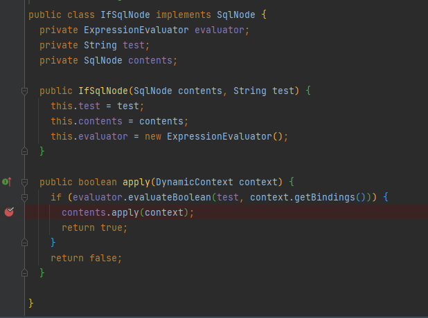
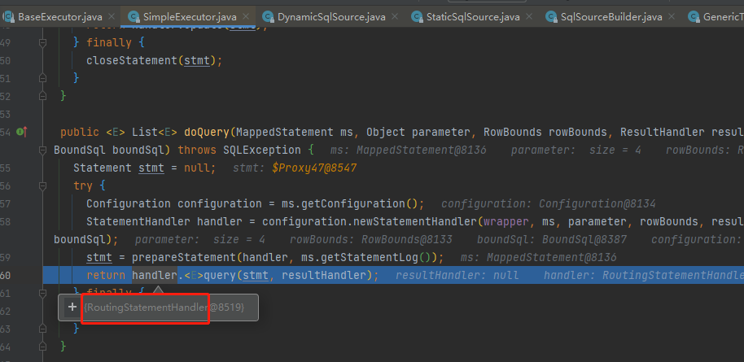

.jpg)

contents中是把mybatis中的sql解析成11个片段。执行完apply方法之后，context中的sqlBuilder的value如下：${}已经被解析，而#{}还没有解析。


${}符号在哪儿被替换的？是在IfSqlNode中替换的：



按F7跳转到TextSqlNode，在GenericTokenParser中完成替换。


```java
// 进入parse方法，来到SqlSourceBuilder类
public SqlSource parse(String originalSql, Class<?> parameterType, Map<String, Object> additionalParameters) {
  ParameterMappingTokenHandler handler = new ParameterMappingTokenHandler(configuration, parameterType, additionalParameters);
  GenericTokenParser parser = new GenericTokenParser("#{", "}", handler);
  String sql = parser.parse(originalSql);
  return new StaticSqlSource(configuration, sql, handler.getParameterMappings());
}
```


解析之后，#{}变成了问号。进入下一行的sqlSource.getBoundSql方法：

```java
// DynamicSqlSource.java
public BoundSql getBoundSql(Object parameterObject) {
    DynamicContext context = new DynamicContext(configuration, parameterObject);
    rootSqlNode.apply(context);
    SqlSourceBuilder sqlSourceParser = new SqlSourceBuilder(configuration);
    Class<?> parameterType = parameterObject == null ? Object.class : parameterObject.getClass();
    SqlSource sqlSource = sqlSourceParser.parse(context.getSql(), parameterType, context.getBindings());
    BoundSql boundSql = sqlSource.getBoundSql(parameterObject);
    for (Map.Entry<String, Object> entry : context.getBindings().entrySet()) {
        boundSql.setAdditionalParameter(entry.getKey(), entry.getValue());
    }
    return boundSql;
}

// 来到StaticSqlSource.java
public BoundSql getBoundSql(Object parameterObject) {
    return new BoundSql(configuration, sql, parameterMappings, parameterObject);
}
```


```java
// 最后来到BaseExecutor
public <E> List<E> query(MappedStatement ms, Object parameter, RowBounds rowBounds, ResultHandler resultHandler, CacheKey key, BoundSql boundSql) throws SQLException {
  ErrorContext.instance().resource(ms.getResource()).activity("executing a query").object(ms.getId());
  if (closed) throw new ExecutorException("Executor was closed.");
  if (queryStack == 0 && ms.isFlushCacheRequired()) {
    clearLocalCache();
  }
  List<E> list;
  try {
    queryStack++;
    list = resultHandler == null ? (List<E>) localCache.getObject(key) : null;
    if (list != null) {
      handleLocallyCachedOutputParameters(ms, key, parameter, boundSql);
    } else {
      list = queryFromDatabase(ms, parameter, rowBounds, resultHandler, key, boundSql);
    }
  } finally {
    queryStack--;
  }
  if (queryStack == 0) {
    for (DeferredLoad deferredLoad : deferredLoads) {
      deferredLoad.load();
    }
    deferredLoads.clear(); // issue #601
    if (configuration.getLocalCacheScope() == LocalCacheScope.STATEMENT) {
      clearLocalCache(); // issue #482
    }
  }
  return list;
}
```



最终走到PreparedStatementHandler类


### 37，resultMap对于联合主键怎么写

答案是写2个id列：

```xml
<resultMap id = "BaseResultMap" >
    <id column = "CONTRACT_NO" property = "contractNo" jdbcType = "VARCHAR"/>
    <id column = "CUST_ID" property = "custId" jdbcType = "VARCHAR"/>

</resultMap>
```

mybatis源码对于id的处理：

```java
// XMLMapperBuilder.java
  private ResultMap resultMapElement(XNode resultMapNode, List<ResultMapping> additionalResultMappings, Class<?> enclosingType) throws Exception {
    ErrorContext.instance().activity("processing " + resultMapNode.getValueBasedIdentifier());
    String type = resultMapNode.getStringAttribute("type",
        resultMapNode.getStringAttribute("ofType",
            resultMapNode.getStringAttribute("resultType",
                resultMapNode.getStringAttribute("javaType"))));
    Class<?> typeClass = resolveClass(type);
    if (typeClass == null) {
      typeClass = inheritEnclosingType(resultMapNode, enclosingType);
    }
    Discriminator discriminator = null;
    List<ResultMapping> resultMappings = new ArrayList<>();
    resultMappings.addAll(additionalResultMappings);
    List<XNode> resultChildren = resultMapNode.getChildren();
    for (XNode resultChild : resultChildren) {
      if ("constructor".equals(resultChild.getName())) {
        processConstructorElement(resultChild, typeClass, resultMappings);
      } else if ("discriminator".equals(resultChild.getName())) {
        discriminator = processDiscriminatorElement(resultChild, typeClass, resultMappings);
      } else {
        List<ResultFlag> flags = new ArrayList<>();
        // 如果含有id列，在flags集合中加入id标志，是List集合，允许多个id列
        if ("id".equals(resultChild.getName())) {
          flags.add(ResultFlag.ID);
        }
        resultMappings.add(buildResultMappingFromContext(resultChild, typeClass, flags));
      }
    }
    String id = resultMapNode.getStringAttribute("id",
            resultMapNode.getValueBasedIdentifier());
    String extend = resultMapNode.getStringAttribute("extends");
    Boolean autoMapping = resultMapNode.getBooleanAttribute("autoMapping");
    ResultMapResolver resultMapResolver = new ResultMapResolver(builderAssistant, id, typeClass, extend, discriminator, resultMappings, autoMapping);
    try {
      return resultMapResolver.resolve();
    } catch (IncompleteElementException  e) {
      configuration.addIncompleteResultMap(resultMapResolver);
      throw e;
    }
  }

// ResultMapping类，对应resultMap中的一列，id列或result列


// ResultMap类
public class ResultMap {
  // 全局配置信息
  private Configuration configuration;

  // resultMap的编号
  private String id;

  // 最终输出结果对应的Java类
  private Class<?> type;

  // XML中的<result>的列表，即ResultMapping列表
  private List<ResultMapping> resultMappings;

  // XML中的<id>的列表
  private List<ResultMapping> idResultMappings;

  // XML中的<constructor>中各个属性的列表
  private List<ResultMapping> constructorResultMappings;

  // XML中非<constructor>相关的属性列表
  private List<ResultMapping> propertyResultMappings;

  // 所有参与映射的数据库中字段的集合
  private Set<String> mappedColumns;

  // 所有参与映射的Java对象属性集合
  private Set<String> mappedProperties;

  // 鉴别器
  private Discriminator discriminator;

  // 是否存在嵌套映射
  private boolean hasNestedResultMaps;

  // 是否存在嵌套查询
  private boolean hasNestedQueries;

  // 是否启动自动映射
  private Boolean autoMapping;
// 省略
}


// ResultMap中的内部类Builder
// 遍历这个resultMap的所有resultMapping
for (ResultMapping resultMapping : resultMap.resultMappings) {
                resultMap.hasNestedQueries = resultMap.hasNestedQueries || resultMapping.getNestedQueryId() != null;
                resultMap.hasNestedResultMaps = resultMap.hasNestedResultMaps || (resultMapping.getNestedResultMapId() != null && resultMapping.getResultSet() == null);
                final String column = resultMapping.getColumn();
    if (column != null) {
        resultMap.mappedColumns.add(column.toUpperCase(Locale.ENGLISH));
    } else if (resultMapping.isCompositeResult()) {
        for (ResultMapping compositeResultMapping : resultMapping.getComposites()) {
            final String compositeColumn = compositeResultMapping.getColumn();
            if (compositeColumn != null) {
                resultMap.mappedColumns.add(compositeColumn.toUpperCase(Locale.ENGLISH));
            }
        }
    }
    final String property = resultMapping.getProperty();
    if (property != null) {
        resultMap.mappedProperties.add(property);
    }
    /**
    如果是<id column = "CASE_ID" property = "caseId" jdbcType = "VARCHAR"/>
    因为不含有constructor标签，所以会加到propertyResultMappings集合
    又因为含有id标签，所以会加到idResultMappings集合
    可见id标签的这条，既在propertyResultMappings集合里，又在idResultMappings集合里
    */
    if (resultMapping.getFlags().contains(ResultFlag.CONSTRUCTOR)) {
        resultMap.constructorResultMappings.add(resultMapping);
        if (resultMapping.getProperty() != null) {
            constructorArgNames.add(resultMapping.getProperty());
        }
    } else {
        resultMap.propertyResultMappings.add(resultMapping);
    }

    /*
        如果这个resultMapping有id标志，就把这个resultMapping加入
        idResultMapping集合
    */
    if (resultMapping.getFlags().contains(ResultFlag.ID)) {
        resultMap.idResultMappings.add(resultMapping);
    }
}


/**
 * 获取idResultMappings，用来生成rowKey
 * 如果idResultMappings是空的，则使用propertyResultMappings
 * @param resultMap
 * @return
 */
private List<ResultMapping> getResultMappingsForRowKey(ResultMap resultMap) {
    // 获取idResultMappings
    List<ResultMapping> resultMappings = resultMap.getIdResultMappings();
    // 如果idResultMappings是空的，则使用propertyResultMappings
    if (resultMappings.isEmpty()) {
        resultMappings = resultMap.getPropertyResultMappings();
    }
    return resultMappings;
}

/**
 * 生成rowKey，它是一个java类
 * @param resultMap
 * @param rsw
 * @param columnPrefix
 * @return
 * @throws SQLException
 */
private CacheKey createRowKey(ResultMap resultMap, ResultSetWrapper rsw, String columnPrefix) throws SQLException {
    final CacheKey cacheKey = new CacheKey();
    cacheKey.update(resultMap.getId());
    List<ResultMapping> resultMappings = getResultMappingsForRowKey(resultMap);
    if (resultMappings.isEmpty()) {
        if (Map.class.isAssignableFrom(resultMap.getType())) {
            createRowKeyForMap(rsw, cacheKey);
        } else {
            createRowKeyForUnmappedProperties(resultMap, rsw, cacheKey, columnPrefix);
        }
    } else {
        createRowKeyForMappedProperties(resultMap, rsw, cacheKey, resultMappings, columnPrefix);
    }
    if (cacheKey.getUpdateCount() < 2) {
        return CacheKey.NULL_CACHE_KEY;
    }
    return cacheKey;
}


private void createRowKeyForMappedProperties(ResultMap resultMap, ResultSetWrapper rsw, CacheKey cacheKey, List<ResultMapping> resultMappings, String columnPrefix) throws SQLException {
    /*
     * 方法中的参数List<ResultMapping> resultMappings
     * （1）如果idResultMappings只有一个值，即只有一个id标签，例如<id column = "CASE_ID" property = "caseId" />
     * （2）如果idResultMappings有2个或多个值，即有2个或多个id标签
     * （3）如果idResultMappings没有值，即没有配置id标签，那就是用propertyResultMappings
     */
    for (ResultMapping resultMapping : resultMappings) {
        // 联合查询
        if (resultMapping.getNestedResultMapId() != null && resultMapping.getResultSet() == null) {
            // Issue #392
            final ResultMap nestedResultMap = configuration.getResultMap(resultMapping.getNestedResultMapId());
            /*
             * 递归调用
             */
            createRowKeyForMappedProperties(nestedResultMap, rsw, cacheKey, nestedResultMap.getConstructorResultMappings(),
                    prependPrefix(resultMapping.getColumnPrefix(), columnPrefix));
        }
        // 非联合查询
        else if (resultMapping.getNestedQueryId() == null) {
            // 使到id标签中的column（如果有id标签，否则是普通result标签）
            final String column = prependPrefix(resultMapping.getColumn(), columnPrefix);
            final TypeHandler<?> th = resultMapping.getTypeHandler();
            List<String> mappedColumnNames = rsw.getMappedColumnNames(resultMap, columnPrefix);
            // Issue #114
            if (column != null && mappedColumnNames.contains(column.toUpperCase(Locale.ENGLISH))) {
                // 从结果中取出该column对应的值
                final Object value = th.getResult(rsw.getResultSet(), column);
                if (value != null || configuration.isReturnInstanceForEmptyRow()) {
                    // cacheKey中有一个List: updateList，表示更新历史
                    cacheKey.update(column);
                    cacheKey.update(value);
                }
            }
        }
    }
}
```

### 38，@Resource注解是在哪儿解析的

```java
// CommonAnnotationBeanPostProcessor.java
private InjectionMetadata buildResourceMetadata(final Class<?> clazz) {
    LinkedList<InjectionMetadata.InjectedElement> elements = new LinkedList<InjectionMetadata.InjectedElement>();
    Class<?> targetClass = clazz;

    do {
        final LinkedList<InjectionMetadata.InjectedElement> currElements =
                new LinkedList<InjectionMetadata.InjectedElement>();

        // 先处理属性上的注解
        ReflectionUtils.doWithLocalFields(targetClass, new ReflectionUtils.FieldCallback() {
            @Override
            public void doWith(Field field) throws IllegalArgumentException, IllegalAccessException {
                if (webServiceRefClass != null && field.isAnnotationPresent(webServiceRefClass)) {
                    if (Modifier.isStatic(field.getModifiers())) {
                        throw new IllegalStateException("@WebServiceRef annotation is not supported on static fields");
                    }
                    currElements.add(new WebServiceRefElement(field, field, null));
                }
                else if (ejbRefClass != null && field.isAnnotationPresent(ejbRefClass)) {
                    if (Modifier.isStatic(field.getModifiers())) {
                        throw new IllegalStateException("@EJB annotation is not supported on static fields");
                    }
                    currElements.add(new EjbRefElement(field, field, null));
                }
                /*
                    属性上的@Resource注解，如果存在则生成一个ResourceElement对象，加入List
                    */
                else if (field.isAnnotationPresent(Resource.class)) {
                    if (Modifier.isStatic(field.getModifiers())) {
                        throw new IllegalStateException("@Resource annotation is not supported on static fields");
                    }
                    if (!ignoredResourceTypes.contains(field.getType().getName())) {
                        currElements.add(new ResourceElement(field, field, null));
                    }
                }
            }
        });

        // 再处理方法上的注解
        ReflectionUtils.doWithLocalMethods(targetClass, new ReflectionUtils.MethodCallback() {
            @Override
            public void doWith(Method method) throws IllegalArgumentException, IllegalAccessException {
                Method bridgedMethod = BridgeMethodResolver.findBridgedMethod(method);
                if (!BridgeMethodResolver.isVisibilityBridgeMethodPair(method, bridgedMethod)) {
                    return;
                }
                if (method.equals(ClassUtils.getMostSpecificMethod(method, clazz))) {
                    if (webServiceRefClass != null && bridgedMethod.isAnnotationPresent(webServiceRefClass)) {
                        if (Modifier.isStatic(method.getModifiers())) {
                            throw new IllegalStateException("@WebServiceRef annotation is not supported on static methods");
                        }
                        if (method.getParameterTypes().length != 1) {
                            throw new IllegalStateException("@WebServiceRef annotation requires a single-arg method: " + method);
                        }
                        PropertyDescriptor pd = BeanUtils.findPropertyForMethod(bridgedMethod, clazz);
                        currElements.add(new WebServiceRefElement(method, bridgedMethod, pd));
                    }
                    else if (ejbRefClass != null && bridgedMethod.isAnnotationPresent(ejbRefClass)) {
                        if (Modifier.isStatic(method.getModifiers())) {
                            throw new IllegalStateException("@EJB annotation is not supported on static methods");
                        }
                        if (method.getParameterTypes().length != 1) {
                            throw new IllegalStateException("@EJB annotation requires a single-arg method: " + method);
                        }
                        PropertyDescriptor pd = BeanUtils.findPropertyForMethod(bridgedMethod, clazz);
                        currElements.add(new EjbRefElement(method, bridgedMethod, pd));
                    }
                    // 方法上的@Resource，如果存在，生成一个ResourceElement对象，加入List
                    else if (bridgedMethod.isAnnotationPresent(Resource.class)) {
                        if (Modifier.isStatic(method.getModifiers())) {
                            throw new IllegalStateException("@Resource annotation is not supported on static methods");
                        }
                        Class<?>[] paramTypes = method.getParameterTypes();
                        if (paramTypes.length != 1) {
                            throw new IllegalStateException("@Resource annotation requires a single-arg method: " + method);
                        }
                        if (!ignoredResourceTypes.contains(paramTypes[0].getName())) {
                            PropertyDescriptor pd = BeanUtils.findPropertyForMethod(bridgedMethod, clazz);
                            currElements.add(new ResourceElement(method, bridgedMethod, pd));
                        }
                    }
                }
            }
        });

        elements.addAll(0, currElements);
        targetClass = targetClass.getSuperclass();
    }
    while (targetClass != null && targetClass != Object.class);

    return new InjectionMetadata(clazz, elements);
}

// 内部类
private class ResourceElement extends LookupElement {

    private final boolean lazyLookup;

    public ResourceElement(Member member, AnnotatedElement ae, PropertyDescriptor pd) {
        super(member, pd);
        // 获取注解 @Resource并解析
        Resource resource = ae.getAnnotation(Resource.class);
        String resourceName = resource.name();
        Class<?> resourceType = resource.type();
        this.isDefaultName = !StringUtils.hasLength(resourceName);
        if (this.isDefaultName) {
            resourceName = this.member.getName();
            if (this.member instanceof Method && resourceName.startsWith("set") && resourceName.length() > 3) {
                resourceName = Introspector.decapitalize(resourceName.substring(3));
            }
        }
        else if (embeddedValueResolver != null) {
            resourceName = embeddedValueResolver.resolveStringValue(resourceName);
        }
        if (resourceType != null && Object.class != resourceType) {
            checkResourceType(resourceType);
        }
        else {
            // No resource type specified... check field/method.
            resourceType = getResourceType();
        }
        this.name = resourceName;
        this.lookupType = resourceType;
        String lookupValue = (lookupAttribute != null ?
                (String) ReflectionUtils.invokeMethod(lookupAttribute, resource) : null);
        this.mappedName = (StringUtils.hasLength(lookupValue) ? lookupValue : resource.mappedName());
        Lazy lazy = ae.getAnnotation(Lazy.class);
        this.lazyLookup = (lazy != null && lazy.value());
    }

    @Override
    protected Object getResourceToInject(Object target, String requestingBeanName) {
        return (this.lazyLookup ? buildLazyResourceProxy(this, requestingBeanName) :
                getResource(this, requestingBeanName));
    }
}
```

对比@Autowired注解的解析：AutowiredAnnotationBeanPostProcessor

Spring处理@Autowired注解，有2处：

（1）postProcessMergedBeanDefinition方法：预处理，缓存属性或方法

（2）populateBean方法：注入属性或方法

```java
// AutowiredAnnotationBeanPostProcessor
public class AutowiredAnnotationBeanPostProcessor extends InstantiationAwareBeanPostProcessorAdapter
        implements MergedBeanDefinitionPostProcessor, PriorityOrdered, BeanFactoryAware {

    protected final Log logger = LogFactory.getLog(getClass());

    private final Set<Class<? extends Annotation>> autowiredAnnotationTypes =
            new LinkedHashSet<Class<? extends Annotation>>();

    private String requiredParameterName = "required";

    private boolean requiredParameterValue = true;

    private int order = Ordered.LOWEST_PRECEDENCE - 2;

    private ConfigurableListableBeanFactory beanFactory;

    private final Set<String> lookupMethodsChecked =
            Collections.newSetFromMap(new ConcurrentHashMap<String, Boolean>(256));

    private final Map<Class<?>, Constructor<?>[]> candidateConstructorsCache =
            new ConcurrentHashMap<Class<?>, Constructor<?>[]>(256);

    private final Map<String, InjectionMetadata> injectionMetadataCache =
            new ConcurrentHashMap<String, InjectionMetadata>(256);


    /**
     * Create a new AutowiredAnnotationBeanPostProcessor
     * for Spring's standard {@link Autowired} annotation.
     * <p>Also supports JSR-330's {@link javax.inject.Inject} annotation, if available.
     */
    @SuppressWarnings("unchecked")
    public AutowiredAnnotationBeanPostProcessor() {
        // @Autowired
        this.autowiredAnnotationTypes.add(Autowired.class);
        // @Value
        this.autowiredAnnotationTypes.add(Value.class);
        try {
            this.autowiredAnnotationTypes.add((Class<? extends Annotation>)
                    ClassUtils.forName("javax.inject.Inject", AutowiredAnnotationBeanPostProcessor.class.getClassLoader()));
            logger.info("JSR-330 'javax.inject.Inject' annotation found and supported for autowiring");
        }
        catch (ClassNotFoundException ex) {
            // JSR-330 API not available - simply skip.
        }
    }

    /*
      doCreateBean方法中的方法applyMergedBeanDefinitionPostProcessors：
      protected void applyMergedBeanDefinitionPostProcessors(RootBeanDefinition mbd, Class<?> beanType, String beanName) {
        for (BeanPostProcessor bp : getBeanPostProcessors()) {
            if (bp instanceof MergedBeanDefinitionPostProcessor) {
                MergedBeanDefinitionPostProcessor bdp = (MergedBeanDefinitionPostProcessor) bp;
                bdp.postProcessMergedBeanDefinition(mbd, beanType, beanName);
            }
        }
    }
    */
    @Override
    public void postProcessMergedBeanDefinition(RootBeanDefinition beanDefinition, Class<?> beanType, String beanName) {
        if (beanType != null) {
            InjectionMetadata metadata = findAutowiringMetadata(beanName, beanType, null);
            metadata.checkConfigMembers(beanDefinition);
        }
    }

    // populateBean方法中遍历BeanPostProcessors来调用此方法
    @Override
    public PropertyValues postProcessPropertyValues(
            PropertyValues pvs, PropertyDescriptor[] pds, Object bean, String beanName) throws BeanCreationException {

        InjectionMetadata metadata = findAutowiringMetadata(beanName, bean.getClass(), pvs);
        try {
            metadata.inject(bean, beanName, pvs);
        }
        catch (BeanCreationException ex) {
            throw ex;
        }
        catch (Throwable ex) {
            throw new BeanCreationException(beanName, "Injection of autowired dependencies failed", ex);
        }
        return pvs;
    }
    // 省略
}
```

看一下PostProcessor的调用关系：


```java
// CommonAnnotationBeanPostProcessor.java的部分注释
/**
org.springframework.beans.factory.config.BeanPostProcessor implementation 
that supports common Java annotations out of the box, in particular the 
JSR-250 annotations in the javax.annotation package. These common Java 
annotations are supported in many Java EE 5 technologies (e.g. JSF 1.2), 
as well as in Java 6's JAX-WS.

This post-processor includes support for the PostConstruct and PreDestroy 
annotations - as init annotation and destroy annotation, respectively - 
through inheriting from InitDestroyAnnotationBeanPostProcessor with 
pre-configured annotation types.

The central element is the Resource annotation for annotation-driven injection
of named beans, by default from the containing Spring BeanFactory, with only 
mappedName references resolved in JNDI. The "alwaysUseJndiLookup" flag enforces
JNDI lookups equivalent to standard Java EE 5 resource injection for name 
references and default names as well. The target beans can be simple POJOs, 
with no special requirements other than the type having to match.

*/
```
